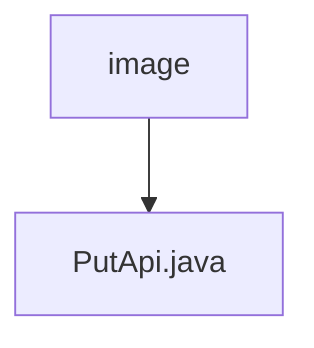

# Basic Information

|      |      |
|------|------|
| Name | image |
| Language | .java |
| Code Path | WeFe/union/union-service/src/main/java/com/welab/wefe/union/service/api/dataresource/dataset/image |
| Package Name | docs.union.union-service.src.main.java.com.welab.wefe.union.service.api.dataresource.dataset.image |
| Brief Description | The PutApi class handles the addition of image datasets, with inputs including fields such as task type, labels, file size, etc., and invokes the ImageDataSetService to complete the operation. |

# Description

This is a Java class named PutApi, designed to handle the addition operations for image datasets. The class extends AbstractApi, uses the Api annotation to define its path and name, and allows signature-based access. It injects the ImageDataSetService and processes input data by calling the add method within the handle method.  

The input class, Input, extends DataResourcePutInput and includes multiple fields such as forJobType, labelList, labeledCount, etc., which describe the attributes of the image dataset. Each field has corresponding getter and setter methods, with the labelCompleted field marked as mandatory. Additionally, the Input class contains several fields related to dataset usage statistics, such as usageCountInJob.

### Package Internal Structure View

This flowchart illustrates the API path structure for dataset image resources in the WeFe project. The root node "image" represents the image resource directory, which contains a specific API implementation file "PutApi.java". This structure clearly reflects the single implementation path of the image resource API, aligning with the given two-path information.

# File List

| Name   | Type  | Description |
|-------|------|-------------|
| [PutApi.java](PutApi.md) | file | The PutApi class handles the addition of image datasets, with inputs including fields such as task type, labels, file size, etc., and invokes the ImageDataSetService to complete the operation. |

