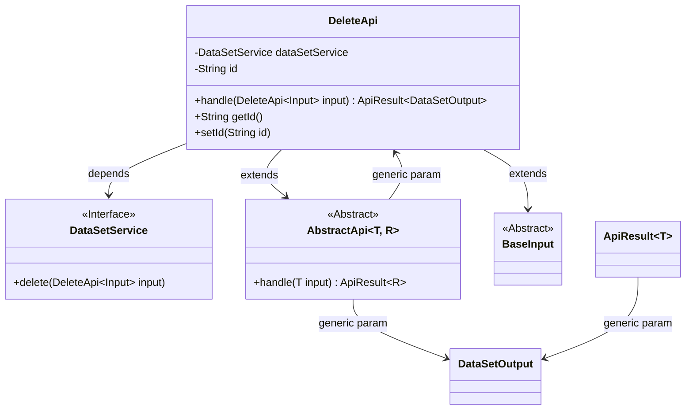

# Basic Information

|      |      |
|------|------|
| Name | DeleteApi |
| Language | .java |
| Code Path | WeFe/union/union-service/src/main/java/com/welab/wefe/union/service/api/dataresource/dataset/nomal/DeleteApi.java |
| Package Name | com.welab.wefe.union.service.api.dataresource.dataset.nomal |
| Dependencies | ['com.welab.wefe.common.exception.StatusCodeWithException', 'com.welab.wefe.common.web.api.base.AbstractApi', 'com.welab.wefe.common.web.api.base.Api', 'com.welab.wefe.common.web.dto.ApiResult', 'com.welab.wefe.union.service.dto.base.BaseInput', 'com.welab.wefe.union.service.dto.dataresource.dataset.table.DataSetOutput', 'com.welab.wefe.union.service.service.DataSetService', 'org.springframework.beans.factory.annotation.Autowired'] |
| Brief Description | API class for deleting datasets, with the path "data_set/delete", allowing signed access. It deletes the specified dataset by ID through DataSetService and returns a success result. The input parameters include an ID field. |

# Description

This is a Java class named DeleteApi, designed to handle API requests for dataset deletion. The class extends AbstractApi, using generics to specify the input type as DeleteApi.Input and the output type as DataSetOutput. It is annotated with @Api, defining the API path as "data_set/delete", the name as "data_set_delete", and allowing signed access. The class injects DataSetService for business processing. The handle method takes input parameters, calls the delete method of dataSetService to perform the deletion operation, and returns a successful result. The input parameter Input extends BaseInput and includes a string-type id property along with its getter and setter methods.

# Class Summary

| Name   | Type  | Description |
|-------|------|-------------|
| DeleteApi | class | API class for deleting datasets, with the path `data_set/delete`, requires signature-based access. It invokes the `delete` method of `dataSetService` to process the input ID and returns a success result. |

## Class DeleteApi

|      |      |
|------|------|
| Access Modifier | @Api(path = "data_set/delete", name = "data_set_delete", allowAccessWithSign = true);public |
| Type | class |
| Name | DeleteApi |
| Description | API class for deleting datasets, with the path `data_set/delete`, requires signature-based access. It invokes the `delete` method of `dataSetService` to process the input ID and returns a success result. |

### UML Class Diagram

This code illustrates the class structure of a dataset deletion API. The DeleteApi inherits from the generic abstract class AbstractApi, specifying the input type as an inner class Input (which extends BaseInput) and the output type as DataSetOutput. It implements deletion functionality through autowired DataSetService interface dependency, with the handle method processing input and returning ApiResult-wrapped responses. The class diagram clearly depicts inheritance, dependency, and generic relationships, reflecting Spring-style API layer design patterns.

### Internal Method Call Graph

```mermaid
graph TD
    A["Class DeleteApi"]
    B["Annotation: @Api"]
    C["Inheritance: AbstractApi<Input, DataSetOutput>"]
    D["Dependency Injection: @Autowired DataSetService"]
    E["Overridden Method: handle(Input input)"]
    F["Inner Class: Input"]
    G["Field: String id"]
    H["Method: String getId()"]
    I["Method: void setId(String id)"]
    J["Invocation: dataSetService.delete(input)"]
    K["Return: success()"]

    A --> B
    A --> C
    A --> D
    A --> E
    E --> J
    E --> K
    A -.-> F
    F --> G
    F --> H
    F --> I
```

This code demonstrates a Spring framework-based API class DeleteApi designed to handle dataset deletion requests. The @Api annotation defines the interface path and permissions, inheriting from the AbstractApi template class and implementing the handle method, which internally invokes DataSetService to perform deletion operations. The Input inner class encapsulates the request parameter id with its getter/setter methods, reflecting a layered design and dependency injection typical of Spring Boot application architecture.

### Field List

| Name  | Type  | Description |
|-------|-------|------|
| dataSetService | DataSetService | Automatically inject dataset service instance. |

### Method List

| Name  | Type  | Description |
|-------|-------|------|
| handle | ApiResult<DataSetOutput> | This is a Java method that overrides the parent class method, handles delete requests, calls the dataSetService to delete the input data, and returns an empty result upon success. |

