# Basic Information

|      |      |
|------|------|
| Name | DetailApi |
| Language | .java |
| Code Path | WeFe/union/union-service/src/main/java/com/welab/wefe/union/service/api/dataresource/dataset/nomal/DetailApi.java |
| Package Name | com.welab.wefe.union.service.api.dataresource.dataset.nomal |
| Dependencies | ['com.welab.wefe.common.fieldvalidate.annotation.Check', 'com.welab.wefe.common.web.api.base.AbstractApi', 'com.welab.wefe.common.web.api.base.Api', 'com.welab.wefe.common.web.dto.ApiResult', 'com.welab.wefe.union.service.dto.base.BaseInput', 'com.welab.wefe.union.service.dto.dataresource.dataset.table.DataSetDetailOutput', 'com.welab.wefe.union.service.service.DataSetService', 'org.springframework.beans.factory.annotation.Autowired'] |
| Brief Description | This is an API class named DetailApi, with the path "data_set/detail", allowing signed access. It processes the input parameter id and returns dataset details, utilizing the detail method of dataSetService to implement the functionality. |

# Description

This is an API class named DetailApi, used to retrieve dataset details. It inherits from AbstractApi, accepts DetailApi.Input as the input parameter, and returns a result of type DataSetDetailOutput. The API path is "data_set/detail" and allows signed access. Internally, it processes business logic through the injected DataSetService, calling its detail method to obtain details. The input class Input inherits BaseInput and includes a mandatory field id along with its getter and setter methods. The processing logic is implemented in the handle method, which returns a properly encapsulated result upon success.

# Class Summary

| Name   | Type  | Description |
|-------|------|-------------|
| DetailApi | class | This is an API class named DetailApi, with the path data_set/detail, allowing signed access. It processes the input parameter id and returns DataSetDetailOutput, implemented via the dataSetService.detail method. The input class Input inherits from BaseInput, with the id field being mandatory. |


## Class DetailApi

|      |      |
|------|------|
| Access Modifier | @Api(path = "data_set/detail", name = "data_set_detail", allowAccessWithSign = true);public |
| Type | class |
| Name | DetailApi |
| Description | This is an API class named DetailApi, with the path data_set/detail, allowing signed access. It processes the input parameter id and returns DataSetDetailOutput, implemented via the dataSetService.detail method. The input class Input inherits from BaseInput, with the id field being mandatory. |


### UML Class Diagram

```mermaid
classDiagram
    class DetailApi {
        -DataSetService dataSetService
        +handle(DetailApi~Input~ input) ApiResult~DataSetDetailOutput~
    }
    class DataSetService {
        <<Interface>>
        +detail(DetailApi~Input~ input) DataSetDetailOutput
    }
    class DetailApi~Input~ {
        -String id
        +String getId()
        +void setId(String id)
    }
    class BaseInput {
        <<Abstract>>
    }
    class ApiResult~T~ {
        <<Generic>>
    }
    class DataSetDetailOutput {
    }

    DetailApi --> DataSetService : Dependency
    DetailApi~Input~ --|> BaseInput : Inheritance
    DetailApi ..|> AbstractApi~DetailApi~Input~, DataSetDetailOutput~ : Implementation
    DetailApi ..> DetailApi~Input~ : Usage
    DetailApi ..> DataSetDetailOutput : Usage
    DetailApi ..> ApiResult~DataSetDetailOutput~ : Usage
```

Class Diagram Description: This diagram illustrates the DetailApi class and its related structures. DetailApi inherits from the generic class AbstractApi, implementing logic to handle input and output data. It depends on the DataSetService interface to retrieve data details, uses the inner class Input (inherited from BaseInput) as the input parameter, and returns the DataSetDetailOutput result wrapped in ApiResult. The diagram clearly shows the inheritance, implementation, and dependency relationships between classes.


### Internal Method Call Graph

```mermaid
graph TD
    A["Class DetailApi"]
    B["Annotation: @Api"]
    C["Inheritance: AbstractApi<Input, DataSetDetailOutput>"]
    D["Dependency Injection: @Autowired DataSetService"]
    E["Overridden Method: handle(Input input)"]
    F["Inner Class: Input"]
    G["Field: @Check String id"]
    H["Method: getId()"]
    I["Method: setId(String id)"]
    J["Invocation: dataSetService.detail(input)"]
    K["Return: success(result)"]

    A --> B
    A --> C
    A --> D
    A --> E
    A --> F
    F --> G
    F --> H
    F --> I
    E --> J
    J --> K
```



This code defines an API class named DetailApi, which inherits from AbstractApi with specified input and output types. The class is configured with path and permission settings via the @Api annotation, and injects DataSetService using @Autowired. The core method handle() invokes dataSetService.detail() to process input parameters and returns encapsulated results. The inner class Input extends BaseInput, containing an id field with validation annotation and corresponding getter/setter methods. The flowchart clearly illustrates the class structure, dependency relationships, and method invocation chain.

### Field List

| Name  | Type  | Description |
|-------|-------|------|
| dataSetService | DataSetService | The code snippet uses the @Autowired annotation to automatically inject an instance of DataSetService. |

### Method List

| Name  | Type  | Description |
|-------|-------|------|
| handle | ApiResult<DataSetDetailOutput> | Process the input and return dataset details by invoking the service layer's detail method, then encapsulate the result before returning. |


