# Basic Information

|      |      |
|------|------|
| Name | PutApi |
| Language | .java |
| Code Path | WeFe/union/union-service/src/main/java/com/welab/wefe/union/service/api/dataresource/dataset/nomal/PutApi.java |
| Package Name | com.welab.wefe.union.service.api.dataresource.dataset.nomal |
| Dependencies | ['com.welab.wefe.common.exception.StatusCodeWithException', 'com.welab.wefe.common.fieldvalidate.annotation.Check', 'com.welab.wefe.common.web.api.base.AbstractApi', 'com.welab.wefe.common.web.api.base.Api', 'com.welab.wefe.common.web.dto.ApiResult', 'com.welab.wefe.union.service.dto.base.BaseInput', 'com.welab.wefe.union.service.dto.dataresource.dataset.table.DataSetOutput', 'com.welab.wefe.union.service.service.DataSetService', 'org.springframework.beans.factory.annotation.Autowired'] |
| Brief Description | This is an API class named PutApi, designed to handle dataset addition requests. It accepts inputs containing mandatory fields such as ID, name, and member ID, invokes the DataSetService to perform the addition operation, and returns a success result. The input class includes multiple optional and mandatory properties, such as row count, column count, feature list, etc. |

# Description

This is a Java class named PutApi, designed for handling dataset addition operations. It extends AbstractApi, accepts Input type parameters, and returns DataSetOutput. The class injects DataSetService via Autowired and invokes its add method within the handle method to process the input. The Input inner class contains multiple fields, where id, name, memberId, publicLevel, and tags are mandatory, while others such as containsY, rowCount, columnCount, etc., are optional. All fields have corresponding getter and setter methods.

# Class Summary

| Name   | Type  | Description |
|-------|------|-------------|
| PutApi | class | The PutApi class is used to add datasets, including required fields such as id, name, memberId, publicLevel, and tags, as well as other optional fields like description and usage statistics. The input is processed via the dataSetService.add method, which returns a success result. |


## Class PutApi

|      |      |
|------|------|
| Access Modifier | @Api(path = "data_set/put", name = "data_set_put", allowAccessWithSign = true);public |
| Type | class |
| Name | PutApi |
| Description | The PutApi class is used to add datasets, including required fields such as id, name, memberId, publicLevel, and tags, as well as other optional fields like description and usage statistics. The input is processed via the dataSetService.add method, which returns a success result. |


### UML Class Diagram

```mermaid
classDiagram
    class PutApi {
        -DataSetService dataSetService
        +handle(Input input) ApiResult~DataSetOutput~
    }
    <<Interface>> {
        interface AbstractApi~Input, DataSetOutput~ {
            <<Abstract>>
        }
    }
    class Input {
        -String id
        -String name
        -String memberId
        -Boolean containsY
        -Long rowCount
        -Integer columnCount
        -String columnNameList
        -Integer featureCount
        -String featureNameList
        -String publicLevel
        -String publicMemberList
        -int usageCountInJob
        -int usageCountInFlow
        -int usageCountInProject
        -String description
        -String tags
        // Getters/Setters of all fields omitted
    }
    class DataSetService {
        +add(Input input) void
    }
    class BaseInput {
        <<Abstract>>
    }
    class DataSetOutput {
        // Output data structure
    }
    class ApiResult~T~ {
        // Generic result wrapper
    }

    PutApi --|> AbstractApi~Input, DataSetOutput~ : Inheritance
    Input --|> BaseInput : Inheritance
    PutApi --> DataSetService : Dependency
    PutApi ..> Input : Usage
    AbstractApi~Input, DataSetOutput~ ..> ApiResult~DataSetOutput~ : Returns
    AbstractApi~Input, DataSetOutput~ ..> DataSetOutput : Returns
```

This code implements a PUT API for datasets. The core class PutApi inherits from the generic abstract class AbstractApi, processes Input parameters, and returns DataSetOutput results. The Input class inherits from BaseInput and contains various dataset attributes, with data addition operations performed via DataSetService. The class diagram illustrates inheritance relationships, dependencies, and generic parameter passing, clearly reflecting a layered architecture of API layer, service layer, and data model layer.


### Internal Method Call Graph

```mermaid
graph TD
    A["Class PutApi"]
    B["Annotation: @Api"]
    C["Inheritance: AbstractApi<Input, DataSetOutput>"]
    D["Dependency Injection: @Autowired DataSetService"]
    E["Overridden Method: handle(Input input)"]
    F["Inner Class: Input"]
    G["Attributes: 15 fields + validation annotations"]
    H["Methods: 15 pairs of getters/setters"]

    A --> B
    A --> C
    A --> D
    A --> E
    A --> F
    F --> G
    F --> H
    E --> D
    E -->|Invokes| D["dataSetService.add(input)"]
    E -->|Returns| I["ApiResult.success()"]
```



This code describes an API class PutApi with data processing functionality, which inherits from the abstract class AbstractApi and implements the handle method. The main workflow involves executing data addition operations through the dependency-injected DataSetService. The inner class Input defines extensive data fields and validation rules. The flowchart clearly illustrates the class structure, dependency relationships, and core processing logic, including annotation declarations, service invocations, and result return paths.

### Field List

| Name  | Type  | Description |
|-------|-------|------|
| dataSetService | DataSetService | Automatically inject the DataSetService instance. |

### Method List

| Name  | Type  | Description |
|-------|-------|------|
| handle | ApiResult<DataSetOutput> | This code rewrites the handle method, calling dataSetService.add to process the input and returning ApiResult upon success. |


