# Basic Information

|      |      |
|------|------|
| Name | QueryApi |
| Language | .java |
| Code Path | WeFe/union/union-service/src/main/java/com/welab/wefe/union/service/api/dataresource/dataset/nomal/QueryApi.java |
| Package Name | com.welab.wefe.union.service.api.dataresource.dataset.nomal |
| Dependencies | ['com.welab.wefe.common.data.mongodb.dto.PageOutput', 'com.welab.wefe.common.web.api.base.AbstractApi', 'com.welab.wefe.common.web.api.base.Api', 'com.welab.wefe.common.web.dto.ApiResult', 'com.welab.wefe.union.service.dto.base.BaseInput', 'com.welab.wefe.union.service.dto.dataresource.dataset.table.ApiDataSetQueryOutput', 'com.welab.wefe.union.service.service.DataSetService', 'org.springframework.beans.factory.annotation.Autowired'] |
| Brief Description | The QueryApi class is an API for handling dataset queries, with the path data_set/query, allowing signed access. It accepts an Input object containing parameters such as id, memberId, and name, calls the dataSetService.query method to perform the query, and returns a paginated result PageOutput<ApiDataSetQueryOutput>. The default page size is 10. |

# Description

This is a Java class named QueryApi, designed to handle dataset query requests. The class extends AbstractApi, accepts input parameters of type Input, and returns a paginated result in the format of ApiDataSetQueryOutput. The Input class includes multiple query condition fields such as id, memberId, memberName, name, containsY, tag, as well as pagination parameters pageIndex and pageSize. The class performs the actual query operation through the injected DataSetService and returns a successful result. The API path is "data_set/query" and allows signed access.

# Class Summary

| Name   | Type  | Description |
|-------|------|-------------|
| QueryApi | class | The QueryApi class is used to query datasets, supporting pagination and various filtering conditions such as ID, member information, name, tags, etc., with a default of 10 entries per page. |


## Class QueryApi

|      |      |
|------|------|
| Access Modifier | @Api(path = "data_set/query", name = "data_set_query", allowAccessWithSign = true);public |
| Type | class |
| Name | QueryApi |
| Description | The QueryApi class is used to query datasets, supporting pagination and various filtering conditions such as ID, member information, name, tags, etc., with a default of 10 entries per page. |


### UML Class Diagram

```mermaid
classDiagram
    class QueryApi {
        -DataSetService dataSetService
        +handle(Input input) ApiResult~PageOutput~ApiDataSetQueryOutput~~~
    }
    
    class Input {
        -String id
        -String memberId
        -String memberName
        -String name
        -Boolean containsY
        -String tag
        -Integer pageIndex
        -Integer pageSize
        +String getId()
        +void setId(String id)
        +String getMemberId()
        +void setMemberId(String memberId)
        // ...Other getters/setters omitted...
    }

    class DataSetService {
        +query(Input input) PageOutput~ApiDataSetQueryOutput~
    }

    class AbstractApi~T, R~ {
        <<Abstract>>
        +handle(T input) ApiResult~R~
    }

    class PageOutput~T~ {
        <<GenericType>>
    }

    class ApiDataSetQueryOutput {
        <<DTO>>
    }

    class ApiResult~T~ {
        <<GenericType>>
    }

    QueryApi --> AbstractApi~Input, PageOutput~ApiDataSetQueryOutput~~~ : Extends
    QueryApi --> DataSetService : Depends on
    QueryApi --> Input : Nested class
    DataSetService --> Input : Parameter dependency
    DataSetService --> PageOutput~ApiDataSetQueryOutput~ : Return dependency
    AbstractApi~T, R~ --> ApiResult~R~ : Return dependency
```

This code demonstrates a data query API implementation based on the Spring framework. QueryApi inherits from the generic abstract class AbstractApi, processes Input parameters, and returns paginated query results. The core functionality is achieved through DataSetService for data querying, with the Input class encapsulating query conditions including pagination parameters. The class diagram clearly illustrates inheritance, dependency, and generic relationships between components, reflecting the application of layered architecture and DTO patterns.


### Internal Method Call Graph

```mermaid
graph TD
    A["Class QueryApi"]
    B["Annotation: @Api"]
    C["Inheritance: AbstractApi<Input, PageOutput<ApiDataSetQueryOutput>>"]
    D["Dependency Injection: @Autowired DataSetService"]
    E["Overridden Method: handle(Input input)"]
    F["Inner Class: Input"]
    G["Property: String id"]
    H["Property: String memberId"]
    I["Property: String memberName"]
    J["Property: String name"]
    K["Property: Boolean containsY"]
    L["Property: String tag"]
    M["Property: Integer pageIndex=0"]
    N["Property: Integer pageSize=10"]
    O["getter/setter methods"]

    A --> B
    A --> C
    A --> D
    A --> E
    A --> F
    F --> G
    F --> H
    F --> I
    F --> J
    F --> K
    F --> L
    F --> M
    F --> N
    F --> O
    E --> D
    E --> F
```



This code demonstrates a Spring framework-based query API implementation, primarily consisting of the QueryApi class and its inner Input class. QueryApi implements a paginated dataset query interface by extending AbstractApi, utilizing @Autowired to inject DataSetService for business processing. The inner Input class defines comprehensive query parameters including basic fields like id, memberId, and pagination control parameters, with all fields equipped with standard getter/setter methods. The flowchart clearly illustrates the class structure, inheritance relationships, dependency injection, and inner class composition, showcasing a typical API controller design pattern.

### Field List

| Name  | Type  | Description |
|-------|-------|------|
| dataSetService | DataSetService | Automatically inject dataset service instances. |

### Method List

| Name  | Type  | Description |
|-------|-------|------|
| handle | ApiResult<PageOutput<ApiDataSetQueryOutput>> | Process query requests and return dataset service query results. |


