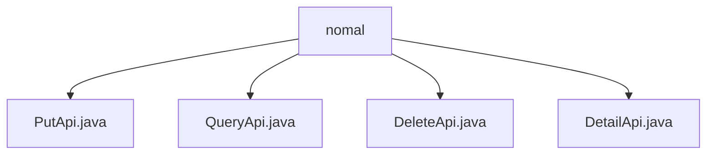

# Basic Information

|      |      |
|------|------|
| Name | nomal |
| Language | .java |
| Code Path | WeFe/union/union-service/src/main/java/com/welab/wefe/union/service/api/dataresource/dataset/nomal |
| Package Name | docs.union.union-service.src.main.java.com.welab.wefe.union.service.api.dataresource.dataset.nomal |
| Brief Description | The PutApi handles dataset addition, inheriting from AbstractApi, utilizing Input and DataSetOutput. The QueryApi manages queries, returning paginated results with various query conditions. The DeleteApi processes deletions, with input containing an id and outputting DataSetOutput. The DetailApi retrieves details, requiring an id as input and returning DataSetDetailOutput. All are processed via DataSetService. |

# Description

## Overview  
This module is a dataset management API component, with its core responsibility being to provide CRUD operations (Create, Read, Update, Delete) for datasets. The interface specifications follow a unified design: all APIs inherit from AbstractApi and adopt the Input/Output pattern (e.g., PutApi.Input includes mandatory fields like id/name, while QueryApi.Output uses a paginated structure). Key data structures include DataSetOutput (generic response), DataSetDetailOutput (detail response), and ApiDataSetQueryOutput (paginated query results). The only external dependency is DataSetService, which is injected via Autowired to implement business logic. For example, DeleteApi invokes its delete method to perform deletions.

## Core Business Scenarios  
The module supports full lifecycle management of datasets: PutApi handles additions (similar to a resource publishing model), QueryApi enables multi-condition paginated queries (e.g., filtering by tags), and DeleteApi/DetailApi manage deletions and detail views, respectively. The interaction model follows RESTful conventions, such as DetailApi retrieving details via the "data_set/detail" path. Typical applications include data service integration (via signed APIs) and console management (using paginated queries). The API types cover write operations (Put/Delete) and read operations (Query/Detail), e.g., QueryApi supports combined condition searches.

### Package Internal Structure View

This flowchart illustrates four Java files under the nomal directory: PutApi.java, QueryApi.java, DeleteApi.java, and DetailApi.java. These files are directly subordinate to the nomal directory without any deeper nesting structure. Each file represents an independent API interface implementation, collectively forming the functional module for routine dataset operations.

# File List

| Name   | Type  | Description |
|-------|------|-------------|
| [PutApi.java](PutApi.md) | file | This is an API class named PutApi, designed to handle dataset addition requests. It accepts inputs containing mandatory fields such as ID, name, and member ID, invokes the DataSetService to perform the addition operation, and returns a success result. The input class includes multiple optional and mandatory attributes, such as row count, column count, feature list, etc. |
| [QueryApi.java](QueryApi.md) | file | The QueryApi class is an API for handling dataset queries, with the path data_set/query, allowing signed access. It accepts an Input object containing parameters such as id, memberId, and name, calls the dataSetService.query method to perform the query, and returns a paginated result PageOutput<ApiDataSetQueryOutput>. The default page size is 10. |
| [DeleteApi.java](DeleteApi.md) | file | API class for deleting datasets, with the path "data_set/delete", allows signature-based access. It deletes the specified dataset by ID via DataSetService and returns a success result. The input parameters include an ID field. |
| [DetailApi.java](DetailApi.md) | file | This is an API class named DetailApi, with the path "data_set/detail", allowing signed access. It processes the input parameter id and returns dataset details, utilizing the detail method of dataSetService to implement the functionality. |

