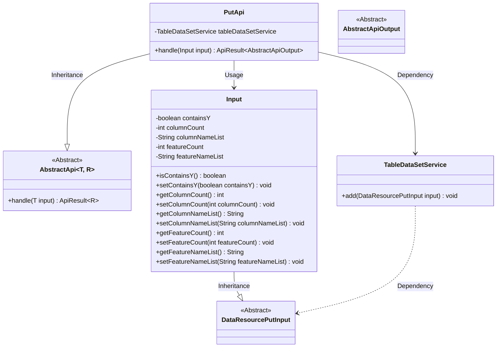
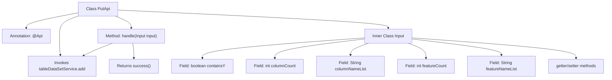

# Basic Information

|      |      |
|------|------|
| Name | PutApi |
| Language | .java |
| Code Path | WeFe/union/union-service/src/main/java/com/welab/wefe/union/service/api/dataresource/dataset/table/PutApi.java |
| Package Name | com.welab.wefe.union.service.api.dataresource.dataset.table |
| Dependencies | ['com.welab.wefe.common.exception.StatusCodeWithException', 'com.welab.wefe.common.fieldvalidate.annotation.Check', 'com.welab.wefe.common.web.api.base.AbstractApi', 'com.welab.wefe.common.web.api.base.Api', 'com.welab.wefe.common.web.dto.AbstractApiOutput', 'com.welab.wefe.common.web.dto.ApiResult', 'com.welab.wefe.union.service.dto.dataresource.DataResourcePutInput', 'com.welab.wefe.union.service.service.TableDataSetService', 'org.springframework.beans.factory.annotation.Autowired'] |
| Brief Description | This is an API class for adding tabular datasets, which includes input parameters such as the number of columns, the number of features, and the list of names. It stores the data into the database through the service layer. |

# Description

This is an API class named PutApi, designed for handling addition operations on tabular datasets. It inherits from AbstractApi, accepts Input-type parameters, and returns AbstractApiOutput. The API path is table_data_set/put, allowing signed access. Internally, it processes data via the add method of TableDataSetService.  

The Input class inherits from DataResourcePutInput and contains five fields: a mandatory boolean containsY, along with four optional fields—columnCount, columnNameList, featureCount, and featureNameList—representing the column count, column name list, feature count, and feature name list, respectively. All fields have corresponding getter and setter methods. Upon successful processing, it returns a success status.

# Class Summary

| Name   | Type  | Description |
|-------|------|-------------|
| PutApi | class | The PutApi class handles table dataset addition requests, with the path being table_data_set/put, requiring signed access. The input parameters include whether it contains Y, the number of columns, a list of column names, the number of features, and a list of feature names. It invokes the TableDataSetService.add method to process the data. |

## Class PutApi

|      |      |
|------|------|
| Access Modifier | @Api(path = "table_data_set/put", name = "table_data_set", allowAccessWithSign = true);public |
| Type | class |
| Name | PutApi |
| Description | The PutApi class handles table dataset addition requests, with the path being table_data_set/put, requiring signed access. The input parameters include whether it contains Y, the number of columns, a list of column names, the number of features, and a list of feature names. It invokes the TableDataSetService.add method to process the data. |

### UML Class Diagram

This class diagram illustrates the structural relationships of PutApi and its associated classes. PutApi inherits from the generic class AbstractApi, specifying Input as the input type and AbstractApiOutput as the output type. The Input class inherits from DataResourcePutInput and contains multiple private fields along with their getter/setter methods. PutApi utilizes TableDataSetService through dependency injection to perform data addition operations, demonstrating a clear hierarchical structure and dependency relationships. The entire design adheres to object-oriented principles, achieving good extensibility through abstract classes and interfaces.

### Internal Method Call Graph

This code illustrates an API class named PutApi, which extends AbstractApi and handles dataset addition operations. The flowchart clearly presents the class structure, including class annotations, service injection, core processing methods, and the nested Input data transfer object. The Input class contains five fields and corresponding getter/setter methods for encapsulating dataset feature information. The handle method implements core business logic by calling tableDataSetService.add, ultimately returning a success result. The entire design demonstrates clear hierarchical relationships and adherence to the single responsibility principle.

### Field List

| Name  | Type  | Description |
|-------|-------|------|
| tableDataSetService | TableDataSetService | Automatically inject the TableDataSetService service instance. |

### Method List

| Name  | Type  | Description |
|-------|-------|------|
| handle | ApiResult<AbstractApiOutput> | Java method override, calls tableDataSetService.add to process the input, returns ApiResult upon success. Throws StatusCodeWithException in case of exceptions. |

