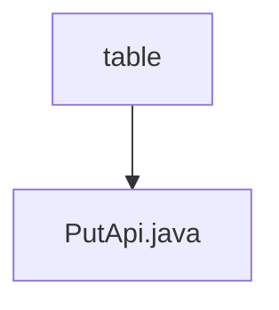

# Basic Information

|      |      |
|------|------|
| Name | table |
| Language | .java |
| Code Path | WeFe/union/union-service/src/main/java/com/welab/wefe/union/service/api/dataresource/dataset/table |
| Package Name | docs.union.union-service.src.main.java.com.welab.wefe.union.service.api.dataresource.dataset.table |
| Brief Description | This is an API class for adding tabular datasets, including input parameters such as the number of columns, the number of features, and the list of names, which stores the data into the database through the service layer. |

# Description

This is an API class named PutApi, designed for handling addition operations on tabular datasets. It inherits from AbstractApi, accepts Input-type parameters, and returns AbstractApiOutput. The API path is table_data_set/put, allowing signed access. Internally, it processes data through the add method of TableDataSetService.  

The Input class inherits from DataResourcePutInput and contains five fields: a mandatory boolean containsY, along with four optional fields—columnCount, columnNameList, featureCount, and featureNameList—representing the column count, column name list, feature count, and feature name list, respectively. All fields have corresponding getter and setter methods. Upon successful processing, it returns a success status.

### Package Internal Structure View

This flowchart illustrates the structural relationship within the data resource dataset table directory, where the table directory contains a PutApi.java file. It is a simple single-layer structure indicating that the PutApi interface file is directly stored under the table directory for handling data resource-related operations.

# File List

| Name   | Type  | Description |
|-------|------|-------------|
| [PutApi.java](PutApi.md) | file | This is an API class for adding tabular datasets, which includes input parameters such as the number of columns, the number of features, and a list of names. It stores the data in the database through the service layer. |

