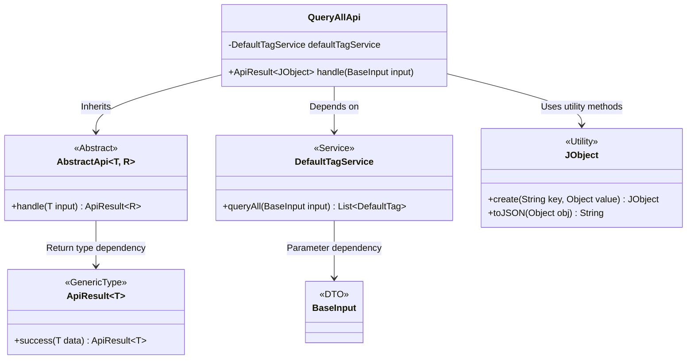
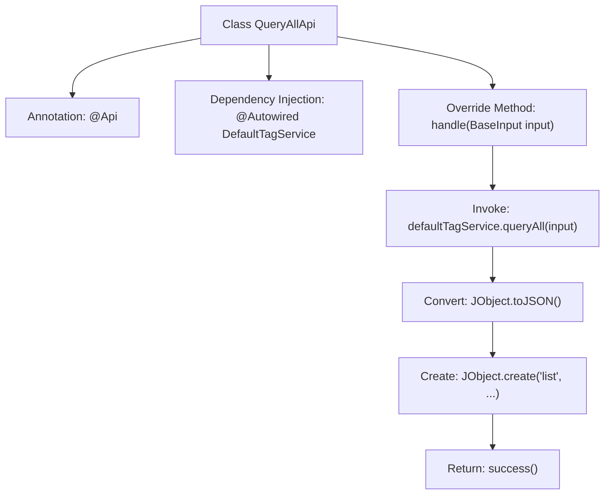

# Basic Information

|      |      |
|------|------|
| Name | QueryAllApi |
| Language | .java |
| Code Path | WeFe/union/union-service/src/main/java/com/welab/wefe/union/service/api/defaulttag/QueryAllApi.java |
| Package Name | com.welab.wefe.union.service.api.defaulttag |
| Dependencies | ['com.welab.wefe.common.util.JObject', 'com.welab.wefe.common.web.api.base.AbstractApi', 'com.welab.wefe.common.web.api.base.Api', 'com.welab.wefe.common.web.dto.ApiResult', 'com.welab.wefe.union.service.dto.base.BaseInput', 'com.welab.wefe.union.service.service.DefaultTagService', 'org.springframework.beans.factory.annotation.Autowired'] |
| Brief Description | The Java class QueryAllApi defines an API interface with the path default_tag/query, allowing signed access. It invokes the queryAll method of DefaultTagService to retrieve data and returns the results in JSON format. |

# Description

This is a Java class named QueryAllApi, which extends AbstractApi and is used to handle default tag query requests. The class is annotated with @Api, specifying the path as default_tag/query and allowing signed access. It autowires the DefaultTagService via @Autowired, overrides the handle method to invoke the queryAll method of defaultTagService for data retrieval, and wraps the result into a JObject containing a list field. The entire class implements the functionality of querying the default tag list.

# Class Summary

| Name   | Type  | Description |
|-------|------|-------------|
| QueryAllApi | class | This is a Java class that defines an API interface with the path "default_tag/query," allowing signed access. It inherits from AbstractApi, uses DefaultTagService to query data, and returns a list of results in JSON format. |

## Class QueryAllApi

|      |      |
|------|------|
| Access Modifier | @Api(path = "default_tag/query", name = "default_tag_query", allowAccessWithSign = true);public |
| Type | class |
| Name | QueryAllApi |
| Description | This is a Java class that defines an API interface with the path "default_tag/query," allowing signed access. It inherits from AbstractApi, uses DefaultTagService to query data, and returns a list of results in JSON format. |

### UML Class Diagram

This class diagram illustrates QueryAllApi as an implementation of AbstractApi, which utilizes DefaultTagService to accomplish tag query functionality. It involves BaseInput as the input DTO, JObject as the JSON utility class, and ApiResult as the generic return type wrapper. The components collaborate through clear dependency relationships to implement signed API query functionality, adhering to RESTful interface design specifications.

### Internal Method Call Graph

This code flowchart illustrates the core structure and workflow of the QueryAllApi class. The class is an API implementation annotated with @Api, which injects the DefaultTagService via @Autowired and overrides the handle method to process requests. The flow starts with receiving BaseInput, invokes the service layer to query data, converts the result to JSON format, wraps it into a JObject, and finally returns a successful ApiResult. The entire process demonstrates a typical API controller pattern, consisting of three main phases: dependency injection, business logic processing, and response encapsulation.

### Field List

| Name  | Type  | Description |
|-------|-------|------|
| defaultTagService | DefaultTagService | The code snippet uses the @Autowired annotation to automatically inject an instance of DefaultTagService. |

### Method List

| Name  | Type  | Description |
|-------|-------|------|
| handle | ApiResult<JObject> | Java method override, processes input and returns query results of tag list in JSON format. |

