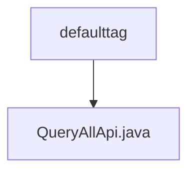

# Basic Information

|      |      |
|------|------|
| Name | defaulttag |
| Language | .java |
| Code Path | WeFe/union/union-service/src/main/java/com/welab/wefe/union/service/api/defaulttag |
| Package Name | docs.union.union-service.src.main.java.com.welab.wefe.union.service.api.defaulttag |
| Brief Description | The Java class QueryAllApi defines an API interface with the path default_tag/query, allowing signed access. It invokes the queryAll method of DefaultTagService to retrieve data and returns the result in JSON format. |

# Description

This is a Java class named QueryAllApi, which inherits from AbstractApi and is used to handle default tag query requests. The class is annotated with the @Api annotation, specifying the path as default_tag/query and allowing signed access. The class injects the DefaultTagService via @Autowired, overrides the handle method, calls the queryAll method of defaultTagService to retrieve data, and encapsulates the result into a JObject containing a list field for return. The entire class implements the functionality of querying the default tag list.

### Package Internal Structure View

This flowchart illustrates the hierarchical relationship between the defaulttag directory and the QueryAllApi.java file. As the parent directory, defaulttag contains a child file QueryAllApi.java, which represents a typical Java project API interface file storage structure, reflecting the subordinate relationship between a single interface file and its functional module.

# File List

| Name   | Type  | Description |
|-------|------|-------------|
| [QueryAllApi.java](QueryAllApi.md) | file | The Java class QueryAllApi defines an API interface with the path default_tag/query, allowing signed access. It invokes the queryAll method of DefaultTagService to retrieve data and returns the result in JSON format. |

