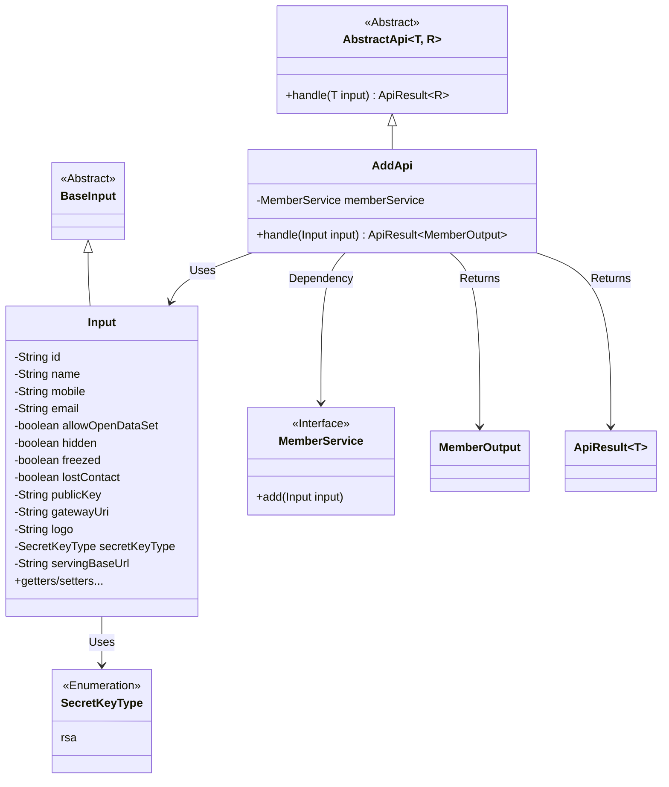

# Basic Information

|      |      |
|------|------|
| Name | AddApi |
| Language | .java |
| Code Path | WeFe/union/union-service/src/main/java/com/welab/wefe/union/service/api/member/AddApi.java |
| Package Name | com.welab.wefe.union.service.api.member |
| Dependencies | ['com.welab.wefe.common.constant.SecretKeyType', 'com.welab.wefe.common.exception.StatusCodeWithException', 'com.welab.wefe.common.fieldvalidate.annotation.Check', 'com.welab.wefe.common.web.api.base.AbstractApi', 'com.welab.wefe.common.web.api.base.Api', 'com.welab.wefe.common.web.dto.ApiResult', 'com.welab.wefe.union.service.dto.base.BaseInput', 'com.welab.wefe.union.service.dto.member.MemberOutput', 'com.welab.wefe.union.service.service.MemberService', 'org.springframework.beans.factory.annotation.Autowired'] |
| Brief Description | The `AddApi` class is used to add members, with the path `member/add`, requiring signed access. The input includes fields such as ID, name, contact information, etc., and outputs `MemberOutput`. The processing logic calls the `memberService.add` method. |

# Description

The code defines an API class named `AddApi`, which is used to add member information. The API path is `member/add`, and it does not allow signature access. The class inherits from `AbstractApi`, with the input type as `Input` and the output type as `MemberOutput`. The request to add a member is processed via `MemberService`.  

The `Input` class includes multiple member attributes such as `id`, `name`, `mobile`, `email`, etc., where `id` is a required field. It also contains various boolean status flags and configuration information, such as `allowOpenDataSet`, `hidden`, `freezed`, etc. All attributes are provided with getter and setter methods.  

In the processing logic, the `memberService.add` method is called, and a successful result is returned.

# Class Summary

| Name   | Type  | Description |
|-------|------|-------------|
| AddApi | class | The AddApi class is used to add members, including input parameters such as ID, name, contact information, etc., and calls the MemberService.add method to process the request. |

## Class AddApi

|      |      |
|------|------|
| Access Modifier | @Api(path = "member/add", name = "member_add", allowAccessWithSign = false);public |
| Type | class |
| Name | AddApi |
| Description | The AddApi class is used to add members, including input parameters such as ID, name, contact information, etc., and calls the MemberService.add method to process the request. |

### UML Class Diagram

This code demonstrates the implementation structure of a member addition API. AddApi inherits from the generic abstract class AbstractApi, processes Input parameters, and returns MemberOutput results. The Input class extends BaseInput and contains various fields for member information along with corresponding getter/setter methods. AddApi utilizes the MemberService interface through dependency injection to implement member addition functionality, with the SecretKeyType enum defining key types. The overall architecture reflects clear hierarchical relationships and separation of responsibilities.

### Internal Method Call Graph

```mermaid
graph TD
    A["Class AddApi"]
    B["Annotation: @Api"]
    C["Inheritance: AbstractApi<Input, MemberOutput>"]
    D["Dependency Injection: @Autowired MemberService"]
    E["Overridden Method: handle(Input input)"]
    F["Inner Class: Input"]
    G["Property: String id (Required)"]
    H["Property: String name"]
    I["Property: String mobile"]
    J["Property: String email"]
    K["Property: boolean allowOpenDataSet"]
    L["Property: boolean hidden"]
    M["Property: boolean freezed"]
    N["Property: boolean lostContact"]
    O["Property: String publicKey"]
    P["Property: String gatewayUri"]
    Q["Property: String logo"]
    R["Property: SecretKeyType secretKeyType"]
    S["Property: String servingBaseUrl"]
    T["Getter/Setter Methods"]

    A --> B
    A --> C
    A --> D
    A --> E
    A --> F
    F --> G
    F --> H
    F --> I
    F --> J
    F --> K
    F --> L
    F --> M
    F --> N
    F --> O
    F --> P
    F --> Q
    F --> R
    F --> S
    F --> T
    E --> D
    E --> F
```

This flowchart illustrates the complete structure of the AddApi class, including class annotations, inheritance relationships, the dependency-injected MemberService, the overridden handle method, and the Input inner class containing 13 properties with corresponding Getter/Setter methods. It highlights the validation annotation for the mandatory id field and the process where the handle method processes input parameters through memberService.add(). The class structure clearly demonstrates the separation design between API interfaces and business logic, with the Input inner class encapsulating all possible member property configuration items.

### Field List

| Name  | Type  | Description |
|-------|-------|------|
| memberService | MemberService | Using @Autowired to automatically inject an instance of MemberService. |

### Method List

| Name  | Type  | Description |
|-------|-------|------|
| handle | ApiResult<MemberOutput> | Process member addition requests, invoke service layer methods, and return successful results. |

