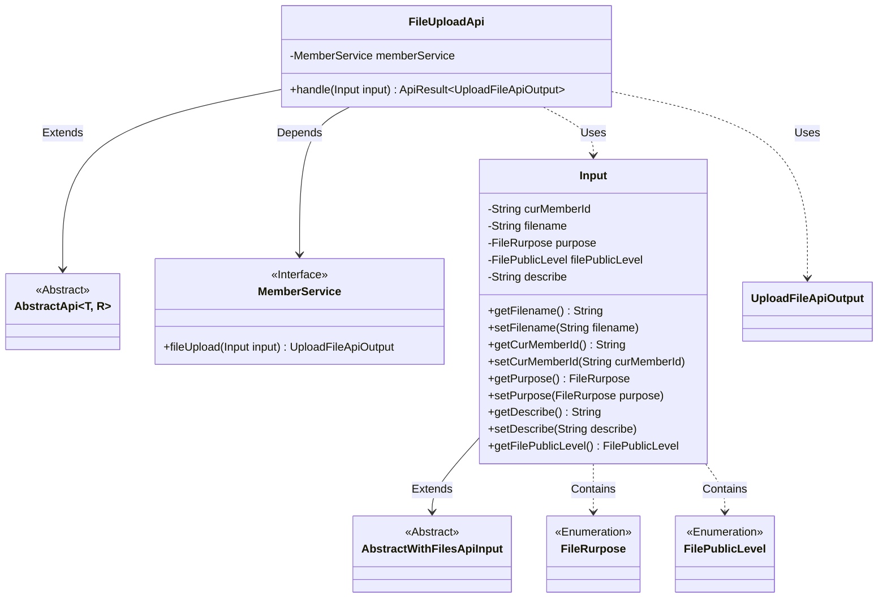
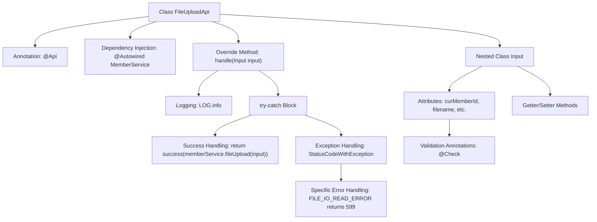

# Basic Information

|      |      |
|------|------|
| Name | FileUploadApi |
| Language | .java |
| Code Path | WeFe/union/union-service/src/main/java/com/welab/wefe/union/service/api/member/FileUploadApi.java |
| Package Name | com.welab.wefe.union.service.api.member |
| Dependencies | ['com.welab.wefe.common.StatusCode', 'com.welab.wefe.common.enums.FilePublicLevel', 'com.welab.wefe.common.exception.StatusCodeWithException', 'com.welab.wefe.common.fieldvalidate.annotation.Check', 'com.welab.wefe.common.web.api.base.AbstractApi', 'com.welab.wefe.common.web.api.base.Api', 'com.welab.wefe.common.web.dto.AbstractWithFilesApiInput', 'com.welab.wefe.common.web.dto.ApiResult', 'com.welab.wefe.common.web.dto.UploadFileApiOutput', 'com.welab.wefe.common.wefe.enums.FileRurpose', 'com.welab.wefe.union.service.service.MemberService', 'org.springframework.beans.factory.annotation.Autowired'] |
| Brief Description | File upload API class, handling member file upload requests, requires parameters such as member ID, file name, purpose, etc., supports private or public file levels, and returns specific error codes in case of exceptions. |

# Description

The code defines a file upload API class named FileUploadApi, which inherits from AbstractApi and handles file upload requests. The API path is member/file/upload, allowing signed access. The class injects MemberService, and its core method handle invokes memberService.fileUpload to process the upload logic. When catching exceptions, it specially handles the FILE_IO_READ_ERROR status code and returns a 599 HTTP status code. The input class Input inherits from AbstractWithFilesApiInput, containing required fields curMemberId, filename, and purpose, as well as optional fields filePublicLevel (defaulting to Private) and describe. Each field has getter/setter methods.

# Class Summary

| Name   | Type  | Description |
|-------|------|-------------|
| FileUploadApi | class | File Upload API class, handles member file upload requests, requires mandatory parameters such as member ID, file name, and purpose, supports private or public file settings, and returns specific error codes in case of exceptions. |

## Class FileUploadApi

|      |      |
|------|------|
| Access Modifier | @Api(path = "member/file/upload", name = "member_file_upload", allowAccessWithSign = true);public |
| Type | class |
| Name | FileUploadApi |
| Description | File Upload API class, handles member file upload requests, requires mandatory parameters such as member ID, file name, and purpose, supports private or public file settings, and returns specific error codes in case of exceptions. |

### UML Class Diagram

This code demonstrates the implementation class FileUploadApi for a file upload API, which inherits from the generic abstract class AbstractApi, processes Input parameters, and returns UploadFileApiOutput results. The Input class inherits from AbstractWithFilesApiInput and includes file-related attributes and enumeration type fields. FileUploadApi utilizes the MemberService interface through dependency injection to implement file upload functionality and handles potential exception status codes. The class diagram clearly illustrates the inheritance, dependency, and association relationships among the components.

### Internal Method Call Graph

This code demonstrates the implementation of a file upload API, including the main class FileUploadApi and a nested input class Input. The flowchart clearly illustrates the class structure relationships, encompassing API annotations, service injection, core processing methods with their exception handling logic, and input parameter validation mechanisms. The nested Input class meticulously defines the required fields for file upload and their access methods, with the entire design reflecting layered processing and defensive programming principles.

### Field List

| Name  | Type  | Description |
|-------|-------|------|
| memberService | MemberService | Automatically inject the MemberService instance. |

### Method List

| Name  | Type  | Description |
|-------|-------|------|
| handle | ApiResult<UploadFileApiOutput> | Handle file upload requests, return the upload result upon success, return status code 599 for read errors, and directly throw other exceptions. |

