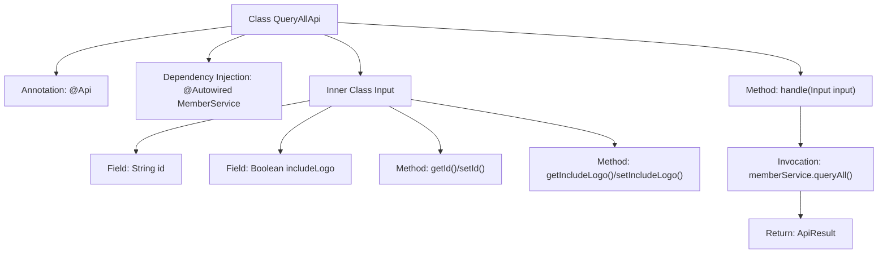

# Basic Information

|      |      |
|------|------|
| Name | QueryAllApi |
| Language | .java |
| Code Path | WeFe/union/union-service/src/main/java/com/welab/wefe/union/service/api/member/QueryAllApi.java |
| Package Name | com.welab.wefe.union.service.api.member |
| Dependencies | ['com.welab.wefe.common.util.JObject', 'com.welab.wefe.common.web.api.base.AbstractApi', 'com.welab.wefe.common.web.api.base.Api', 'com.welab.wefe.common.web.dto.AbstractApiInput', 'com.welab.wefe.common.web.dto.ApiResult', 'com.welab.wefe.union.service.service.MemberService', 'org.springframework.beans.factory.annotation.Autowired'] |
| Brief Description | This is an API class for querying all members, with the path "member/query_all", supporting signature-based access and a log sampling interval of 60 seconds. The input parameters include ID and whether to include a logo, and it returns JSON data of the member list. |

# Description

The code defines an API class named QueryAllApi, which is used to query all member information. The API path is member/query_all, allowing signed access with a log sampling interval of 60 seconds. The input parameters include an optional ID (querying all when empty) and a boolean includeLogo (defaulting to true). The processing logic calls the memberService.queryAll method and returns a JSON result containing the member list.

# Class Summary

| Name   | Type  | Description |
|-------|------|-------------|
| QueryAllApi | class | Defined an API endpoint for querying all members, with the path `member/query_all`, supporting signed access and a log sampling interval of 60 seconds. The input parameters include the primary key ID and whether to include logos, with the default behavior being to query all members and return a JSON-formatted list. |


## Class QueryAllApi

|      |      |
|------|------|
| Access Modifier | @Api(path = "member/query_all", name = "member_query_all", allowAccessWithSign = true, logSaplingInterval = 60_000);public |
| Type | class |
| Name | QueryAllApi |
| Description | Defined an API endpoint for querying all members, with the path `member/query_all`, supporting signed access and a log sampling interval of 60 seconds. The input parameters include the primary key ID and whether to include logos, with the default behavior being to query all members and return a JSON-formatted list. |


### UML Class Diagram

```mermaid
classDiagram
    class QueryAllApi {
        -MemberService memberService
        +handle(QueryAllApi~Input~ input) ApiResult~JObject~
    }
    QueryAllApi --> MemberService : Dependency

    class MemberService {
        <<Interface>>
        +queryAll(QueryAllApi~Input~ input) List~Member~
    }

    class AbstractApi~T, R~ {
        <<Abstract>>
        +handle(T input) ApiResult~R~
    }
    QueryAllApi --|> AbstractApi~QueryAllApi~Input~, JObject~

    class AbstractApiInput {
        <<Abstract>>
    }
    QueryAllApi~Input~ --|> AbstractApiInput

    class QueryAllApi~Input~ {
        -String id
        -Boolean includeLogo
        +String getId()
        +void setId(String id)
        +Boolean getIncludeLogo()
        +void setIncludeLogo(Boolean includeLogo)
    }

    class JObject {
        +create(String key, Object value) JObject
        +toJSON(Object obj) String
    }
```

This class diagram illustrates the structure of QueryAllApi and its related classes. QueryAllApi inherits from the generic abstract class AbstractApi, processing Input-type parameters and returning JObject results. It depends on the MemberService interface to query member data, while the Input class inherits from AbstractApiInput and contains id and includeLogo fields. JObject provides JSON utility methods. The overall design adheres to API layered architecture, achieving type-safe extension through generics and abstract classes.


### Internal Method Call Graph



This code defines an API class named QueryAllApi, which inherits from AbstractApi and is used to query all member information. The class configures API paths and access permissions through the @Api annotation, utilizing MemberService to handle business logic. The inner class Input defines query parameters id and includeLogo, along with corresponding getter and setter methods. The handle method invokes memberService.queryAll() to retrieve data and encapsulates the result as ApiResult<JObject> for return. The flowchart clearly illustrates the class structure, fields, method invocation relationships, and data flow.

### Field List

| Name  | Type  | Description |
|-------|-------|------|
| memberService | MemberService | Use @Autowired to automatically inject an instance of MemberService. |

### Method List

| Name  | Type  | Description |
|-------|-------|------|
| handle | ApiResult<JObject> | This method overrides the parent class logic, receives input parameters, invokes the member service to query all data, converts the results into JSON format, and encapsulates them into a successful response for return. |


