# Basic Information

|      |      |
|------|------|
| Name | QueryApi |
| Language | .java |
| Code Path | WeFe/union/union-service/src/main/java/com/welab/wefe/union/service/api/member/QueryApi.java |
| Package Name | com.welab.wefe.union.service.api.member |
| Dependencies | ['com.welab.wefe.common.data.mongodb.dto.PageOutput', 'com.welab.wefe.common.exception.StatusCodeWithException', 'com.welab.wefe.common.web.api.base.AbstractApi', 'com.welab.wefe.common.web.api.base.Api', 'com.welab.wefe.common.web.dto.ApiResult', 'com.welab.wefe.union.service.dto.base.BaseInput', 'com.welab.wefe.union.service.dto.member.MemberQueryOutput', 'com.welab.wefe.union.service.service.MemberService', 'org.springframework.beans.factory.annotation.Autowired'] |
| Brief Description | Member Query API, supports signature-based access, with input parameters including ID, name, and pagination information. It invokes MemberService to query and returns paginated results. |

# Description

The code defines an API class named QueryApi for querying member information. The API path is member/query and supports signed access. It inherits from AbstractApi, with the input type being QueryApi.Input and the output being paginated MemberQueryOutput. The inner class Input includes fields for id, name, pageIndex, and pageSize, along with corresponding getter/setter methods. The processing logic is implemented through the query method of MemberService, returning paginated query results. The default pagination parameters are 10 entries per page, starting from page index 0.

# Class Summary

| Name   | Type  | Description |
|-------|------|-------------|
| QueryApi | class | The QueryApi class is used for paginated queries of member information, including parameters such as ID and name, with a default of 10 records per page, and it calls the MemberService to process the request. |


## Class QueryApi

|      |      |
|------|------|
| Access Modifier | @Api(path = "member/query", name = "member_query", allowAccessWithSign = true);public |
| Type | class |
| Name | QueryApi |
| Description | The QueryApi class is used for paginated queries of member information, including parameters such as ID and name, with a default of 10 records per page, and it calls the MemberService to process the request. |


### UML Class Diagram

```mermaid
classDiagram
    class QueryApi {
        -MemberService memberService
        +handle(Input input) ApiResult~PageOutput~MemberQueryOutput~~~
    }
    
    class Input {
        -String id
        -String name
        -Integer pageIndex
        -Integer pageSize
        +String getId()
        +void setId(String id)
        +String getName()
        +void setName(String name)
        +Integer getPageIndex()
        +void setPageIndex(Integer pageIndex)
        +Integer getPageSize()
        +void setPageSize(Integer pageSize)
    }
    
    class AbstractApi~T, R~ {
        <<Abstract>>
    }
    
    class MemberService {
        <<Interface>>
    }
    
    class PageOutput~T~ {
        <<Generic>>
    }
    
    class MemberQueryOutput {
    }
    
    class ApiResult~T~ {
        <<Generic>>
    }
    
    class BaseInput {
    }
    
    QueryApi --> AbstractApi~Input, PageOutput~MemberQueryOutput~~~ : Extends
    QueryApi --> MemberService : Depends on
    Input --> BaseInput : Extends
    AbstractApi~T, R~ <|-- QueryApi : Implements
    PageOutput~T~ --> MemberQueryOutput : Contains
    ApiResult~T~ --> PageOutput~MemberQueryOutput~ : Contains
```

This code demonstrates a query API implementation based on the Spring framework. The QueryApi class inherits from the generic abstract class AbstractApi, handling Member query requests and executing actual queries through the MemberService interface. The Input inner class encapsulates query parameters (ID, name, pagination info) and extends the BaseInput base class. The architecture achieves clear layer separation: API entry point, business logic processing, data transfer objects, and paginated result encapsulation, reflecting a typical Controller-Service layered design pattern. The generic classes PageOutput and ApiResult provide type-safe response encapsulation mechanisms.


### Internal Method Call Graph

```mermaid
graph TD
    A["Class QueryApi"]
    B["Annotation: @Api"]
    C["Inheritance: AbstractApi<Input, PageOutput<MemberQueryOutput>>"]
    D["Dependency Injection: @Autowired MemberService"]
    E["Overridden Method: handle(Input input)"]
    F["Inner Class: Input"]
    G["Field: String id"]
    H["Field: String name"]
    I["Field: Integer pageIndex"]
    J["Field: Integer pageSize"]
    K["getter/setter methods"]

    A --> B
    A --> C
    A --> D
    A --> E
    A --> F
    F --> G
    F --> H
    F --> I
    F --> J
    F --> K
    E --> D["Invokes memberService.query(input)"]
    E --> C["Returns ApiResult<PageOutput<MemberQueryOutput>>"]
```



This code demonstrates a Spring framework-based query API implementation, primarily consisting of the main QueryApi class and its nested Input parameter class. The flowchart clearly illustrates class inheritance relationships, dependency injection, core method invocation chains, and parameter structures. QueryApi processes input parameters through the handle method, invokes MemberService to execute queries, and returns paginated results. The Input class encapsulates query conditions (id/name) and pagination parameters (pageIndex/pageSize), providing access control via getter/setter methods. The overall design follows common RESTful API patterns.

### Field List

| Name  | Type  | Description |
|-------|-------|------|
| memberService | MemberService | Use @Autowired to automatically inject an instance of MemberService. |

### Method List

| Name  | Type  | Description |
|-------|-------|------|
| handle | ApiResult<PageOutput<MemberQueryOutput>> | Process member query requests, invoke service layer methods, and return paginated results. |


