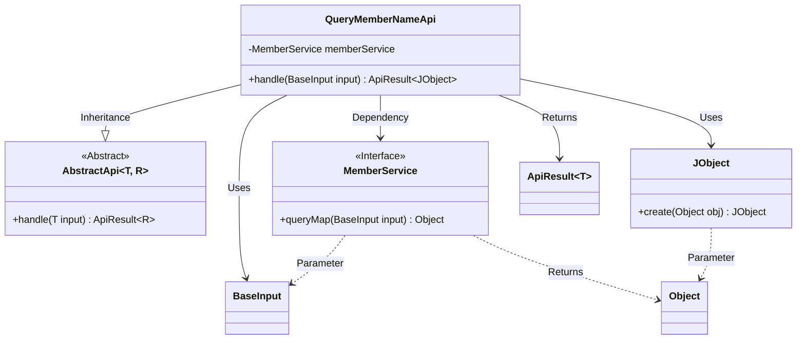
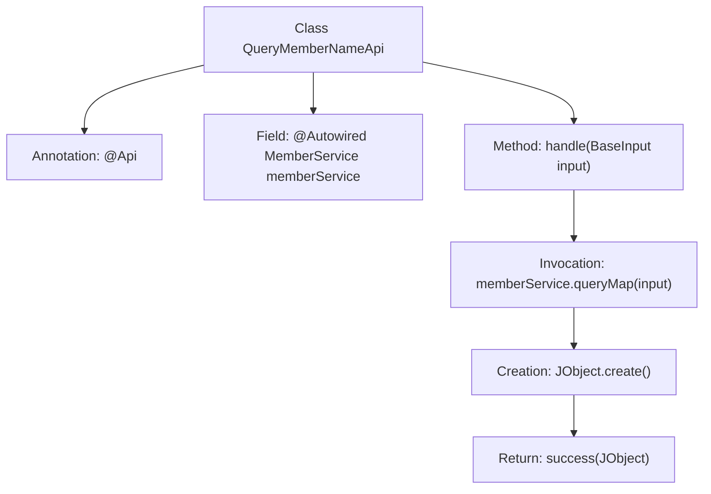

# Basic Information

|      |      |
|------|------|
| Name | QueryMemberNameApi |
| Language | .java |
| Code Path | WeFe/union/union-service/src/main/java/com/welab/wefe/union/service/api/member/QueryMemberNameApi.java |
| Package Name | com.welab.wefe.union.service.api.member |
| Dependencies | ['com.welab.wefe.common.exception.StatusCodeWithException', 'com.welab.wefe.common.util.JObject', 'com.welab.wefe.common.web.api.base.AbstractApi', 'com.welab.wefe.common.web.api.base.Api', 'com.welab.wefe.common.web.dto.ApiResult', 'com.welab.wefe.union.service.dto.base.BaseInput', 'com.welab.wefe.union.service.service.MemberService', 'org.springframework.beans.factory.annotation.Autowired'] |
| Brief Description | This is an API class named member_map, with the path member/map, allowing signed access. It inherits from AbstractApi, uses MemberService to query member information, and returns JSON results. |

# Description

The code defines an API class named QueryMemberNameApi with the path "member/map", the name "member_map", and allows access with a signature. It inherits from AbstractApi, uses BaseInput as the input type, and JObject as the output type. The class injects the MemberService member service and calls memberService.queryMap through the handle method to process the input, returning the result encapsulated as a successful JObject. This API is used to query member name mapping information.

# Class Summary

| Name   | Type  | Description |
|-------|------|-------------|
| QueryMemberNameApi | class | Defined an API class named QueryMemberNameApi with the path member/map, allowing signed access, which queries member information through MemberService and returns JSON results. |

## Class QueryMemberNameApi

|      |      |
|------|------|
| Access Modifier | @Api(path = "member/map", name = "member_map", allowAccessWithSign = true);public |
| Type | class |
| Name | QueryMemberNameApi |
| Description | Defined an API class named QueryMemberNameApi with the path member/map, allowing signed access, which queries member information through MemberService and returns JSON results. |

### UML Class Diagram

This code demonstrates a member query API class `QueryMemberNameApi` implemented based on the abstract class `AbstractApi`. The class queries member information through the `MemberService` interface and encapsulates the result as `JObject` for return. The class diagram clearly shows inheritance relationships (`AbstractApi`), dependency injection (`MemberService`), and input/output data types (`BaseInput` and `JObject`). This API employs generic design with `BaseInput` as the input type and `ApiResult` containing `JObject` as the return type, reflecting a well-layered architecture and type-safe characteristics.

### Internal Method Call Graph

This code demonstrates a QueryMemberNameApi class that inherits from AbstractApi, primarily designed to handle member name query requests. The class defines API paths and permissions via the @Api annotation and injects MemberService for business logic processing. The core method handle receives a BaseInput parameter, invokes memberService.queryMap to retrieve data, wraps it into JObject format, and finally returns an ApiResult via the success method. The entire flow clearly illustrates the complete call chain from request processing to result return.

### Field List

| Name  | Type  | Description |
|-------|-------|------|
| memberService | MemberService | Using @Autowired to automatically inject an instance of MemberService. |

### Method List

| Name  | Type  | Description |
|-------|-------|------|
| handle | ApiResult<JObject> | This is a Java method that overrides the parent class method, calls the memberService to query data, and returns a successful result. |

