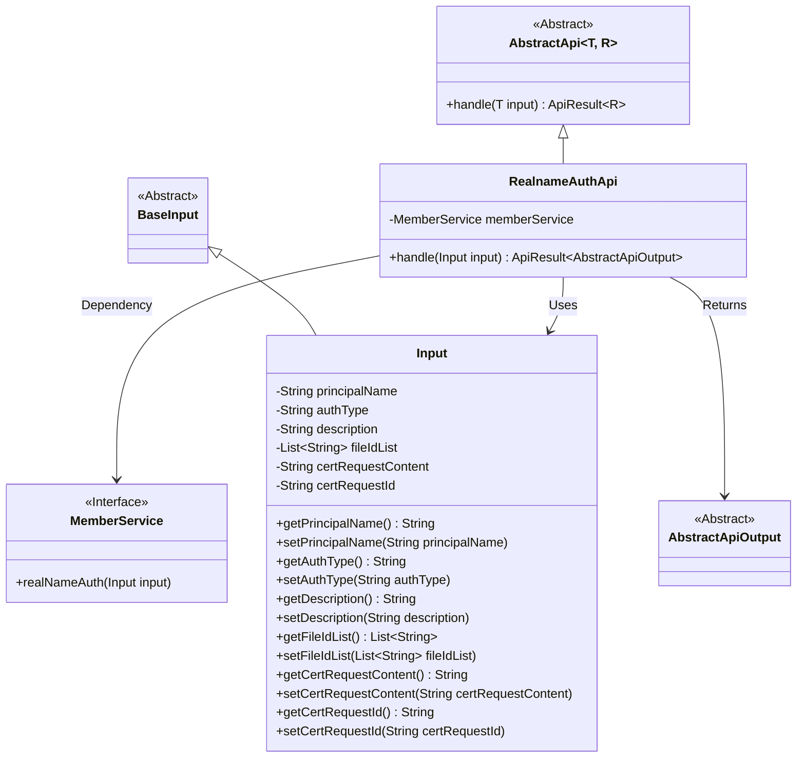

# Basic Information

|      |      |
|------|------|
| Name | RealnameAuthApi |
| Language | .java |
| Code Path | WeFe/union/union-service/src/main/java/com/welab/wefe/union/service/api/member/RealnameAuthApi.java |
| Package Name | com.welab.wefe.union.service.api.member |
| Dependencies | ['com.welab.wefe.common.exception.StatusCodeWithException', 'com.welab.wefe.common.fieldvalidate.annotation.Check', 'com.welab.wefe.common.web.api.base.AbstractApi', 'com.welab.wefe.common.web.api.base.Api', 'com.welab.wefe.common.web.dto.AbstractApiOutput', 'com.welab.wefe.common.web.dto.ApiResult', 'com.welab.wefe.union.service.dto.base.BaseInput', 'com.welab.wefe.union.service.service.MemberService', 'org.springframework.beans.factory.annotation.Autowired', 'java.util.List'] |
| Brief Description | Real-name Authentication API class, handling user real-name authentication requests, including mandatory fields such as name, authentication type, file list, certificate request content, and ID, invoking MemberService to complete the authentication. |

# Description

The RealnameAuthApi is an API class designed for handling member real-name authentication, located at the path member/realname/auth and allowing signed access. It inherits from AbstractApi, with Input as the input type and AbstractApiOutput as the output. The real-name authentication request is processed via MemberService, and the handling process is logged. The Input class includes mandatory fields principalName, authType, fileIdList, certRequestContent, certRequestId, and an optional field description, providing getter and setter methods for each field.

# Class Summary

| Name   | Type  | Description |
|-------|------|-------------|
| RealnameAuthApi | class | The RealnameAuthApi is an API for handling real-name authentication. It requires mandatory fields such as principalName, authType, and fileIdList to be passed in, invokes the memberService to complete the authentication, and returns the result. |

## Class RealnameAuthApi

|      |      |
|------|------|
| Access Modifier | @Api(path = "member/realname/auth", name = "member_realname_auth", allowAccessWithSign = true);public |
| Type | class |
| Name | RealnameAuthApi |
| Description | The RealnameAuthApi is an API for handling real-name authentication. It requires mandatory fields such as principalName, authType, and fileIdList to be passed in, invokes the memberService to complete the authentication, and returns the result. |

### UML Class Diagram

This code demonstrates the implementation structure of a real-name authentication API. RealnameAuthApi inherits from AbstractApi, processes Input parameters containing multiple mandatory fields, and completes real-name authentication operations through the MemberService interface. The class diagram clearly shows inheritance relationships (AbstractApi→RealnameAuthApi, BaseInput→Input), dependency relationships (RealnameAuthApi uses MemberService), and input/output type associations. The Input class contains 7 fields, with 5 being mandatory, validated via @Check annotations. The overall design adheres to the API layer's data processing pattern, achieving separation between business logic and framework.

### Internal Method Call Graph

```mermaid
graph TD
    A["Class RealnameAuthApi"]
    B["Annotation: @Api"]
    C["Inheritance: AbstractApi<Input, AbstractApiOutput>"]
    D["Dependency Injection: @Autowired MemberService"]
    E["Overridden Method: handle(Input input)"]
    F["Inner Class: Input"]
    G["Field: String principalName"]
    H["Field: String authType"]
    I["Field: String description"]
    J["Field: List<String> fileIdList"]
    K["Field: String certRequestContent"]
    L["Field: String certRequestId"]
    M["Getter/Setter Methods"]

    A --> B
    A --> C
    A --> D
    A --> E
    A --> F
    F --> G
    F --> H
    F --> I
    F --> J
    F --> K
    F --> L
    F --> M
```

This code defines a real-name authentication API class RealnameAuthApi, which inherits from AbstractApi and implements the handle method. The class includes MemberService dependency injection and an Input inner class. The Input class encapsulates 7 authentication-related fields and their access methods. The flowchart illustrates the class structure, inheritance relationship, dependency injection, and inner class composition, highlighting the core processing method and data carrier structure.

### Field List

| Name  | Type  | Description |
|-------|-------|------|
| memberService | MemberService | Using @Autowired to automatically inject an instance of MemberService. |

### Method List

| Name  | Type  | Description |
|-------|-------|------|
| handle | ApiResult<AbstractApiOutput> | Rewrite the handle method to call the memberService for real-name authentication and return a successful result. |

