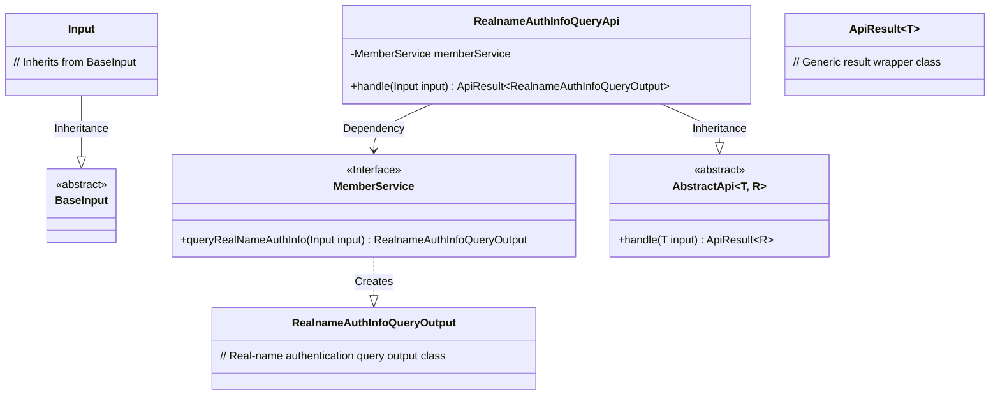
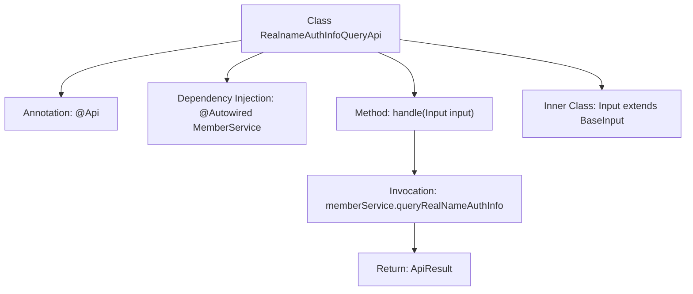

# Basic Information

|      |      |
|------|------|
| Name | RealnameAuthInfoQueryApi |
| Language | .java |
| Code Path | WeFe/union/union-service/src/main/java/com/welab/wefe/union/service/api/member/RealnameAuthInfoQueryApi.java |
| Package Name | com.welab.wefe.union.service.api.member |
| Dependencies | ['com.welab.wefe.common.data.mongodb.dto.member.RealnameAuthInfoQueryOutput', 'com.welab.wefe.common.exception.StatusCodeWithException', 'com.welab.wefe.common.web.api.base.AbstractApi', 'com.welab.wefe.common.web.api.base.Api', 'com.welab.wefe.common.web.dto.ApiResult', 'com.welab.wefe.union.service.dto.base.BaseInput', 'com.welab.wefe.union.service.service.MemberService', 'org.springframework.beans.factory.annotation.Autowired'] |
| Brief Description | This is an API interface for querying member real-name authentication information, which uses signature verification for access control, invokes MemberService to process requests, and returns results. |

# Description

This is an API class named RealnameAuthInfoQueryApi, used to query member real-name authentication information. It inherits from AbstractApi, accepts Input as the input parameter, and returns a result of type RealnameAuthInfoQueryOutput. The API path is member/realname/authInfo/query, allowing signed access. The class injects MemberService and processes the request by calling its queryRealNameAuthInfo method. Input is a static inner class that inherits from BaseInput. The handle method is responsible for processing the request and returning a successful result.

# Class Summary

| Name   | Type  | Description |
|-------|------|-------------|
| RealnameAuthInfoQueryApi | class | This is an API for querying real-name authentication information, with the path member/realname/authInfo/query. It requires signed access, calls MemberService to process the request, and returns the result. |

## Class RealnameAuthInfoQueryApi

|      |      |
|------|------|
| Access Modifier | @Api(path = "member/realname/authInfo/query", name = "member/realname/authInfo/query", allowAccessWithSign = true);public |
| Type | class |
| Name | RealnameAuthInfoQueryApi |
| Description | This is an API for querying real-name authentication information, with the path member/realname/authInfo/query. It requires signed access, calls MemberService to process the request, and returns the result. |

### UML Class Diagram

Class Diagram Description: The diagram illustrates the class structure of the real-name authentication query API. The core class RealnameAuthInfoQueryApi inherits from the generic abstract class AbstractApi and implements business logic by depending on the MemberService interface. It includes the nested class Input inheriting from BaseInput, with the MemberService interface responsible for generating RealnameAuthInfoQueryOutput results. The design employs generics, clearly separating input and output types, adhering to object-oriented design principles.

### Internal Method Call Graph

This flowchart illustrates the core structure of the RealnameAuthInfoQueryApi class. The class defines the API path via the @Api annotation and injects the MemberService dependency through @Autowired. The main business logic is implemented in the handle method, which calls memberService.queryRealNameAuthInfo and returns the encapsulated result. Input serves as a static inner class inheriting from BaseInput for parameter passing. The overall flow clearly demonstrates the call chain from request processing to result return.

### Field List

| Name  | Type  | Description |
|-------|-------|------|
| memberService | MemberService | Automatically inject the MemberService instance. |

### Method List

| Name  | Type  | Description |
|-------|-------|------|
| handle | ApiResult<RealnameAuthInfoQueryOutput> | Rewrite the method to query real-name authentication information by calling the memberService and return the result. |

