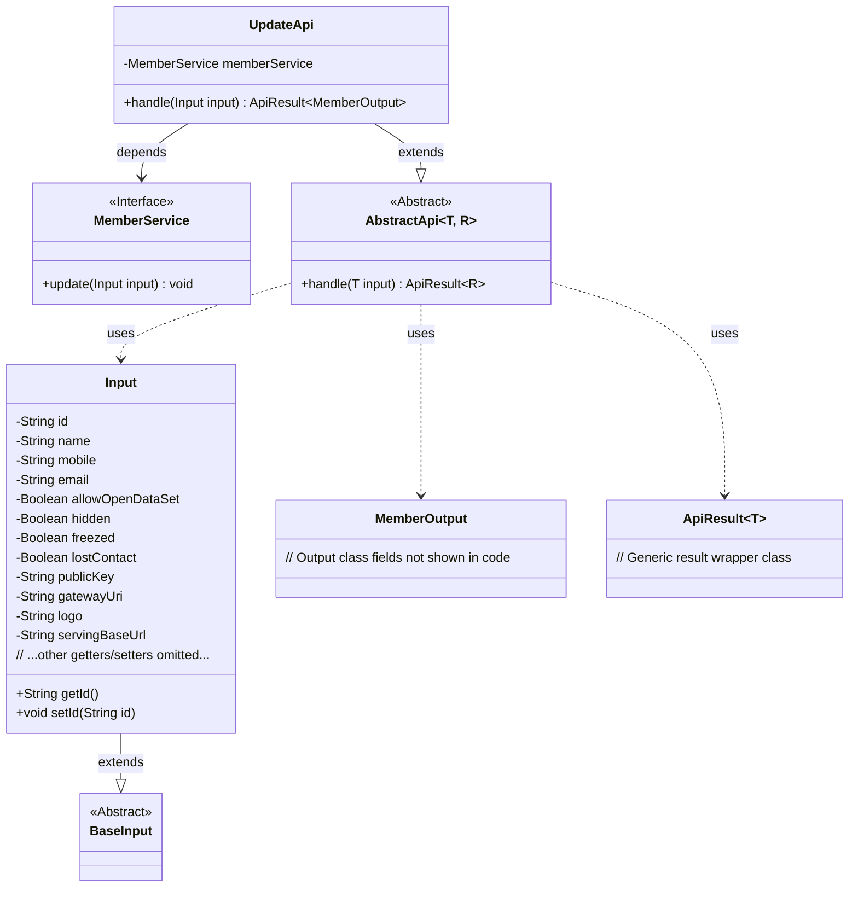

# Basic Information

|      |      |
|------|------|
| Name | UpdateApi |
| Language | .java |
| Code Path | WeFe/union/union-service/src/main/java/com/welab/wefe/union/service/api/member/UpdateApi.java |
| Package Name | com.welab.wefe.union.service.api.member |
| Dependencies | ['com.welab.wefe.common.exception.StatusCodeWithException', 'com.welab.wefe.common.fieldvalidate.annotation.Check', 'com.welab.wefe.common.web.api.base.AbstractApi', 'com.welab.wefe.common.web.api.base.Api', 'com.welab.wefe.common.web.dto.ApiResult', 'com.welab.wefe.union.service.dto.base.BaseInput', 'com.welab.wefe.union.service.dto.member.MemberOutput', 'com.welab.wefe.union.service.service.MemberService', 'org.springframework.beans.factory.annotation.Autowired'] |
| Brief Description | Member update API, requires signature authentication. The input includes fields such as ID, name, contact information, etc., and calls MemberService to update the data. |

# Description

This is a Java class named UpdateApi, designed to handle member information update requests. It extends AbstractApi, accepts input parameters of type Input, and returns results of type MemberOutput. The class is annotated with @Api, defining the path as member/update and allowing signed access. The inner class Input includes multiple member attributes such as id, name, mobile, email, etc., with id and publicKey being mandatory fields. The class utilizes the injected MemberService to call the update method for processing the update logic, returning an empty result upon success.

# Class Summary

| Name   | Type  | Description |
|-------|------|-------------|
| UpdateApi | class | API for updating member information, including fields such as ID, name, contact details, etc. The mandatory fields are ID and public key, and the update operation is performed by calling MemberService. |

## Class UpdateApi

|      |      |
|------|------|
| Access Modifier | @Api(path = "member/update", name = "member_update", allowAccessWithSign = true);public |
| Type | class |
| Name | UpdateApi |
| Description | API for updating member information, including fields such as ID, name, contact details, etc. The mandatory fields are ID and public key, and the update operation is performed by calling MemberService. |

### UML Class Diagram

This code demonstrates the implementation structure of a member update API. UpdateApi inherits from the generic abstract class AbstractApi, processes Input parameters, and returns MemberOutput results. The Input class extends BaseInput and contains multiple member fields with validation annotations. The MemberService interface provides core business logic and is invoked by UpdateApi through dependency injection. The overall design follows a layered architecture with separation of input/output and business logic, conforming to common API development patterns.

### Internal Method Call Graph

```mermaid
graph TD
    A["Class UpdateApi"]
    B["Annotation: @Api"]
    C["Inheritance: AbstractApi<Input, MemberOutput>"]
    D["Dependency Injection: @Autowired MemberService"]
    E["Overridden Method: handle(Input input)"]
    F["Inner Class: Input extends BaseInput"]
    G["Field Collection: id/name/mobile/email etc."]
    H["Getter/Setter Method Group"]

    A -->|"Defines API metadata"| B
    A -->|"Extends parent class"| C
    A -->|"Injects service"| D
    A -->|"Core processing"| E
    A -->|"Input parameter"| F
    F -->|"Contains"| G
    F -->|"Provides"| H
    E -->|"Invokes"| D
    E -->|"Parameter"| F
```

This flowchart illustrates the complete structure of the UpdateApi class: defining interface metadata via the @Api annotation, inheriting from an abstract parent class for generic logic, and relying on MemberService for business operations. The core handle method accepts Input parameters (containing 12 fields and their access methods), invokes the service layer to complete update operations, and returns uniformly encapsulated results. The class structure clearly reflects the layered design of control layer, parameter validation, and service invocation.

### Field List

| Name  | Type  | Description |
|-------|-------|------|
| memberService | MemberService | Automatically inject the MemberService instance. |

### Method List

| Name  | Type  | Description |
|-------|-------|------|
| handle | ApiResult<MemberOutput> | Method overrides the input processing, invokes memberService to update data, and returns the result upon success. Throws StatusCodeWithException in case of exceptions. |

