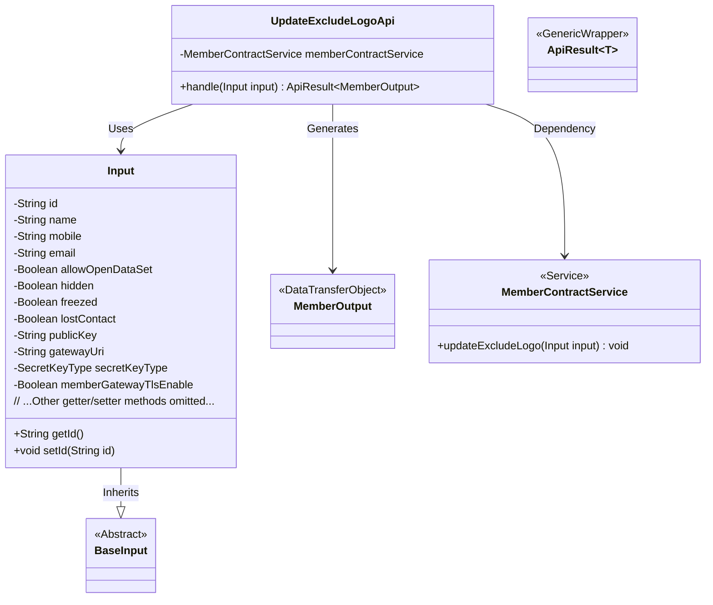

# Basic Information

|      |      |
|------|------|
| Name | UpdateExcludeLogoApi |
| Language | .java |
| Code Path | WeFe/union/union-service/src/main/java/com/welab/wefe/union/service/api/member/UpdateExcludeLogoApi.java |
| Package Name | com.welab.wefe.union.service.api.member |
| Dependencies | ['com.welab.wefe.common.constant.SecretKeyType', 'com.welab.wefe.common.exception.StatusCodeWithException', 'com.welab.wefe.common.fieldvalidate.annotation.Check', 'com.welab.wefe.common.web.api.base.AbstractApi', 'com.welab.wefe.common.web.api.base.Api', 'com.welab.wefe.common.web.dto.ApiResult', 'com.welab.wefe.union.service.dto.base.BaseInput', 'com.welab.wefe.union.service.dto.member.MemberOutput', 'com.welab.wefe.union.service.service.contract.MemberContractService', 'org.springframework.beans.factory.annotation.Autowired'] |
| Brief Description | Update member information interface, path member/update_exclude_logo, requires signature authentication. The input includes mandatory fields such as id, public key, and other optional fields, which call the MemberContractService to update data. |

# Description

The code defines an API class named `UpdateExcludeLogoApi` with the path `member/update_exclude_logo`, allowing signed access. It inherits from `AbstractApi`, with `Input` as the input type and `MemberOutput` as the output type. The update operation is processed via `MemberContractService`.  

The `Input` class contains multiple fields, where `id` and `publicKey` are mandatory, while other fields such as `name`, `mobile`, `email`, etc., are optional. It also includes boolean-type fields like `allowOpenDataSet`, `hidden`, `freezed`, etc., as well as configuration items such as `secretKeyType` and `memberGatewayTlsEnable`. All fields are provided with getter and setter methods.

# Class Summary

| Name   | Type  | Description |
|-------|------|-------------|
| UpdateExcludeLogoApi | class | Update member information interface, path member/update_exclude_logo, requires signature authentication. Input includes fields such as ID and public key, calls MemberContractService to update data, returns MemberOutput. |

## Class UpdateExcludeLogoApi

|      |      |
|------|------|
| Access Modifier | @Api(path = "member/update_exclude_logo", name = "member_update_exclude_logo", allowAccessWithSign = true);public |
| Type | class |
| Name | UpdateExcludeLogoApi |
| Description | Update member information interface, path member/update_exclude_logo, requires signature authentication. Input includes fields such as ID and public key, calls MemberContractService to update data, returns MemberOutput. |

### UML Class Diagram

This class diagram illustrates the core structure of the member information update API. UpdateExcludeLogoApi inherits from AbstractApi, processes business logic through MemberContractService, uses the nested Input class as a parameter carrier that inherits from BaseInput, and returns ApiResult-wrapped MemberOutput results. The Input class contains fields such as member ID, contact details, status flags, etc., with parameter validation implemented via @Check annotations, demonstrating clear responsibility layering and type-safe design.

### Internal Method Call Graph

```mermaid
graph TD
    A["Class UpdateExcludeLogoApi"]
    B["Annotation: @Api"]
    C["Inheritance: AbstractApi<Input, MemberOutput>"]
    D["Dependency Injection: @Autowired MemberContractService"]
    E["Overridden Method: handle(Input input)"]
    F["Inner Class: Input"]
    G["Base Class Inheritance: BaseInput"]
    H["Field: String id (Required)"]
    I["Field: String name"]
    J["Field: String mobile"]
    K["Field: String email"]
    L["Field: Boolean allowOpenDataSet"]
    M["Field: Boolean hidden"]
    N["Field: Boolean freezed"]
    O["Field: Boolean lostContact"]
    P["Field: String publicKey (Required)"]
    Q["Field: String gatewayUri"]
    R["Field: SecretKeyType secretKeyType"]
    S["Field: Boolean memberGatewayTlsEnable"]
    T["getter/setter Methods"]

    A --> B
    A --> C
    A --> D
    A --> E
    A --> F
    F --> G
    F --> H
    F --> I
    F --> J
    F --> K
    F --> L
    F --> M
    F --> N
    F --> O
    F --> P
    F --> Q
    F --> R
    F --> S
    F --> T
    E --> D
```

This code defines an UpdateExcludeLogoApi class annotated with @Api, which inherits from AbstractApi and implements member information update functionality. It primarily includes a handle method for processing requests and a nested Input class. The Input class inherits from BaseInput and defines multiple member attribute fields, with id and publicKey being required. The flowchart illustrates the class structure, inheritance relationships, field definitions, and method invocation paths, highlighting the correlation between the API processing flow and input parameters.

### Field List

| Name  | Type  | Description |
|-------|-------|------|
| memberContractService | MemberContractService | Automatically inject the MemberContractService instance. |

### Method List

| Name  | Type  | Description |
|-------|-------|------|
| handle | ApiResult<MemberOutput> | Process member contract update operations, exclude the Logo field, and return an empty result upon successful completion. |

