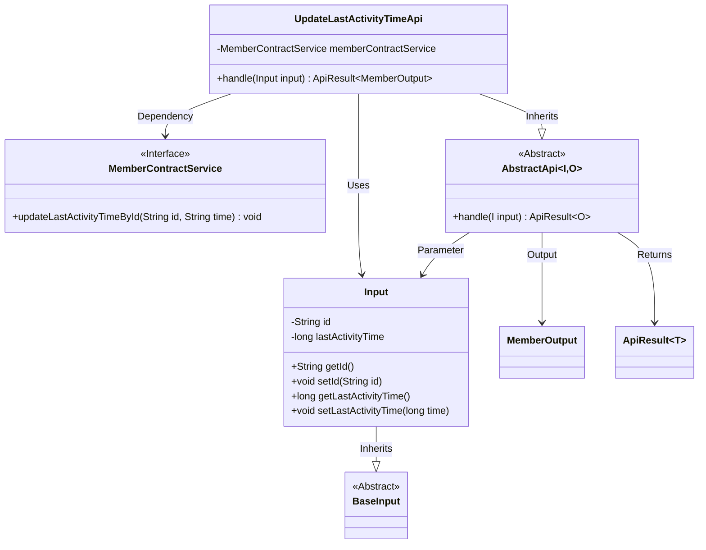
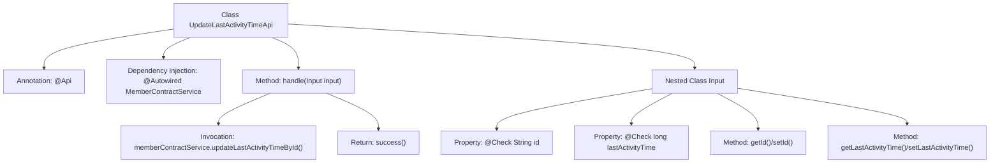

# Basic Information

|      |      |
|------|------|
| Name | UpdateLastActivityTimeApi |
| Language | .java |
| Code Path | WeFe/union/union-service/src/main/java/com/welab/wefe/union/service/api/member/UpdateLastActivityTimeApi.java |
| Package Name | com.welab.wefe.union.service.api.member |
| Dependencies | ['com.welab.wefe.common.exception.StatusCodeWithException', 'com.welab.wefe.common.fieldvalidate.annotation.Check', 'com.welab.wefe.common.web.api.base.AbstractApi', 'com.welab.wefe.common.web.api.base.Api', 'com.welab.wefe.common.web.dto.ApiResult', 'com.welab.wefe.union.service.dto.base.BaseInput', 'com.welab.wefe.union.service.dto.member.MemberOutput', 'com.welab.wefe.union.service.service.contract.MemberContractService', 'org.springframework.beans.factory.annotation.Autowired'] |
| Brief Description | API class UpdateLastActivityTimeApi, path member/update_last_activity_time, updates the user's last activity time via MemberContractService, requiring id and lastActivityTime as input. |

# Description

The code defines an API class named `UpdateLastActivityTimeApi`, which is used to update a member's last activity time. The API path is `member/update_last_activity_time` and allows access with a signature. It inherits from `AbstractApi`, with the input type being the inner class `Input` and the output type being `MemberOutput`. The `Input` class contains two required fields: `id` and `lastActivityTime`. The processing logic updates the last activity time of the specified member via `memberContractService`. Upon successful execution, it returns an empty result. The entire API implements the functionality of updating a member's last activity time.

# Class Summary

| Name   | Type  | Description |
|-------|------|-------------|
| UpdateLastActivityTimeApi | class | API class UpdateLastActivityTimeApi, path member/update_last_activity_time, allows signature access, updates the user's last activity time via MemberContractService. The input must include id and lastActivityTime. |

## Class UpdateLastActivityTimeApi

|      |      |
|------|------|
| Access Modifier | @Api(path = "member/update_last_activity_time", name = "member_update_last_activity_time", allowAccessWithSign = true);public |
| Type | class |
| Name | UpdateLastActivityTimeApi |
| Description | API class UpdateLastActivityTimeApi, path member/update_last_activity_time, allows signature access, updates the user's last activity time via MemberContractService. The input must include id and lastActivityTime. |

### UML Class Diagram

This code demonstrates the implementation of an API for updating a member's last activity time. The UpdateLastActivityTimeApi inherits from AbstractApi, processes Input parameters, and returns ApiResult<MemberOutput>. It relies on the MemberContractService interface to execute the actual business logic. The Input class inherits from BaseInput, contains two fields (id and lastActivityTime), and exposes properties via getter/setter methods. The overall structure reflects clear hierarchical and dependency relationships, adhering to object-oriented design principles.

### Internal Method Call Graph

This code defines an UpdateLastActivityTimeApi class annotated with @Api for updating member last activity time. The core flow involves calling memberContractService via the handle method to update data, using the nested Input class to validate parameters. The diagram illustrates class structure, method invocation relationships, and parameter validation logic, demonstrating the processing chain from API entry to database operations.

### Field List

| Name  | Type  | Description |
|-------|-------|------|
| memberContractService | MemberContractService | Automatically inject the MemberContractService instance. |

### Method List

| Name  | Type  | Description |
|-------|-------|------|
| handle | ApiResult<MemberOutput> | This method handles the request to update the last activity time of a member, invokes the service to update the specified member's last activity time, and returns a successful result. |

