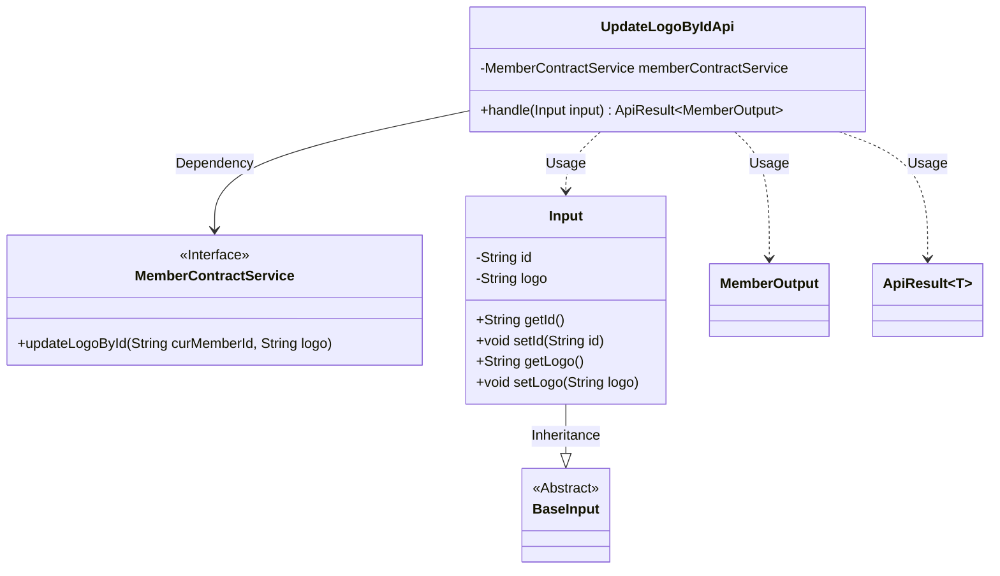
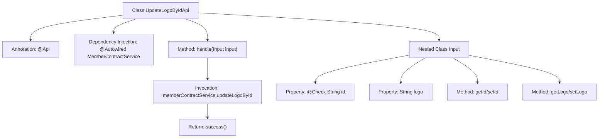

# Basic Information

|      |      |
|------|------|
| Name | UpdateLogoByIdApi |
| Language | .java |
| Code Path | WeFe/union/union-service/src/main/java/com/welab/wefe/union/service/api/member/UpdateLogoByIdApi.java |
| Package Name | com.welab.wefe.union.service.api.member |
| Dependencies | ['com.welab.wefe.common.exception.StatusCodeWithException', 'com.welab.wefe.common.fieldvalidate.annotation.Check', 'com.welab.wefe.common.web.api.base.AbstractApi', 'com.welab.wefe.common.web.api.base.Api', 'com.welab.wefe.common.web.dto.ApiResult', 'com.welab.wefe.union.service.dto.base.BaseInput', 'com.welab.wefe.union.service.dto.member.MemberOutput', 'com.welab.wefe.union.service.service.contract.MemberContractService', 'org.springframework.beans.factory.annotation.Autowired'] |
| Brief Description | API for updating member avatar, with the path `member/update_logo`, requires signature authentication. The input parameters are `id` and `logo`. It calls `memberContractService` to update the avatar and returns a success result. |

# Description

The code defines an API class named UpdateLogoByIdApi, which is used to update member avatars. The API path is member/update_logo and allows signed access. The class inherits from AbstractApi, accepts Input-type parameters, and returns a MemberOutput result. The Input class includes a required field id and an optional field logo, with the avatar update functionality implemented via the updateLogoById method of MemberContractService. Upon successful processing, an empty result is returned.

# Class Summary

| Name   | Type  | Description |
|-------|------|-------------|
| UpdateLogoByIdApi | class | This is an API interface for updating user avatars, with the path member/update_logo, requiring signature verification. It updates the avatar of a specified user ID through MemberContractService. The input parameters are id and logo, where id is a required field. |

## Class UpdateLogoByIdApi

|      |      |
|------|------|
| Access Modifier | @Api(path = "member/update_logo", name = "member_update_logo", allowAccessWithSign = true);public |
| Type | class |
| Name | UpdateLogoByIdApi |
| Description | This is an API interface for updating user avatars, with the path member/update_logo, requiring signature verification. It updates the avatar of a specified user ID through MemberContractService. The input parameters are id and logo, where id is a required field. |

### UML Class Diagram

This code demonstrates the implementation of an API for updating member logos. The UpdateLogoByIdApi inherits from AbstractApi, processes Input parameters, and returns an ApiResult<MemberOutput> result. The Input class inherits from BaseInput and contains two fields: id and logo, with business logic implemented through the MemberContractService interface. The class diagram clearly illustrates the dependencies between components, including service invocation, parameter passing, and result encapsulation.

### Internal Method Call Graph

This flowchart illustrates the structure of the UpdateLogoByIdApi class, including API annotations, service injection, and core processing methods. The handle method invokes memberContractService to update the user logo, ultimately returning a success result. The nested Input class defines a mandatory id field and an optional logo field, along with corresponding getter/setter methods. The entire process clearly demonstrates the call chain from request handling to database updates.

### Field List

| Name  | Type  | Description |
|-------|-------|------|
| memberContractService | MemberContractService | The code snippet uses the @Autowired annotation to automatically inject an instance of MemberContractService. |

### Method List

| Name  | Type  | Description |
|-------|-------|------|
| handle | ApiResult<MemberOutput> | Process the member Logo update request, call the service to update the specified member's Logo, and return an empty result upon success. |

