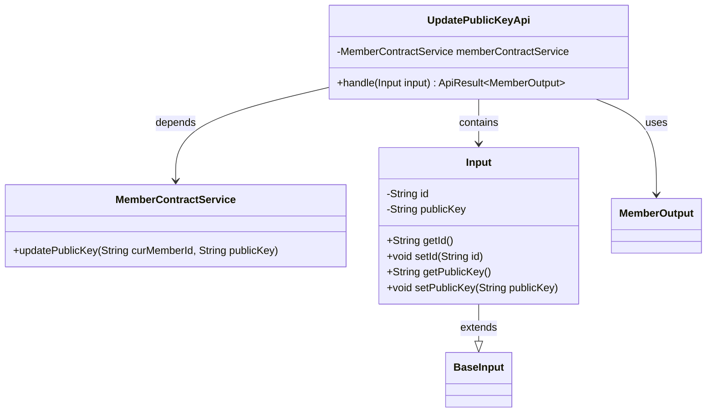
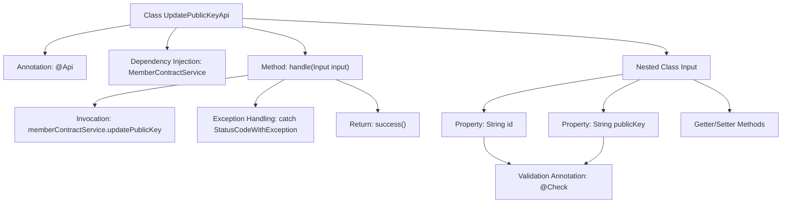

# Basic Information

|      |      |
|------|------|
| Name | UpdatePublicKeyApi |
| Language | .java |
| Code Path | WeFe/union/union-service/src/main/java/com/welab/wefe/union/service/api/member/UpdatePublicKeyApi.java |
| Package Name | com.welab.wefe.union.service.api.member |
| Dependencies | ['com.welab.wefe.common.exception.StatusCodeWithException', 'com.welab.wefe.common.fieldvalidate.annotation.Check', 'com.welab.wefe.common.web.api.base.AbstractApi', 'com.welab.wefe.common.web.api.base.Api', 'com.welab.wefe.common.web.dto.ApiResult', 'com.welab.wefe.union.service.dto.base.BaseInput', 'com.welab.wefe.union.service.dto.member.MemberOutput', 'com.welab.wefe.union.service.service.contract.MemberContractService', 'org.springframework.beans.factory.annotation.Autowired'] |
| Brief Description | This is an API class for updating member public keys, with the path "member/update_public_key", requiring signature-based access. It takes the member ID and new public key as input, invokes the MemberContractService to update the public key, and returns MemberOutput upon success. The input parameters id and publicKey are mandatory. |

# Description

This is an API class named UpdatePublicKeyApi, designed for updating a member's public key. The API path is member/update_public_key and allows access with a signature. It inherits from AbstractApi, with the input type being the inner class Input and the output type being MemberOutput. The Input class contains two mandatory fields: id and publicKey. The processing logic is implemented through the updatePublicKey method of memberContractService, and any exceptions encountered are thrown directly. Upon successful execution, it returns a success status.

# Class Summary

| Name   | Type  | Description |
|-------|------|-------------|
| UpdatePublicKeyApi | class | API for updating member public key, with the path `member/update_public_key`, requires passing the `id` and `publicKey` parameters. It calls `memberContractService` to update the public key and returns a `MemberOutput` result. |

## Class UpdatePublicKeyApi

|      |      |
|------|------|
| Access Modifier | @Api(path = "member/update_public_key", name = "member_update_public_key", allowAccessWithSign = true);public |
| Type | class |
| Name | UpdatePublicKeyApi |
| Description | API for updating member public key, with the path `member/update_public_key`, requires passing the `id` and `publicKey` parameters. It calls `memberContractService` to update the public key and returns a `MemberOutput` result. |

### UML Class Diagram

This code illustrates the class structure of an API for updating member public keys. UpdatePublicKeyApi inherits from AbstractApi, processes Input parameters, and returns MemberOutput results. It relies on MemberContractService to perform the actual public key update operation. The Input class extends BaseInput, containing two mandatory fields (id and publicKey) with their accessor methods. The overall design demonstrates clear separation of responsibilities: Input handles data validation, the API class manages workflow control, and the service class implements business logic.

### Internal Method Call Graph

This flowchart illustrates the core structure of the UpdatePublicKeyApi class, which is a Spring component annotated with @Api. Its primary function is to update member public keys via MemberContractService. The flow starts with the class declaration, proceeds through dependency injection and the request-handling method handle(), which includes service invocation and exception handling, ultimately returning a success result. The nested Input class defines the request parameter structure, containing two mandatory fields (id and publicKey) along with their validation rules. The entire process demonstrates the complete chain of API operations from request reception to business processing, highlighting input validation and exception handling mechanisms.

### Field List

| Name  | Type  | Description |
|-------|-------|------|
| memberContractService | MemberContractService | Automatically inject member contract service instance. |

### Method List

| Name  | Type  | Description |
|-------|-------|------|
| handle | ApiResult<MemberOutput> | Handling member public key updates, returning results upon success, throwing exceptions in case of errors. |

