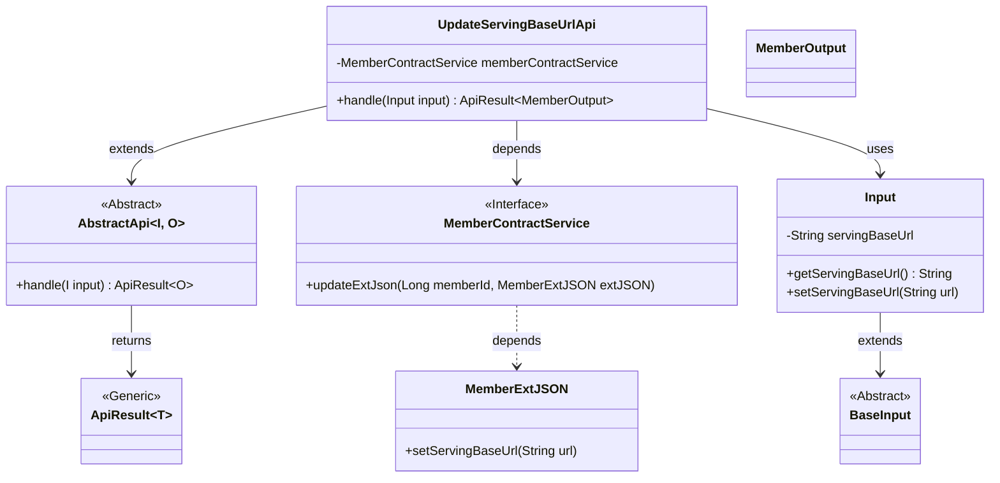
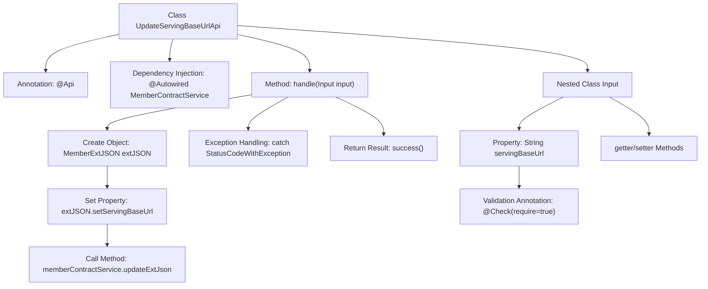

# Basic Information

|      |      |
|------|------|
| Name | UpdateServingBaseUrlApi |
| Language | .java |
| Code Path | WeFe/union/union-service/src/main/java/com/welab/wefe/union/service/api/member/UpdateServingBaseUrlApi.java |
| Package Name | com.welab.wefe.union.service.api.member |
| Dependencies | ['com.welab.wefe.common.data.mongodb.entity.union.ext.MemberExtJSON', 'com.welab.wefe.common.exception.StatusCodeWithException', 'com.welab.wefe.common.fieldvalidate.annotation.Check', 'com.welab.wefe.common.web.api.base.AbstractApi', 'com.welab.wefe.common.web.api.base.Api', 'com.welab.wefe.common.web.dto.ApiResult', 'com.welab.wefe.union.service.dto.base.BaseInput', 'com.welab.wefe.union.service.dto.member.MemberOutput', 'com.welab.wefe.union.service.service.contract.MemberContractService', 'org.springframework.beans.factory.annotation.Autowired'] |
| Brief Description | The UpdateServingBaseUrlApi interface is used to update the member service base URL, processing input parameters through the MemberContractService and returning a successful result. |

# Description

The code defines an API class named `UpdateServingBaseUrlApi`, which is used to update the member service base URL. The API path is `member/update_serving_base_url` and allows signed access. It inherits from `AbstractApi`, with the input type being the inner class `Input` and the output type being `MemberOutput`. The `Input` class contains a required field `servingBaseUrl` along with its getter/setter methods. The processing logic updates the `servingBaseUrl` field in the member extension JSON via `memberContractService`. If the operation succeeds, it returns an empty result; exceptions are thrown directly. The entire API is configured with routing and permission control through annotations.

# Class Summary

| Name   | Type  | Description |
|-------|------|-------------|
| UpdateServingBaseUrlApi | class | API for updating the base URL of member services, which processes the input parameter servingBaseUrl through MemberContractService and returns MemberOutput upon success. |

## Class UpdateServingBaseUrlApi

|      |      |
|------|------|
| Access Modifier | @Api(path = "member/update_serving_base_url", name = "member_update_serving_base_url", allowAccessWithSign = true);public |
| Type | class |
| Name | UpdateServingBaseUrlApi |
| Description | API for updating the base URL of member services, which processes the input parameter servingBaseUrl through MemberContractService and returns MemberOutput upon success. |

### UML Class Diagram

This code defines an API class UpdateServingBaseUrlApi for handling member service base URL updates, which inherits from the generic abstract class AbstractApi. The class updates member extension information through the MemberContractService interface and contains a nested Input class for receiving request parameters. The class diagram illustrates inheritance relationships, dependency relationships, and generic parameter passing. The core workflow involves processing input through the handle method and returning results encapsulated in ApiResult. The Input class inherits from BaseInput and includes the servingBaseUrl field with accessors, while MemberExtJSON is used to store extension information.

### Internal Method Call Graph

This flowchart illustrates the complete structure and workflow of the UpdateServingBaseUrlApi class. The class is an API-annotated controller that inherits from AbstractApi, primarily handling requests to update the serving base URL. The core process includes: receiving input parameters via the handle method, creating a MemberExtJSON object and setting the serving URL, invoking memberContractService for data updates, and finally returning a success result. The nested Input class defines the required input parameter servingBaseUrl and its validation rules, including standard getter/setter methods. The entire flow incorporates exception handling to catch and rethrow StatusCodeWithException.

### Field List

| Name  | Type  | Description |
|-------|-------|------|
| memberContractService | MemberContractService | The code snippet uses @Autowired to automatically inject an instance of MemberContractService. |

### Method List

| Name  | Type  | Description |
|-------|-------|------|
| handle | ApiResult<MemberOutput> | Process the input and update the member extension JSON, returning the result upon success or throwing an exception in case of errors. |

