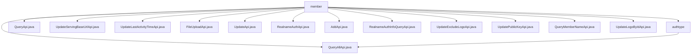

# Basic Information

|      |      |
|------|------|
| Name | member |
| Language | .java |
| Code Path | WeFe/union/union-service/src/main/java/com/welab/wefe/union/service/api/member |
| Package Name | docs.union.union-service.src.main.java.com.welab.wefe.union.service.api.member |
| Brief Description | QueryAllApi queries member authentication types, path member/authtype/query. QueryApi queries member information, path member/query. UpdateServingBaseUrlApi updates the service URL, path member/update_serving_base_url. UpdateLastActivityTimeApi updates the last activity time, path member/update_last_activity_time. FileUploadApi handles file uploads, path member/file/upload. UpdateApi updates member information, path member/update. RealnameAuthApi handles real-name authentication, path member/realname/auth. AddApi adds a member, path member/add. RealnameAuthInfoQueryApi queries real-name information, path member/realname/authInfo/query. UpdateExcludeLogoApi updates member information, path member/update_exclude_logo. UpdatePublicKeyApi updates the public key, path member/update_public_key. QueryMemberNameApi queries member names, path member/map. UpdateLogoByIdApi updates the avatar, path member/update_logo. QueryAllApi queries all members, path member/query_all. |

# Description

## Overview  
The core responsibility of this module is to provide comprehensive lifecycle management services for members, including basic CRUD operations, real-name authentication, file uploads, and activity status updates. The interface specifications adhere to a unified design: inheriting from the AbstractApi base class, defining paths and access permissions via the @Api annotation, and using specific DTOs (e.g., BaseInput/JObject) for input and output, while relying on MemberService to implement business logic. Key data structures include MemberOutput (member information), RealnameAuthInfoQueryOutput (real-name authentication results), and paginated query result wrapper classes. External dependencies primarily consist of MemberService and MemberContractService. For example, UpdatePublicKeyApi updates public keys via memberContractService, and FileUploadApi returns a 599 status code for file I/O exceptions.  

## Key Business Scenarios  
The module supports end-to-end member information management: 1) Basic operations such as AddApi for adding members and QueryApi for paginated queries; 2) Extended functionalities like RealnameAuthApi for real-name authentication and FileUploadApi for file management; 3) Status maintenance such as UpdateLastActivityTimeApi for recording active timestamps. The interaction model resembles RESTful design, with paths differentiating functionalities (e.g., member/update for information updates, member/realname/auth for authentication submissions). Typical applications include the member registration-authentication-information maintenance loop, such as creating an account via AddApi followed by invoking RealnameAuthApi to complete authentication. API types encompass CRUD (e.g., QueryAllApi), status changes (e.g., UpdateServingBaseUrlApi), and file operations (e.g., FileUploadApi).

### Package Internal Structure View

This flowchart illustrates the API file structure of the member module in the WeFe project. The top level is the member directory, which contains 15 child nodes. Among them, authtype is a subdirectory, while the rest are Java API files. The authtype directory further includes a QueryAllApi.java file. The entire structure clearly reflects the hierarchical design of APIs in the member module.

# File List

| Name   | Type  | Description |
|-------|------|-------------|
| [QueryApi.java](QueryApi.md) | file | Member Query API, supports signature-based access, with input parameters including ID, name, and pagination information. It invokes the MemberService to query and returns paginated results. |
| [UpdateServingBaseUrlApi.java](UpdateServingBaseUrlApi.md) | file | The UpdateServingBaseUrlApi interface is used to update the member service base URL, processing input parameters through the MemberContractService and returning a successful result. |
| [UpdateLastActivityTimeApi.java](UpdateLastActivityTimeApi.md) | file | API class UpdateLastActivityTimeApi, path member/update_last_activity_time, updates the user's last activity time via MemberContractService, requiring id and lastActivityTime as input. |
| [FileUploadApi.java](FileUploadApi.md) | file | File Upload API class, handling member file upload requests, requires parameters such as member ID, file name, and purpose, supports private or public file levels, and returns specific error codes in case of exceptions. |
| [UpdateApi.java](UpdateApi.md) | file | Member Update API, requires signature authentication for access. The input includes fields such as ID, name, contact information, etc., and calls the MemberService to update data. |
| [RealnameAuthApi.java](RealnameAuthApi.md) | file | Real-name Authentication API class, handling user real-name authentication requests, including mandatory fields such as name, authentication type, file list, certificate request content, and ID, invoking MemberService to complete the authentication. |
| [AddApi.java](AddApi.md) | file | The `AddApi` class is used to add members, with the path as `member/add`, requiring signed access. The input includes fields such as ID, name, contact information, etc., and outputs `MemberOutput`. The processing logic calls the `memberService.add` method. |
| [RealnameAuthInfoQueryApi.java](RealnameAuthInfoQueryApi.md) | file | This is an API interface for querying member real-name authentication information, which uses signature verification for access control, calls MemberService to process the request, and returns the result. |
| [UpdateExcludeLogoApi.java](UpdateExcludeLogoApi.md) | file | Update member information interface, path member/update_exclude_logo, requires signature authentication. The input includes mandatory fields such as id, public key, and other optional fields, which call the MemberContractService to update data. |
| [UpdatePublicKeyApi.java](UpdatePublicKeyApi.md) | file | This is an API class for updating a member's public key, with the path "member/update_public_key," requiring signature-based access. It takes the member ID and new public key as input, invokes the MemberContractService to update the public key, and returns MemberOutput upon success. The input parameters id and publicKey are mandatory. |
| [QueryMemberNameApi.java](QueryMemberNameApi.md) | file | This is an API class named member_map, with the path member/map, allowing signed access. It inherits from AbstractApi, uses MemberService to query member information, and returns JSON results. |
| [UpdateLogoByIdApi.java](UpdateLogoByIdApi.md) | file | API for updating member avatar, with the path `member/update_logo`, requires signed access. The input parameters are `id` and `logo`. It calls `memberContractService` to update the avatar and returns a success result. |
| [QueryAllApi.java](QueryAllApi.md) | file | This is an API class for querying all members, with the path "member/query_all", supporting signed access and a log sampling interval of 60 seconds. The input parameters include ID and whether to include a logo, returning JSON data of the member list. |
| [authtype](authtype/_module.md) | package | This is an API class for querying member authentication types, with the path member/authtype/query, allowing signed access. It calls the queryAllAuthType method of MemberService and returns a result list. |

