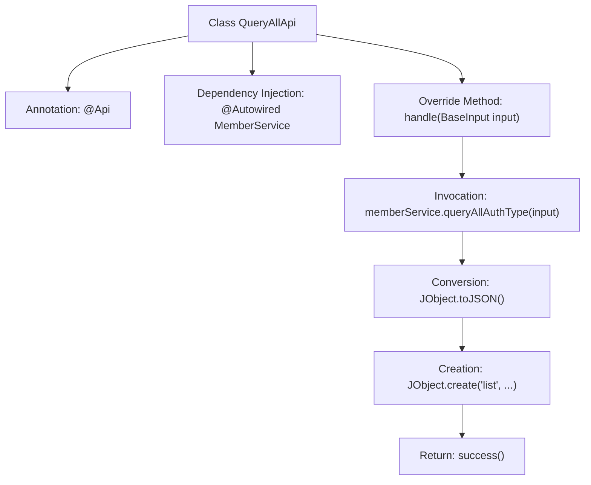

# Basic Information

|      |      |
|------|------|
| Name | QueryAllApi |
| Language | .java |
| Code Path | WeFe/union/union-service/src/main/java/com/welab/wefe/union/service/api/member/authtype/QueryAllApi.java |
| Package Name | com.welab.wefe.union.service.api.member.authtype |
| Dependencies | ['com.welab.wefe.common.util.JObject', 'com.welab.wefe.common.web.api.base.AbstractApi', 'com.welab.wefe.common.web.api.base.Api', 'com.welab.wefe.common.web.dto.ApiResult', 'com.welab.wefe.union.service.dto.base.BaseInput', 'com.welab.wefe.union.service.service.MemberService', 'org.springframework.beans.factory.annotation.Autowired'] |
| Brief Description | This is an API class for querying member authentication types, with the path member/authtype/query, allowing signed access. It calls the queryAllAuthType method of MemberService and returns a result list. |

# Description

The code defines an API class named `QueryAllApi`, which is used to query all member authentication types. The class annotation specifies the API path as `member/authtype/query`, the name as `member_authtype_query`, and allows signed access. This class inherits from `AbstractApi`, uses `BaseInput` as the input parameter, and returns a result of type `JObject`. By injecting the `MemberService` member service, the `handle` method calls `queryAllAuthType` to query all authentication types, converts the result into JSON format, and encapsulates it as a successful response before returning.

# Class Summary

| Name   | Type  | Description |
|-------|------|-------------|
| QueryAllApi | class | This is an API class for querying member authentication types, with the path "member/authtype/query". It allows signed access and calls the `queryAllAuthType` method of `MemberService` to return a result list. |


## Class QueryAllApi

|      |      |
|------|------|
| Access Modifier | @Api(path = "member/authtype/query", name = "member_authtype_query", allowAccessWithSign = true);public |
| Type | class |
| Name | QueryAllApi |
| Description | This is an API class for querying member authentication types, with the path "member/authtype/query". It allows signed access and calls the `queryAllAuthType` method of `MemberService` to return a result list. |


### UML Class Diagram

```mermaid
classDiagram
    class QueryAllApi {
        -MemberService memberService
        +handle(BaseInput input) ApiResult~JObject~
    }
    class BaseInput
    class JObject {
        +create(String key, Object value) JObject
        +toJSON(Object obj) String
    }
    class MemberService {
        +queryAllAuthType(BaseInput input) Object
    }
    class ApiResult~T~ {
        <<Interface>>
    }
    class AbstractApi~I~O~ {
        <<Abstract>>
        +handle(I input) ApiResult~O~
    }

    QueryAllApi --> MemberService : Dependency
    QueryAllApi --|> AbstractApi~BaseInput,JObject~
    AbstractApi~BaseInput,JObject~ ..|> ApiResult~JObject~ : Implements
    MemberService ..> BaseInput : Uses
    QueryAllApi ..> JObject : Uses
```

This code demonstrates a `QueryAllApi` class for querying all authentication types, which inherits from the generic abstract class `AbstractApi` with `BaseInput` as the input type and `JObject` as the output type. The class injects the `MemberService` service, processes requests by calling its `queryAllAuthType` method, and encapsulates the result as `ApiResult<JObject>` for return. `JObject` provides static methods for JSON data creation and conversion. The overall design reflects the application of Dependency Injection and Template Method patterns, achieving separation between business logic and API processing.


### Internal Method Call Graph



This flowchart illustrates the core processing flow of the QueryAllApi class. The class defines interface metadata through the @Api annotation, injects MemberService dependency, and overrides the handle method to process requests. The flow sequentially invokes the service layer to query data, performs JSON serialization, encapsulates the result object, and returns a success response, fully presenting the call chain from request processing to result return.

### Field List

| Name  | Type  | Description |
|-------|-------|------|
| memberService | MemberService | Automatically inject the MemberService instance. |

### Method List

| Name  | Type  | Description |
|-------|-------|------|
| handle | ApiResult<JObject> | Java method override, processes input and returns JSON-formatted data of member service query results. |


