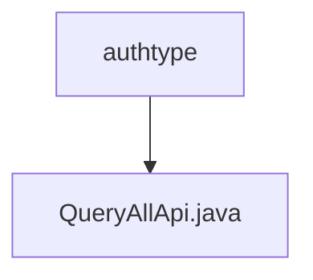

# Basic Information

|      |      |
|------|------|
| Name | authtype |
| Language | .java |
| Code Path | WeFe/union/union-service/src/main/java/com/welab/wefe/union/service/api/member/authtype |
| Package Name | docs.union.union-service.src.main.java.com.welab.wefe.union.service.api.member.authtype |
| Brief Description | This is an API class for querying member authentication types, with the path member/authtype/query, allowing signed access. It calls the queryAllAuthType method of MemberService and returns a result list. |

# Description

The code defines an API class named `QueryAllApi`, which is used to query all member authentication types. The class annotation specifies the API path as `member/authtype/query`, the name as `member_authtype_query`, and allows signed access. This class inherits from `AbstractApi`, uses `BaseInput` as the input parameter, and returns a result of type `JObject`. By injecting the `MemberService` member service, the `handle` method calls `queryAllAuthType` to query all authentication types, converts the result into JSON format, and encapsulates it as a successful response for return.

### Package Internal Structure View

This flowchart illustrates the hierarchical structure of the member/authtype directory under the union-service module in the WeFe project. The root node "authtype" contains a child node "QueryAllApi.java," indicating that this is an API interface file for handling member authentication type queries. The entire structure is concise and clear, reflecting a single-function module's file organization approach.

# File List

| Name   | Type  | Description |
|-------|------|-------------|
| [QueryAllApi.java](QueryAllApi.md) | file | This is an API class for querying member authentication types, with the path member/authtype/query, allowing signed access. It calls the `queryAllAuthType` method of `MemberService` and returns a result list. |

