# Basic Information

|      |      |
|------|------|
| Name | UnionAliveApi |
| Language | .java |
| Code Path | WeFe/union/union-service/src/main/java/com/welab/wefe/union/service/api/server/UnionAliveApi.java |
| Package Name | com.welab.wefe.union.service.api.server |
| Dependencies | ['com.welab.wefe.common.web.api.base.AbstractApi', 'com.welab.wefe.common.web.api.base.Api', 'com.welab.wefe.common.web.dto.ApiResult', 'com.welab.wefe.common.web.dto.NoneApiOutput', 'com.welab.wefe.union.service.dto.base.BaseInput'] |
| Brief Description | The UnionAliveApi class is a service liveness check interface with the path "service/alive". It does not require signature verification, inherits from AbstractApi, takes the Input class as input, and returns void. |

# Description

The code defines an API class named `UnionAliveApi` for handling liveliness check requests. The class annotation specifies the API path as `"service/alive"`, the name as `"alive"`, and disables signature access. This class inherits from `AbstractApi`, using `Input` as the input parameter type and `NoneApiOutput` as the output type. The `handle` method directly returns a successful result without processing input parameters. The inner static class `Input` inherits from `BaseInput`, indicating that this API requires no specific input parameters. The overall implementation is concise and solely intended for service liveliness status checks.

# Class Summary

| Name   | Type  | Description |
|-------|------|-------------|
| UnionAliveApi | class | The Java class `UnionAliveApi` defines an unsigned alive detection API interface with the path `service/alive`, which processes the input and returns a successful result. |


## Class UnionAliveApi

|      |      |
|------|------|
| Access Modifier | @Api(path = "service/alive", name = "alive", allowAccessWithSign = false);public |
| Type | class |
| Name | UnionAliveApi |
| Description | The Java class `UnionAliveApi` defines an unsigned alive detection API interface with the path `service/alive`, which processes the input and returns a successful result. |


### UML Class Diagram

```mermaid
classDiagram
    class UnionAliveApi {
        +handle(Input input) ApiResult~NoneApiOutput~
    }
    UnionAliveApi --|> AbstractApi : Inheritance
    UnionAliveApi ..|> <<Interface>> Api : Implementation

    class AbstractApi~T, R~ {
        <<abstract>>
        +handle(T input) ApiResult~R~
    }
    AbstractApi ..|> <<Interface>> Api : Implementation

    class <<Interface>> Api {
        <<Interface>>
    }

    class Input {
    }
    Input --|> BaseInput : Inheritance

    class NoneApiOutput {
    }
    class ApiResult~T~ {
    }

    // Dependency relationships
    UnionAliveApi --> Input : Uses
    UnionAliveApi --> NoneApiOutput : Uses
    AbstractApi --> ApiResult : Uses
```

This code demonstrates a class named `UnionAliveApi`, which inherits from the generic abstract class `AbstractApi` and implements the `Api` interface. The class processes parameters of type `Input` and returns results of type `ApiResult<NoneApiOutput>`. `Input` is a static nested class inheriting from `BaseInput`, while `NoneApiOutput` represents an empty response type. The overall structure reflects the template method pattern, where the abstract class standardizes the API processing flow, and concrete implementations are completed by subclasses. The annotations indicate that this is a signature-free liveness detection interface.


### Internal Method Call Graph

```mermaid
graph TD
    A["Class UnionAliveApi"]
    B["Annotation: @Api"]
    C["Parent Class: AbstractApi<Input, NoneApiOutput>"]
    D["Method: handle(Input input)"]
    E["Nested Class: Input"]
    F["Parent Class: BaseInput"]
    G["Return: ApiResult<NoneApiOutput>"]

    A --> B
    A --> C
    A --> D
    D --> G
    A --> E
    E --> F
```



This flowchart illustrates the structure of the UnionAliveApi class, including class annotations, inheritance relationships, core methods, and nested class definitions. The main workflow is: the class configures service paths via the @Api annotation, inherits from the AbstractApi template class, implements the handle method to process input parameters and returns encapsulated results. The nested Input class inherits BaseInput as the request parameter carrier, collectively forming a complete API service endpoint structure.

### Field List

| Name  | Type  | Description |
|-------|-------|------|

### Method List

| Name  | Type  | Description |
|-------|-------|------|
| handle | ApiResult<NoneApiOutput> | This is a Java method that overrides the parent class method, processes the input, and returns a successful empty API result. |


