# Basic Information

|      |      |
|------|------|
| Name | UnionAvailableApi |
| Language | .java |
| Code Path | WeFe/union/union-service/src/main/java/com/welab/wefe/union/service/api/server/UnionAvailableApi.java |
| Package Name | com.welab.wefe.union.service.api.server |
| Dependencies | ['com.welab.wefe.common.web.api.base.AbstractApi', 'com.welab.wefe.common.web.api.base.Api', 'com.welab.wefe.common.web.dto.ApiResult', 'com.welab.wefe.common.wefe.checkpoint.CheckpointManager', 'com.welab.wefe.common.wefe.checkpoint.dto.ServiceAvailableCheckOutput', 'com.welab.wefe.union.service.dto.base.BaseInput', 'org.springframework.beans.factory.annotation.Autowired'] |
| Brief Description | The Java class `UnionAvailableApi` provides an availability check service interface with the path "service/available," supporting signed access. It invokes the `CheckpointManager` to perform the check and returns the result. The input is empty, and the output is `ServiceAvailableCheckOutput`. |

# Description

The code defines an API class named `UnionAvailableApi`, which is used to check service availability. It inherits from `AbstractApi`, accepts an `Input` parameter, and returns a `ServiceAvailableCheckOutput` result. The class annotation indicates that the API path is `"service/available"` and allows signed access. Internally, it performs the check via the `checkAll` method of `CheckpointManager` and returns a successful result. The `Input` class inherits from `BaseInput` and currently defines no additional fields. The entire API encapsulates the core logic for service availability checks.

# Class Summary

| Name   | Type  | Description |
|-------|------|-------------|
| UnionAvailableApi | class | Java API class `UnionAvailableApi`, path `"service/available"`, allows signed access. It checks service availability via `CheckpointManager` and returns the result. The input is `BaseInput`, and the output is `ServiceAvailableCheckOutput`. |


## Class UnionAvailableApi

|      |      |
|------|------|
| Access Modifier | @Api(path = "service/available", name = "available", allowAccessWithSign = true);public |
| Type | class |
| Name | UnionAvailableApi |
| Description | Java API class `UnionAvailableApi`, path `"service/available"`, allows signed access. It checks service availability via `CheckpointManager` and returns the result. The input is `BaseInput`, and the output is `ServiceAvailableCheckOutput`. |


### UML Class Diagram

```mermaid
classDiagram
    class UnionAvailableApi {
        -CheckpointManager checkpointManager
        +handle(Input input) ApiResult~ServiceAvailableCheckOutput~
    }
    <<Interface>> UnionAvailableApi {
        <<AbstractApi>>
    }
    class AbstractApi~T, R~ {
        <<abstract>>
    }
    class Input {
        <<BaseInput>>
    }
    class ServiceAvailableCheckOutput
    class ApiResult~T~
    class CheckpointManager {
        +checkAll() ServiceAvailableCheckOutput
    }

    UnionAvailableApi --> AbstractApi : extends
    UnionAvailableApi --> CheckpointManager : dependency
    UnionAvailableApi --> Input : nested class
    AbstractApi --> ApiResult : uses generic
    AbstractApi --> ServiceAvailableCheckOutput : uses generic
    Input --> BaseInput : extends
```

This code demonstrates a UnionAvailableApi class that inherits from the generic abstract class AbstractApi to handle service availability check requests. The class diagram clearly illustrates the following relationships: 1) UnionAvailableApi extends AbstractApi with specified input/output generic types; 2) Autowired dependency injection of CheckpointManager; 3) Uses nested Input class as request parameter; 4) Core handle method invokes checkpointManager.checkAll() and returns encapsulated results. The overall structure reflects typical API layer implementation patterns in Spring Boot applications, featuring dependency injection, generic inheritance, and nested DTOs.


### Internal Method Call Graph

```mermaid
graph TD
    A["Class UnionAvailableApi"]
    B["Annotation: @Api"]
    C["Inheritance: AbstractApi<Input, ServiceAvailableCheckOutput>"]
    D["Dependency Injection: CheckpointManager checkpointManager"]
    E["Overridden Method: handle(Input input)"]
    F["Inner Class: Input extends BaseInput"]
    G["Invocation: checkpointManager.checkAll()"]
    H["Return: success(output)"]

    A --> B
    A --> C
    A --> D
    A --> E
    E --> G
    G --> H
    A --> F
```



This code defines an API class named UnionAvailableApi, which configures service paths and access permissions through the @Api annotation. The class inherits from AbstractApi with specified generic input/output types. Its core logic involves checking service availability via checkpointManager and returning results. The flowchart illustrates the class structure, dependency relationships, and the internal processing flow of the handle method, including key steps such as dependency injection, method invocation, and result return.

### Field List

| Name  | Type  | Description |
|-------|-------|------|
| checkpointManager | CheckpointManager | Automatically inject the CheckpointManager instance. |

### Method List

| Name  | Type  | Description |
|-------|-------|------|
| handle | ApiResult<ServiceAvailableCheckOutput> | Method override, call the checkpoint manager to verify the availability of all services, and return the successful result along with the checkpoint output. |


