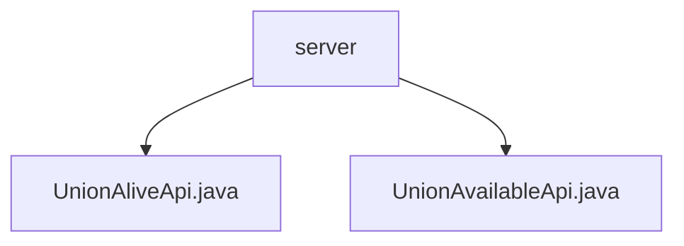

# Basic Information

|      |      |
|------|------|
| Name | server |
| Language | .java |
| Code Path | WeFe/union/union-service/src/main/java/com/welab/wefe/union/service/api/server |
| Package Name | docs.union.union-service.src.main.java.com.welab.wefe.union.service.api.server |
| Brief Description | The `UnionAliveApi` class handles liveliness detection at the path `"service/alive"`, returning success directly without requiring input. The `UnionAvailableApi` class checks service availability at the path `"service/available"`, returning results after performing the check. Both classes inherit from `AbstractApi`. |

# Description

## Overview  
This module provides basic service status detection functionality, comprising two core APIs: liveness check and availability check. The interface specifications adhere to a unified path prefix "service/", implemented via `UnionAliveApi` (no signature required) and `UnionAvailableApi` (signature required) respectively, both inheriting from the base class `AbstractApi`. Key data structures include an empty-parameter `Input` class derived from `BaseInput`, and the response body `ServiceAvailableCheckOutput`. Dependencies are limited to the internal `CheckpointManager` component. For instance, the liveness check directly returns a success response, while the availability check triggers the `checkAll` method to validate service status.  

## Primary Business Scenarios  
The module adopts a "heartbeat detection" pattern, similar to a health check probe mechanism. `UnionAliveApi` is used for lightweight liveness confirmation, whereas `UnionAvailableApi` performs in-depth availability verification. Typical applications include status polling for service registries and circuit-breaking judgments at the gateway layer. Both APIs are query-type interfaces. For example, Kubernetes readiness probes may combine calls to these two interfaces, first confirming process liveness and then verifying dependency service connectivity.

### Package Internal Structure View

This flowchart illustrates the hierarchical structure under the server directory in the union-service module of the WeFe project. The parent node "server" contains two child nodes: the interface files UnionAliveApi.java and UnionAvailableApi.java, which are directly located under the server directory and belong to the same hierarchical level. The entire structure clearly presents the basic organization of server-side API files.

# File List

| Name   | Type  | Description |
|-------|------|-------------|
| [UnionAliveApi.java](UnionAliveApi.md) | file | The `UnionAliveApi` class is a service liveness check interface with the path `"service/alive"`. It does not require signature verification, inherits from `AbstractApi`, takes an `Input` class as input, and produces no output. |
| [UnionAvailableApi.java](UnionAvailableApi.md) | file | The Java class `UnionAvailableApi` provides an availability check service interface with the path "service/available," supporting signed access. It invokes the `CheckpointManager` to perform the check and returns the result. The input is empty, and the output is `ServiceAvailableCheckOutput`. |

