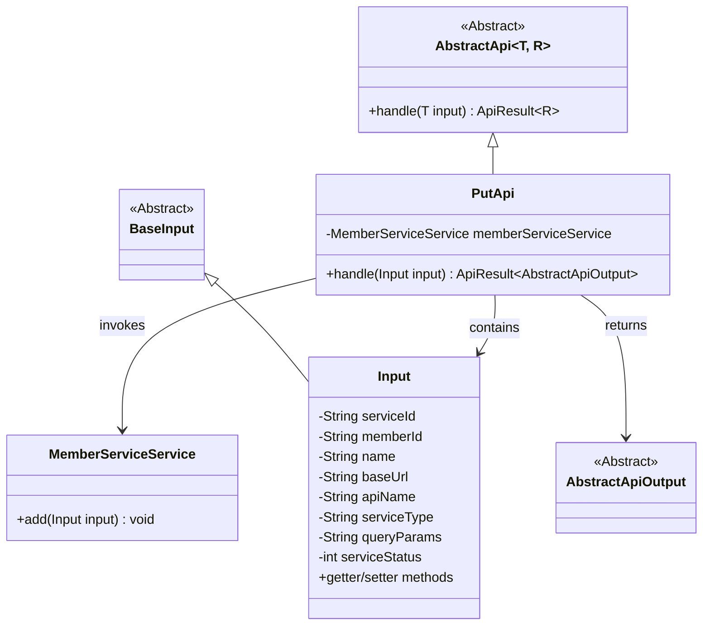
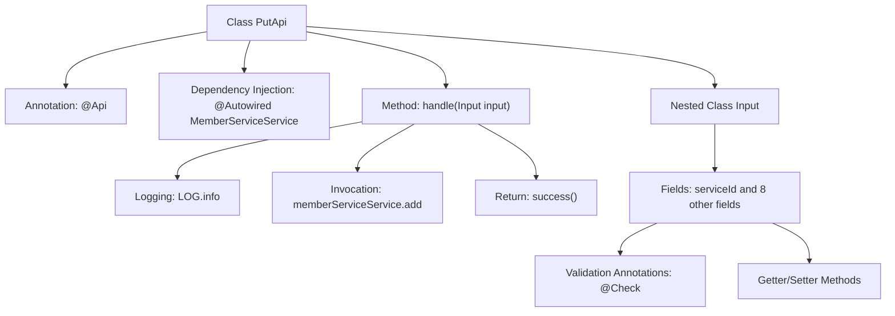

# Basic Information

|      |      |
|------|------|
| Name | PutApi |
| Language | .java |
| Code Path | WeFe/union/union-service/src/main/java/com/welab/wefe/union/service/api/service/PutApi.java |
| Package Name | com.welab.wefe.union.service.api.service |
| Dependencies | ['com.welab.wefe.common.exception.StatusCodeWithException', 'com.welab.wefe.common.fieldvalidate.annotation.Check', 'com.welab.wefe.common.web.api.base.AbstractApi', 'com.welab.wefe.common.web.api.base.Api', 'com.welab.wefe.common.web.dto.AbstractApiOutput', 'com.welab.wefe.common.web.dto.ApiResult', 'com.welab.wefe.union.service.dto.base.BaseInput', 'com.welab.wefe.union.service.service.MemberServiceService', 'org.springframework.beans.factory.annotation.Autowired'] |
| Brief Description | The PutApi class handles member service addition requests, requiring mandatory fields such as serviceId, baseUrl, apiName, and serviceType, and invokes the memberServiceService.add method to complete the operation. |

# Description

The code defines an API class named PutApi with the path member/service/put, allowing signed access. It inherits from AbstractApi, processes Input, and returns AbstractApiOutput. The class injects MemberServiceService, and its handle method calls the add method to process the input. The Input class contains multiple fields, among which serviceId, baseUrl, apiName, serviceType, and serviceStatus are mandatory, while others such as memberId, name, and queryParams are optional. Each field has corresponding getter and setter methods.

# Class Summary

| Name   | Type  | Description |
|-------|------|-------------|
| PutApi | class | This is a member service addition API with the path "member/service/put", requiring signature-based access. The input parameters include mandatory fields such as serviceId, baseUrl, apiName, serviceType, and serviceStatus. The request is processed by invoking the add method of MemberServiceService. |

## Class PutApi

|      |      |
|------|------|
| Access Modifier | @Api(path = "member/service/put", name = "member_service_put", allowAccessWithSign = true);public |
| Type | class |
| Name | PutApi |
| Description | This is a member service addition API with the path "member/service/put", requiring signature-based access. The input parameters include mandatory fields such as serviceId, baseUrl, apiName, serviceType, and serviceStatus. The request is processed by invoking the add method of MemberServiceService. |

### UML Class Diagram

Class Diagram Description: This diagram illustrates the structure of a PutApi class implemented based on the abstract class AbstractApi. PutApi inherits from the generic class AbstractApi<Input, AbstractApiOutput> and contains a dependency call to MemberServiceService. Input, as an internal static class, extends BaseInput and includes multiple fields with validation annotations along with their getter/setter methods. The overall structure reflects a typical pattern where the API processing layer executes business logic through service classes, achieving type safety via generic parameters for input and output.

### Internal Method Call Graph

This flowchart illustrates the core structure of the PutApi class, including the API annotation, the injected MemberServiceService dependency, the main handler method handle() and its internal operation flow. The nested Input class details 9 field attributes with their validation rules, each equipped with corresponding Getter/Setter methods. The handle method sequentially executes three key steps: logging, service invocation, and success return, forming a complete API processing chain.

### Field List

| Name  | Type  | Description |
|-------|-------|------|
| memberServiceService | MemberServiceService | Using @Autowired to automatically inject an instance of MemberServiceService. |

### Method List

| Name  | Type  | Description |
|-------|-------|------|
| handle | ApiResult<AbstractApiOutput> | Process the input and invoke the member service to add data, then return the result upon success. |

