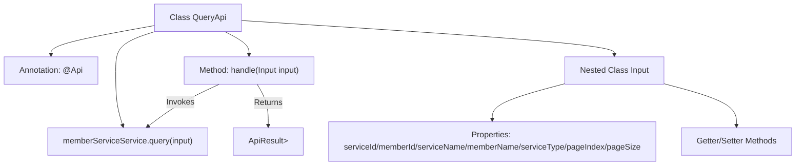

# Basic Information

|      |      |
|------|------|
| Name | QueryApi |
| Language | .java |
| Code Path | WeFe/union/union-service/src/main/java/com/welab/wefe/union/service/api/service/QueryApi.java |
| Package Name | com.welab.wefe.union.service.api.service |
| Dependencies | ['com.welab.wefe.common.data.mongodb.dto.PageOutput', 'com.welab.wefe.common.exception.StatusCodeWithException', 'com.welab.wefe.common.web.api.base.AbstractApi', 'com.welab.wefe.common.web.api.base.Api', 'com.welab.wefe.common.web.dto.ApiResult', 'com.welab.wefe.union.service.dto.base.BaseInput', 'com.welab.wefe.union.service.dto.member.ApiMemberServiceQueryOutput', 'com.welab.wefe.union.service.service.MemberServiceService', 'org.springframework.beans.factory.annotation.Autowired'] |
| Brief Description | Member service query API, supports signature-based access, with input parameters including service ID, member ID, name, etc., and returns a paginated list of member services. |

# Description

This is a Java class named QueryApi, designed to handle API requests for member service queries. The class extends AbstractApi and defines input parameters as Input and output results as PageOutput<ApiMemberServiceQueryOutput>. The API path is "member/service/query" and allows signed access. Input parameters include serviceId, memberId, serviceName, memberName, serviceType, as well as pagination parameters pageIndex and pageSize, with a default page size of 10. The processing logic implements the query functionality by calling the memberServiceService.query method and returns paginated results. All input parameters are provided with getter and setter methods.

# Class Summary

| Name   | Type  | Description |
|-------|------|-------------|
| QueryApi | class | API for querying member services, supporting pagination. Input parameters include service ID, member ID, service name, member name, and service type, with a default of 10 records per page. |


## Class QueryApi

|      |      |
|------|------|
| Access Modifier | @Api(path = "member/service/query", name = "member_service_query", allowAccessWithSign = true);public |
| Type | class |
| Name | QueryApi |
| Description | API for querying member services, supporting pagination. Input parameters include service ID, member ID, service name, member name, and service type, with a default of 10 records per page. |


### UML Class Diagram

```mermaid
classDiagram
    class QueryApi {
        -MemberServiceService memberServiceService
        +handle(Input input) ApiResult~PageOutput~ApiMemberServiceQueryOutput~~
    }
    QueryApi --> MemberServiceService : Dependency
    QueryApi --> Input : Contains
    QueryApi --> AbstractApi~Input, PageOutput~ApiMemberServiceQueryOutput~~ : Inherits

    class AbstractApi~T, R~ {
        <<Abstract>>
        +handle(T input) ApiResult~R~
    }

    class MemberServiceService {
        <<Interface>>
        +query(Input input) PageOutput~ApiMemberServiceQueryOutput~
    }

    class Input {
        -String serviceId
        -String memberId
        -String serviceName
        -String memberName
        -Integer serviceType
        -Integer pageIndex
        -Integer pageSize
        +get/set methods...
    }
    Input --> BaseInput : Inherits

    class BaseInput {
        <<Abstract>>
    }

    class PageOutput~T~ {
        +Generic pagination output class
    }

    class ApiMemberServiceQueryOutput {
        +Member service query output DTO
    }
```

This code demonstrates the implementation of a query API, where QueryApi inherits from the generic abstract class AbstractApi, processes Input parameters, and returns paginated query results. The class diagram clearly illustrates inheritance, dependency, and containment relationships between classes, including the core MemberServiceService interface, Input parameter class, and related generic output class structures. The overall design reflects clear responsibility division and type-safe data processing flow.


### Internal Method Call Graph



This code defines an API class named QueryApi for querying member service information. The class contains a nested Input class as input parameters, which invokes the query method of MemberServiceService through the handle method to perform queries and returns paginated results. The flowchart illustrates the class structure, method invocation relationships, and data processing flow, including annotations, properties, method call chains, and return result types.

### Field List

| Name  | Type  | Description |
|-------|-------|------|
| memberServiceService | MemberServiceService | Using @Autowired to automatically inject an instance of MemberServiceService. |

### Method List

| Name  | Type  | Description |
|-------|-------|------|
| handle | ApiResult<PageOutput<ApiMemberServiceQueryOutput>> | Java method override, calling memberServiceService.query to process the input and return paginated results. |


