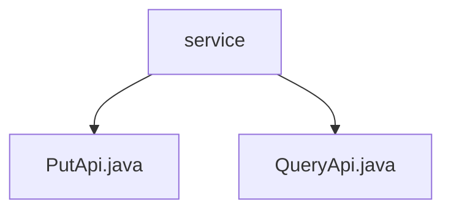

# Basic Information

|      |      |
|------|------|
| Name | service |
| Language | .java |
| Code Path | WeFe/union/union-service/src/main/java/com/welab/wefe/union/service/api/service |
| Package Name | docs.union.union-service.src.main.java.com.welab.wefe.union.service.api.service |
| Brief Description | The PutApi is an API for handling member service additions, with the path member/service/put, inheriting from AbstractApi. It requires fields such as serviceId and calls MemberServiceService.add. The QueryApi is an API for querying member services, with the path member/service/query, inheriting from AbstractApi. Its inputs include serviceId, and it defaults to paginated queries of 10 records, calling memberServiceService.query. |

# Description

## Overview  
The core responsibility of this module is to provide CRUD capabilities for member services. Service registration and updates are implemented through PutApi, while paginated query functionality is achieved via QueryApi. The interface specifications uniformly inherit from AbstractApi, adopting signature authentication, with paths `member/service/put` and `member/service/query` respectively.  

Key data structures include the Input class (containing mandatory fields such as serviceId, baseUrl, apiName, and service status) and the paginated output PageOutput<ApiMemberServiceQueryOutput>. The only external dependency is MemberServiceService, injected via JNI. For example, PutApi invokes the add method, while QueryApi utilizes the query method.  

## Primary Business Scenarios  
The module supports two typical interactions: service registration/updates (similar to CRUD patterns) and paginated service queries (analogous to data filters). In the business workflow, PutApi handles inputs with mandatory validation, while QueryApi implements multi-condition filtering and paginated returns. For instance, services can be filtered by serviceType or queried by memberId for associated services.  

Full functionality covers the entire service lifecycle management, with API types including write and read operations. An integration example involves: the frontend submitting service configurations, which are then persisted via PutApi; the admin console calls QueryApi to display paginated service lists.

### Package Internal Structure View

This flowchart illustrates the API service structure of the union-service module in the WeFe project. The root node "service" contains two Java interface files: PutApi.java and QueryApi.java, representing different API service implementations. This structure clearly reflects the basic composition of the service layer, adhering to the typical layered design pattern of a Spring Boot project.

# File List

| Name   | Type  | Description |
|-------|------|-------------|
| [PutApi.java](PutApi.md) | file | The PutApi class handles member service addition requests, requiring mandatory fields such as serviceId, baseUrl, apiName, and serviceType, and invokes the memberServiceService.add method to complete the operation. |
| [QueryApi.java](QueryApi.md) | file | Member service query API, supports signature-based access, input parameters include service ID, member ID, name, etc., and returns a paginated list of member services. |

