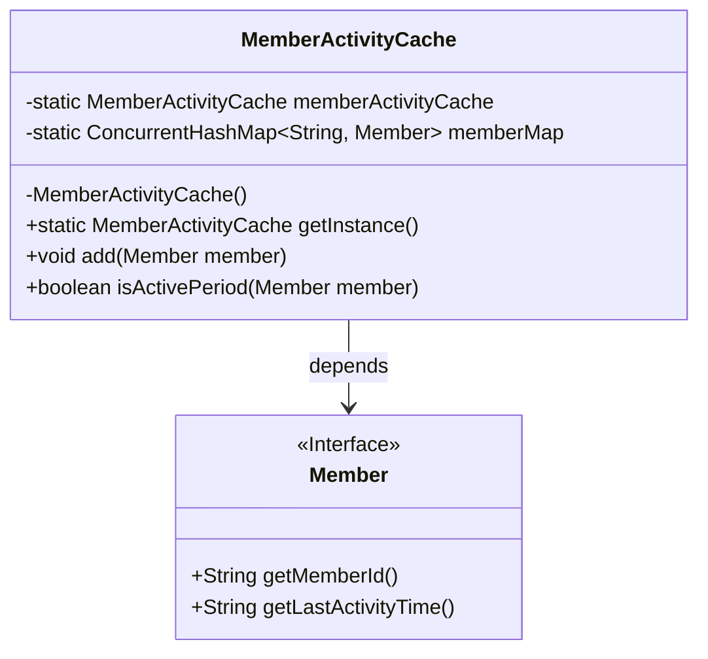
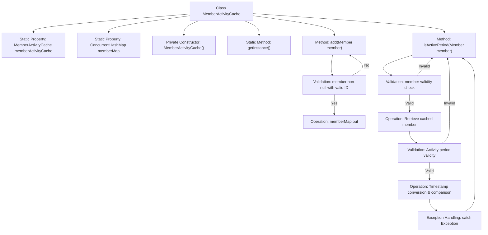

# Basic Information

|      |      |
|------|------|
| Name | MemberActivityCache |
| Language | .java |
| Code Path | WeFe/union/union-service/src/main/java/com/welab/wefe/union/service/cache/MemberActivityCache.java |
| Package Name | com.welab.wefe.union.service.cache |
| Dependencies | ['com.welab.wefe.common.data.mongodb.entity.union.Member', 'com.welab.wefe.common.util.DateUtil', 'com.welab.wefe.common.util.StringUtil', 'java.util.Date', 'java.util.concurrent.ConcurrentHashMap'] |
| Brief Description | MemberActivityCache is a singleton class that uses ConcurrentHashMap to cache member information, providing functionality to add and check whether a member's activity time is valid. |

# Description

MemberActivityCache is a singleton class designed to cache member activity information. It utilizes a ConcurrentHashMap to store the mapping between member IDs and member objects. The class provides an `add` method for adding members to the cache and an `isActivePeriod` method to verify whether a member's activity time falls within the valid period. The `isActivePeriod` method compares the last activity timestamp of the passed member with that of the cached member to ensure the passed time is not later than the cached time. All operations include null checks and exception handling.

# Class Summary

| Name   | Type  | Description |
|-------|------|-------------|
| MemberActivityCache | class | The singleton class MemberActivityCache uses ConcurrentHashMap to cache member information and provides methods for adding members and checking whether their activity time is within the valid period. |

## Class MemberActivityCache

|      |      |
|------|------|
| Access Modifier | public |
| Type | class |
| Name | MemberActivityCache |
| Description | The singleton class MemberActivityCache uses ConcurrentHashMap to cache member information and provides methods for adding members and checking whether their activity time is within the valid period. |

### UML Class Diagram

This code demonstrates a singleton-pattern MemberActivityCache class for caching member activity information. The class uses ConcurrentHashMap to store mappings between member IDs and member objects, providing methods to add members to the cache and check whether a member's activity period is valid. The Member interface defines methods for retrieving member IDs and last activity times. The cache class ensures singleton behavior through a private constructor and static getInstance() method, while thread-safe ConcurrentHashMap enables concurrent access control.

### Internal Method Call Graph

This flowchart illustrates the complete structure and workflow of the MemberActivityCache class. The class follows the singleton pattern, with instances obtained via the static getInstance() method, and contains two core methods: add() for member addition and isActivePeriod() for activity status checking. The add() method validates member objects before storing them in ConcurrentHashMap; the isActivePeriod() method performs multi-level validations (member ID, cache existence, timestamp validity) before ultimately determining activity status through timestamp comparison. All exceptional cases terminate the process and return false, demonstrating rigorous defensive programming principles.

### Field List

| Name  | Type  | Description |
|-------|-------|------|
| memberMap = new ConcurrentHashMap<>() | ConcurrentHashMap<String, Member> | Define a thread-safe ConcurrentHashMap with keys of type String and values of type Member, used to store member information. |
| memberActivityCache = new MemberActivityCache() | MemberActivityCache | The private static member variable memberActivityCache is initialized as an instance of MemberActivityCache. |

### Method List

| Name  | Type  | Description |
|-------|-------|------|
| isActivePeriod | boolean | Check member activity status: Verify the validity of the member ID, compare the last activity time. Return true if the input time is less than or equal to the cached time, otherwise return false. Return false in case of exceptions. |
| getInstance | MemberActivityCache | The static method getInstance returns the member activity cache instance memberActivityCache. |
| add | void | This method checks whether the member object and its ID are valid. If invalid, it returns directly; if valid, it stores the member in a mapping table with the member ID as the key. |

