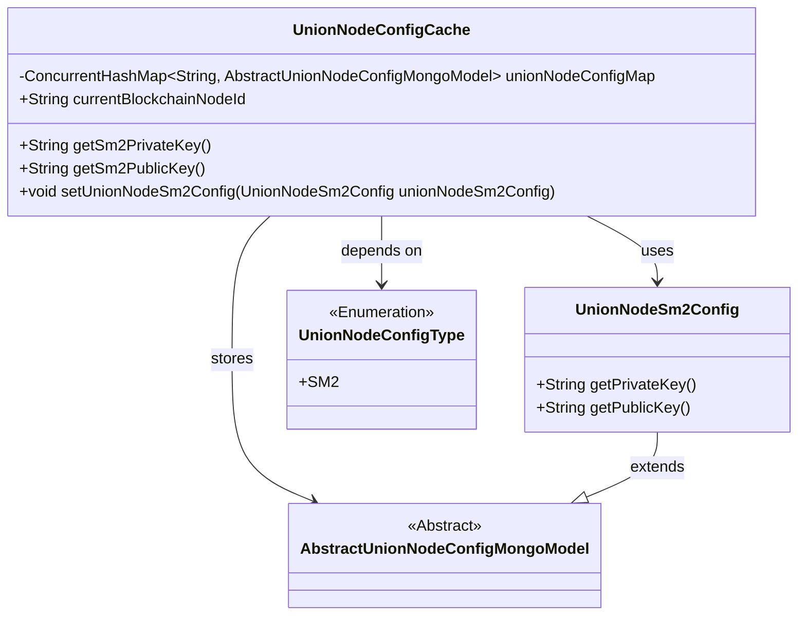
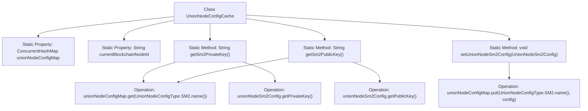

# Basic Information

|      |      |
|------|------|
| Name | UnionNodeConfigCache |
| Language | .java |
| Code Path | WeFe/union/union-service/src/main/java/com/welab/wefe/union/service/cache/UnionNodeConfigCache.java |
| Package Name | com.welab.wefe.union.service.cache |
| Dependencies | ['com.welab.wefe.common.data.mongodb.entity.base.AbstractUnionNodeConfigMongoModel', 'com.welab.wefe.common.data.mongodb.entity.union.UnionNodeSm2Config', 'com.welab.wefe.union.service.constant.UnionNodeConfigType', 'java.util.concurrent.ConcurrentHashMap'] |
| Brief Description | The UnionNodeConfigCache class utilizes a ConcurrentHashMap to store node configurations, provides methods for retrieving and setting SM2 public-private keys, and maintains the current blockchain node ID. |

# Description

The `UnionNodeConfigCache` class is a static configuration cache class that uses `ConcurrentHashMap` to store node configurations of the `AbstractUnionNodeConfigMongoModel` type. It includes a static field `currentBlockchainNodeId` and three static methods: `getSm2PrivateKey` and `getSm2PublicKey` are used to retrieve the private key and public key from the SM2 key configuration, respectively, while `setUnionNodeSm2Config` is used to set the SM2 key configuration. All operations are based on `UnionNodeConfigType.SM2.name()` as the key to access and store configuration data.

# Class Summary

| Name   | Type  | Description |
|-------|------|-------------|
| UnionNodeConfigCache | class | The `UnionNodeConfigCache` class uses `ConcurrentHashMap` to store node configurations, provides methods for retrieving and setting SM2 public-private keys, and records the current blockchain node ID. |

## Class UnionNodeConfigCache

|      |      |
|------|------|
| Access Modifier | public |
| Type | class |
| Name | UnionNodeConfigCache |
| Description | The `UnionNodeConfigCache` class uses `ConcurrentHashMap` to store node configurations, provides methods for retrieving and setting SM2 public-private keys, and records the current blockchain node ID. |

### UML Class Diagram

This code illustrates a configuration caching system where the UnionNodeConfigCache class stores different types of node configurations via ConcurrentHashMap. UnionNodeSm2Config inherits from the abstract class AbstractUnionNodeConfigMongoModel, providing SM2 encryption-related public/private key management functionalities. The UnionNodeConfigType enumeration identifies configuration types. The cache class offers thread-safe configuration data management through static methods for key access and configuration setup.

### Internal Method Call Graph

This flowchart illustrates the structure of the UnionNodeConfigCache class and its key method invocation relationships. The class contains two static properties and three static methods, where both getSm2PrivateKey() and getSm2PublicKey() retrieve the SM2 configuration object via unionNodeConfigMap and return the corresponding keys, while the setUnionNodeSm2Config() method updates the configuration mapping. All methods operate around the ConcurrentHashMap-type unionNodeConfigMap, implementing thread-safe configuration management functionality.

### Field List

| Name  | Type  | Description |
|-------|-------|------|
| unionNodeConfigMap = new ConcurrentHashMap<>() | ConcurrentHashMap<String, AbstractUnionNodeConfigMongoModel> | Defined a thread-safe hash map with string-type keys and values being Mongo model objects of abstract union node configurations. |
| currentBlockchainNodeId | String | Static string variable storing the current blockchain node ID. |

### Method List

| Name  | Type  | Description |
|-------|-------|------|
| getSm2PrivateKey | String | Static method to obtain the SM2 private key, which reads the UnionNodeSm2Config instance from the configuration map and returns its private key. |
| getSm2PublicKey | String | Obtain SM2 Public Key: Extract the SM2 configuration object from the ConfigMap and return its public key. |
| setUnionNodeSm2Config | void | This method stores the SM2 configuration object into the configuration map, using the enum name of UnionNodeConfigType.SM2 as the key. |

