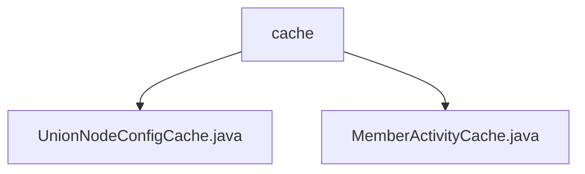

# Basic Information

|      |      |
|------|------|
| Name | cache |
| Language | .java |
| Code Path | WeFe/union/union-service/src/main/java/com/welab/wefe/union/service/cache |
| Package Name | docs.union.union-service.src.main.java.com.welab.wefe.union.service.cache |
| Brief Description | The UnionNodeConfigCache class caches node configurations and provides methods for retrieving and setting SM2 keys. The MemberActivityCache class, implemented as a singleton, manages member activity information and supports functionalities for adding and checking validity periods. |

# Description

## Overview  
The core responsibility of this module is to provide thread-safe configuration and activity information cache management, utilizing ConcurrentHashMap for data storage in multi-threaded environments. The interface specifications include read/write operations for key configurations (e.g., SM2 key pair retrieval/setting) and member activity status validation, all accessed via type-safe key-value pairs (e.g., `UnionNodeConfigType.SM2.name()`).  

Key data structures include `AbstractUnionNodeConfigMongoModel` (the base class for node configurations) and member object mapping tables. External dependencies are limited to MongoDB models and the SM2 encryption algorithm. For example, `UnionNodeConfigCache` associates blockchain nodes through the `currentBlockchainNodeId` field, while `MemberActivityCache` employs timestamp comparison to validate activity expiration.  

## Primary Business Scenarios  
Typical application patterns fall into two categories: 1) Node key management scenarios, such as dynamically updating SM2 configurations via `setUnionNodeSm2Config`; 2) Member status maintenance scenarios, resembling an event bus pattern, where activity status synchronization and validation are achieved through methods like `add`/`isActivePeriod`.  

Functional completeness is reflected in the dual-cache system covering both static configurations (e.g., keys) and dynamic data (e.g., member activities), with all operations incorporating built-in null checks. For instance, `MemberActivityCache` rejects incoming timestamps later than the cached time to ensure data consistency. The API types are exclusively in-memory operation interfaces, with integration use cases including key loading during blockchain node initialization and activity status tracking in member services.

### Package Internal Structure View

This flowchart illustrates the file structure relationships under the `cache` directory in the `union-service` project. The `cache` serves as the parent node, containing two child nodes: the `UnionNodeConfigCache.java` and `MemberActivityCache.java` cache class files. This reflects the basic composition of the caching module in the project, which is used to manage caching functionalities for alliance node configurations and member activity data.

# File List

| Name   | Type  | Description |
|-------|------|-------------|
| [UnionNodeConfigCache.java](UnionNodeConfigCache.md) | file | The UnionNodeConfigCache class uses ConcurrentHashMap to store node configurations, provides methods for obtaining and setting SM2 public-private keys, and maintains the current blockchain node ID. |
| [MemberActivityCache.java](MemberActivityCache.md) | file | MemberActivityCache is a singleton class that uses ConcurrentHashMap to cache member information, providing functionality to add and check whether a member's activity time is valid. |

