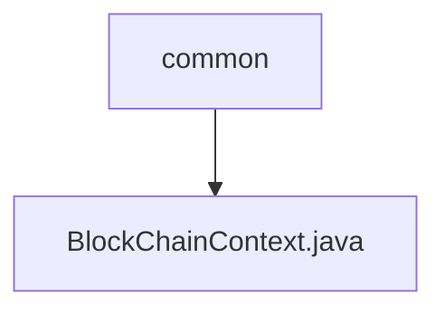

# Basic Information

|      |      |
|------|------|
| Name | common |
| Language | .java |
| Code Path | WeFe/union/union-service/src/main/java/com/welab/wefe/union/service/common |
| Package Name | docs.union.union-service.src.main.java.com.welab.wefe.union.service.common |
| Brief Description | The input content is empty, unable to generate a summary description. |

# Description

The input content is empty and cannot generate a summary description. Please provide the specific content that needs to be summarized.

### Package Internal Structure View

The flowchart illustrates the Java code structure of the union-service module in the WeFe project. The root node "common" represents the public code directory, which contains a blockchain-related Java file "BlockChainContext.java". This structure reflects the location of the blockchain context class in the project, serving as part of the service layer's common components.

# File List

| Name   | Type  | Description |
|-------|------|-------------|
| [BlockChainContext.java](BlockChainContext.md) | file | The input content is empty, unable to generate a summary description. |

