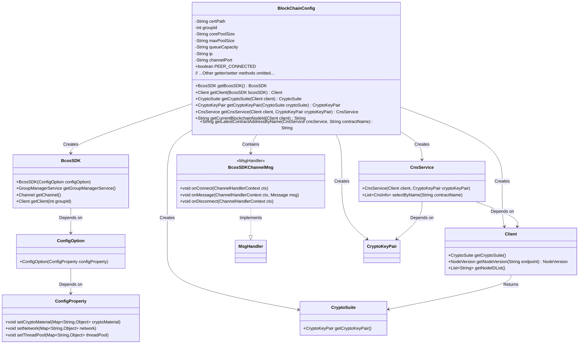

# Basic Information

|      |      |
|------|------|
| Name | BlockChainConfig |
| Language | .java |
| Code Path | WeFe/union/union-service/src/main/java/com/welab/wefe/union/service/config/BlockChainConfig.java |
| Package Name | com.welab.wefe.union.service.config |
| Dependencies | ['com.welab.wefe.common.StatusCode', 'com.welab.wefe.common.exception.StatusCodeWithException', 'com.welab.wefe.common.wefe.enums.ContractName', 'com.welab.wefe.union.service.contract', 'io.netty.channel.ChannelHandlerContext', 'org.apache.commons.collections4.CollectionUtils', 'org.fisco.bcos.sdk.BcosSDK', 'org.fisco.bcos.sdk.client.Client', 'org.fisco.bcos.sdk.config.ConfigOption', 'org.fisco.bcos.sdk.config.model.ConfigProperty', 'org.fisco.bcos.sdk.contract.precompiled.cns.CnsInfo', 'org.fisco.bcos.sdk.contract.precompiled.cns.CnsService', 'org.fisco.bcos.sdk.crypto.CryptoSuite', 'org.fisco.bcos.sdk.crypto.keypair.CryptoKeyPair', 'org.fisco.bcos.sdk.model.Message', 'org.fisco.bcos.sdk.model.NodeVersion.ClientVersion', 'org.fisco.bcos.sdk.network.MsgHandler', 'org.slf4j.Logger', 'org.slf4j.LoggerFactory', 'org.springframework.boot.context.properties.ConfigurationProperties', 'org.springframework.context.annotation.Bean', 'org.springframework.context.annotation.Configuration', 'java.util.ArrayList', 'java.util.HashMap', 'java.util.List', 'java.util.Map'] |
| Brief Description | This is a blockchain configuration class used to initialize the BcosSDK and related contract services. It includes certificate paths, thread pool configurations, network node settings, and the loading logic for multiple smart contracts. It retrieves the latest contract addresses through the CNS service and manages connection status. |

# Description

This is a Spring Boot-based blockchain configuration class primarily used for initializing the FISCO BCOS blockchain SDK and related services. The class defines properties such as certificate paths, group IDs, thread pool configurations, node IPs, and ports. It creates instances of BcosSDK, clients, cryptographic suites, key pairs, and multiple smart contract services through @Bean methods. The inner class BcosSDKChannelMsg handles node connection status changes, logging connection and disconnection events. The getLatestContractAddressByName method retrieves the latest contract address from the CNS service based on the contract name. All configuration properties can be modified via setter methods and support loading from configuration files.

# Class Summary

| Name   | Type  | Description |
|-------|------|-------------|
| BlockChainConfig | class | The BlockChainConfig class configures the blockchain SDK, including parameters such as certificate paths, thread pools, and node networks, and initializes multiple smart contract instances. |

## Class BlockChainConfig

|      |      |
|------|------|
| Access Modifier | @Configuration;@ConfigurationProperties(prefix = "block.chain");public |
| Type | class |
| Name | BlockChainConfig |
| Description | The BlockChainConfig class configures the blockchain SDK, including parameters such as certificate paths, thread pools, and node networks, and initializes multiple smart contract instances. |

### UML Class Diagram

This code represents a blockchain configuration class, primarily responsible for initializing the blockchain SDK and related services. The BlockChainConfig class loads configuration parameters via @ConfigurationProperties, including certificate paths, thread pool settings, and other attributes. The core method getBcosSDK() creates a BcosSDK instance and configures cryptographic materials, network nodes, and thread pool parameters. The class also creates blockchain components such as Client and CryptoSuite through multiple @Bean methods, and implements contract address query functionality. The inner class BcosSDKChannelMsg monitors network connection status. The overall structure demonstrates how a Spring configuration class integrates with a blockchain SDK.

### Internal Method Call Graph

```mermaid
graph TD
    A["Class BlockChainConfig"]
    B["Static Inner Class: BcosSDKChannelMsg"]
    C["Property: String certPath"]
    D["Property: int groupId"]
    E["Property: String corePoolSize"]
    F["Property: String maxPoolSize"]
    G["Property: String queueCapacity"]
    H["Property: String ip"]
    I["Property: String channelPort"]
    J["Static Property: boolean PEER_CONNECTED"]
    K["Method: getBcosSDK()"]
    L["Method: getClient()"]
    M["Method: getCryptoSuite()"]
    N["Method: getCryptoKeyPair()"]
    O["Method: getCnsService()"]
    P["Method: getCurrentBlockchainNodeId()"]
    Q["Method: getLatestContractAddressByName()"]
    R["Method: Multiple getLatestVersionXXXContract()"]
    S["Method: Getters/Setters for properties"]

    A --> B
    A --> C
    A --> D
    A --> E
    A --> F
    A --> G
    A --> H
    A --> I
    A --> J
    A --> K
    A --> L
    A --> M
    A --> N
    A --> O
    A --> P
    A --> Q
    A --> R
    A --> S

    B --> B1["onConnect(ChannelHandlerContext)"]
    B --> B2["onMessage(ChannelHandlerContext, Message)"]
    B --> B3["onDisconnect(ChannelHandlerContext)"]

    K --> K1["Initialize cryptoMaterial"]
    K --> K2["Initialize network"]
    K --> K3["Initialize threadPool"]
    K --> K4["Create ConfigProperty"]
    K --> K5["Create ConfigOption"]
    K --> K6["Create BcosSDK instance"]
    K --> K7["Get ClientVersion"]
    K --> K8["Add connect/disconnect handlers"]
```

This code represents a Spring configuration class for initializing blockchain-related services and contracts. Its primary functions include: 1) Configuring blockchain network parameters; 2) Creating core BcosSDK services; 3) Initializing various smart contract Beans. The flowchart illustrates the class structure, property relationships, and method call chains, particularly detailing the initialization process of the getBcosSDK() method and event handling methods of the BcosSDKChannelMsg inner class. Through layered initialization, this configuration class ultimately provides comprehensive blockchain service access capabilities.

### Field List

| Name  | Type  | Description |
|-------|-------|------|
| ip = "127.0.0.1" | String | Define a private string variable ip with an initial value of the local loopback address 127.0.0.1. |
| PEER_CONNECTED = true | boolean | The static boolean variable PEER_CONNECTED, with a value of true, indicates that the peer connection has been established. |
| channelPort = "20200" | String | The private string variable channelPort is initialized to "20200". |
| log =            LoggerFactory.getLogger(BlockChainConfig.class) | Logger | Define a private static log constant for the BlockChainConfig class, using LoggerFactory to obtain the log instance. |
| maxPoolSize | String | Declare a private string variable maxPoolSize. |
| groupId | int | Private integer variable groupId |
| corePoolSize | String | Declare a private string variable corePoolSize. |
| queueCapacity | String | The private string variable queueCapacity is used to represent the queue capacity. |
| certPath = "conf" | String | The Java variable certPath stores the certificate path, with a default value of "conf". |

### Method List

| Name  | Type  | Description |
|-------|-------|------|
| getLatestVersionMemberServiceContract | MemberServiceContract | This method retrieves the latest version of the MemberService contract address through the CNS service and loads the contract instance. It requires passing the CNS service, client, and key pair, and may throw exceptions. |
| setMaxPoolSize | void | A public method to set the maximum pool size, assigning the input string to the class variable maxPoolSize. |
| getLatestContractAddressByName | String | The method retrieves the latest contract address by name via the CNS service. It throws an exception if the query fails or returns an empty result, otherwise returns the last address in the list. |
| setGroupId | void | The method to set the group ID assigns the parameter groupId to the groupId property of the current object. |
| getLatestVersionBloomFilterContract | BloomFilterContract | The method retrieves the latest version of the Bloom filter contract address via the CNS service and loads the contract instance. It requires passing the CNS service, client, and key pair parameters, and may throw exceptions. |
| getMaxPoolSize | String | Method to obtain the maximum thread pool size, returns the maxPoolSize value as a string type. |
| setCorePoolSize | void | Method to set the core thread count of the thread pool, with the parameter being of string type. |
| getCurrentBlockchainNodeId | String | The method obtains the list of blockchain node IDs via the client and returns the first node ID. |
| setCertPath | void | The method to set the certificate path assigns the input parameter certPath to the class member variable certPath. |
| getLatestVersionDataSetMemberPermissionContract | DataSetMemberPermissionContract | This method retrieves the latest version of the dataset member permission contract address through the CNS service and returns the loaded contract instance. It requires passing the CNS service, client, and key pair parameters, and may throw exceptions. |
| getCnsService | CnsService | The Bean method for creating a CnsService instance, which accepts Client and CryptoKeyPair parameters and returns an initialized CnsService object. |
| getLatestVersionDataResourceContract | DataResourceContract | Define a Bean method to retrieve the latest data resource contract address via the CNS service and load the contract instance. |
| getCryptoKeyPair | CryptoKeyPair | Create a Bean method that returns an encrypted suite key pair. |
| getCryptoSuite | CryptoSuite | Create a Spring Bean that returns the client cipher suites. |
| getLatestVersionMemberContract | MemberContract | The method retrieves the latest version of the MemberContract contract address via the CNS service and loads the contract instance using the client and key pair. |
| getBcosSDK | BcosSDK | Initialize a BcosSDK instance, configure the certificate path, node network, and thread pool parameters, create a ConfigOption, and set up the connection handler. |
| getLatestVersionUnionNodeContract | UnionNodeContract | This method retrieves the latest version of the UnionNode contract address through the CNS service and loads the contract instance using the client and key pair. |
| getClient | Client | Create a Bean method to obtain and return the Client instance of a specified group via BcosSDK. |
| getLatestVersionTableDataSetContract | TableDataSetContract | The method retrieves the latest TableDataSet contract address via the CNS service and loads the contract instance. It requires passing CNS service, client, and key pair parameters, and may throw exceptions. |
| getLatestVersionMemberFileInfoContract | MemberFileInfoContract | This method retrieves the latest version of the MemberFileInfo contract address via the CNS service and loads the contract instance. It requires passing the CNS service, client, and key pair parameters, and may throw exceptions. |
| getCertPath | String | Methods to obtain the certificate path, returning the value of the certPath variable of string type. |
| getCorePoolSize | String | Methods to obtain the core thread count of a thread pool, returning the corePoolSize value as a string. |
| getGroupId | int | The method returns the value of the integer variable groupId. |
| getLatestVersionDataSetContract | DataSetContract | Define a Bean method to fetch the latest data set contract address via the CNS service and load the contract instance. |
| getQueueCapacity | String | Methods to obtain queue capacity, returning the queue capacity value as a string type. |
| getLatestVersionImageDataSetContract | ImageDataSetContract | Load the latest version of ImageDataSetContract, obtain the contract address through the CNS service, and initialize it using the client and key pair. |
| setQueueCapacity | void | Methods for setting queue capacity, assigning the input parameter queueCapacity to the class property of the same name. |
| getIp | String | Methods to obtain the IP address, returning the IP value as a string type. |
| setIp | void | The method to set the IP address assigns the incoming string parameter to the class's ip variable. |
| getChannelPort | String | Public method to obtain the channelPort value. |
| setChannelPort | void | The method to set the channel port is to assign the input parameter channelPort to the class member variable channelPort. |

