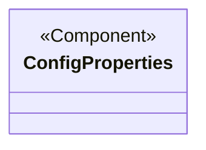
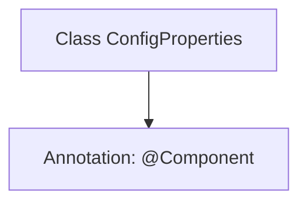

# Basic Information

|      |      |
|------|------|
| Name | ConfigProperties |
| Language | .java |
| Code Path | WeFe/union/union-service/src/main/java/com/welab/wefe/union/service/config/ConfigProperties.java |
| Package Name | com.welab.wefe.union.service.config |
| Dependencies | ['org.springframework.stereotype.Component'] |
| Brief Description | Configuration Property Component Class |

# Description

This is a Spring component class named ConfigProperties, marked with the @Component annotation, indicating it is a component that can be managed by the Spring container. The class is currently empty, with no properties or methods defined, and may be used for injecting or storing configuration properties later. As a configuration class, it is typically used to centrally manage application configuration parameters.

# Class Summary

| Name   | Type  | Description |
|-------|------|-------------|
| ConfigProperties | class | Configuration Attribute Component Class. |

## Class ConfigProperties

|      |      |
|------|------|
| Access Modifier | @Component;public |
| Type | class |
| Name | ConfigProperties |
| Description | Configuration Attribute Component Class. |

### UML Class Diagram

This class diagram illustrates a simple Spring component class `ConfigProperties`, annotated with `<<Component>>` to indicate it is a component managed by the Spring framework. The current class has an empty implementation, typically used for storing configuration properties, which can later be injected via `@Value` or `@ConfigurationProperties` for external configurations. The diagram adheres to the basic structure of a Spring component, reserving space for future extension of configuration properties.

### Internal Method Call Graph

This code defines a Spring component class named `ConfigProperties`, annotated with `@Component`. This annotation indicates that the class will be automatically detected and registered as a Bean in the Spring application context, typically used for configuration properties or utility classes. Since the class body is empty, it currently serves only as a basic component container, with the potential to add configuration-related properties or methods later.

### Field List

| Name  | Type  | Description |
|-------|-------|------|

### Method List

| Name  | Type  | Description |
|-------|-------|------|

