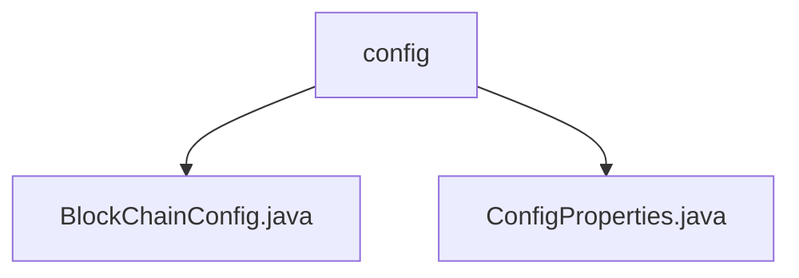

# Basic Information

|      |      |
|------|------|
| Name | config |
| Language | .java |
| Code Path | WeFe/union/union-service/src/main/java/com/welab/wefe/union/service/config |
| Package Name | docs.union.union-service.src.main.java.com.welab.wefe.union.service.config |
| Brief Description | The BlockChainConfig class initializes the FISCO BCOS blockchain SDK, configures properties such as certificates and group IDs, and creates SDK instances and smart contract services. ConfigProperties is an empty Spring component class used for subsequent configuration management. |

# Description

## Overview  
This module is implemented based on Spring Boot, with its core responsibility being the initialization of the FISCO BCOS blockchain SDK and the management of related service configurations. It creates BcosSDK instances, clients, encryption suites, and other components through @Bean methods, constructing blockchain infrastructure in a manner similar to the factory pattern. Key data structures include configuration properties such as certificate paths, group IDs, and node IPs/ports, as well as the internal class BcosSDKChannelMsg for handling node connection status changes. External dependencies primarily include the FISCO BCOS SDK and the Spring framework. For example, the getLatestContractAddressByName method dynamically retrieves contract addresses from the CNS service.

## Main Business Scenarios  
The module supports rapid initialization and dynamic configuration of blockchain services, with typical scenarios including smart contract deployment and node connection management. Flexible configuration is achieved through property injection, allowing dynamic adjustments to parameters such as thread pool settings and certificate paths. The interaction model adopts an event-driven mechanism, similar to an event bus pattern, to monitor node connection status changes. Functional completeness is reflected in its support for both basic SDK construction (e.g., key pair generation) and advanced services (e.g., CNS queries). API types encompass configuration injection and contract address queries, such as overriding default configurations via setter methods.

### Package Internal Structure View

This flowchart illustrates the directory structure of the config configuration under the union-service module in the WeFe project. The config directory contains two Java configuration files: BlockChainConfig.java and ConfigProperties.java, which are used for blockchain configuration and general property configuration, respectively. This structure clearly reflects the organization of configuration files, making it easier for developers to quickly locate relevant configuration classes.

# File List

| Name   | Type  | Description |
|-------|------|-------------|
| [BlockChainConfig.java](BlockChainConfig.md) | file | This is a blockchain configuration class used to initialize the BcosSDK and related contract services. It includes certificate paths, thread pool configurations, network node settings, and the loading logic for multiple smart contracts. It retrieves the latest contract addresses through the CNS service and manages connection status. |
| [ConfigProperties.java](ConfigProperties.md) | file | Configuration Attribute Component Class |

