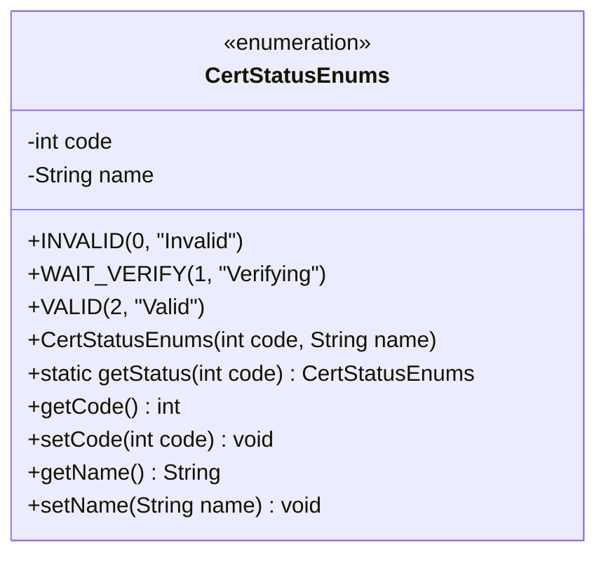
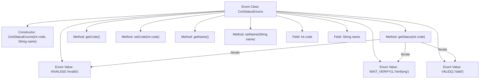

# Basic Information

|      |      |
|------|------|
| Name | CertStatusEnums |
| Language | .java |
| Code Path | WeFe/union/union-service/src/main/java/com/welab/wefe/union/service/constant/CertStatusEnums.java |
| Package Name | com.welab.wefe.union.service.constant |
| Dependencies | [] |
| Brief Description | The enumeration CertStatusEnums defines certification statuses: 0 invalid, 1 in progress, 2 valid, and provides a method to retrieve the status based on the code. |

# Description

The enumeration class CertStatusEnums defines three certification statuses: INVALID (invalid, code=0), WAIT_VERIFY (pending verification, code=1), and VALID (valid, code=2). Each enum item includes code and name attributes, with getter/setter methods provided. The class implements a static method getStatus to look up the corresponding enum item by its code value, returning null if not found. The overall structure is designed to manage the mapping relationship between certification status codes and their corresponding states.

# Class Summary

| Name   | Type  | Description |
|-------|------|-------------|
| CertStatusEnums | enum | The enumeration CertStatusEnums defines certification statuses: 0 invalid, 1 in progress, 2 valid, including methods for retrieving status. |

## Class CertStatusEnums

|      |      |
|------|------|
| Access Modifier | public |
| Type | enum |
| Name | CertStatusEnums |
| Description | The enumeration CertStatusEnums defines certification statuses: 0 invalid, 1 in progress, 2 valid, including methods for retrieving status. |

### UML Class Diagram

This code defines an enumeration class `CertStatusEnums` to represent certification statuses. The enumeration includes three constant values: `INVALID` (Invalid), `WAIT_VERIFY` (Verifying), and `VALID` (Valid), each with a corresponding status code and name. The class provides methods to get and set the status code and name, as well as a static method `getStatus` to look up the corresponding enumeration value based on the status code. The enumeration class is initialized via a private constructor and encapsulates two attributes: the status code and name.

### Internal Method Call Graph

This flowchart illustrates the complete structure of the CertStatusEnums enum class, including three predefined enum values (INVALID/WAIT_VERIFY/VALID) with their corresponding status codes and descriptions. The class contains a constructor, a static method getStatus() for finding enums by code, as well as getter/setter methods for the code and name fields. The core logic getStatus() iterates through all enum values for matching, clearly demonstrating the invocation relationship between enum values and the lookup method in the flowchart.

### Field List

| Name  | Type  | Description |
|-------|-------|------|

### Method List

| Name  | Type  | Description |
|-------|-------|------|

