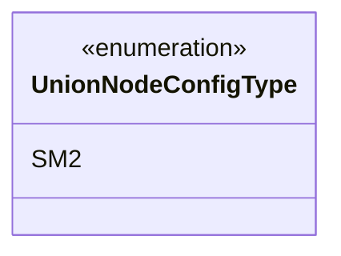
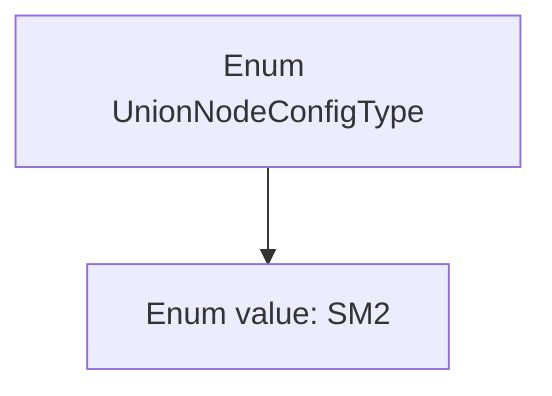

# Basic Information

|      |      |
|------|------|
| Name | UnionNodeConfigType |
| Language | .java |
| Code Path | WeFe/union/union-service/src/main/java/com/welab/wefe/union/service/constant/UnionNodeConfigType.java |
| Package Name | com.welab.wefe.union.service.constant |
| Dependencies | [] |
| Brief Description | The UnionNodeConfigType enumeration type currently only includes the SM2 configuration item. |

# Description

The content defines a public enumeration type named `UnionNodeConfigType`, which contains only one enumeration value: `SM2`. Enumerations are used to represent a finite set of configuration types, where `SM2` here may serve as an identifier for a specific configuration or algorithm. The entire definition is concise and clear, without any additional modifiers or extensions.

# Class Summary

| Name   | Type  | Description |
|-------|------|-------------|
| UnionNodeConfigType | enum | The UnionNodeConfigType enumeration type currently only includes the SM2 configuration item. |

## Class UnionNodeConfigType

|      |      |
|------|------|
| Access Modifier | public |
| Type | enum |
| Name | UnionNodeConfigType |
| Description | The UnionNodeConfigType enumeration type currently only includes the SM2 configuration item. |

### UML Class Diagram

This code defines an enumeration type named UnionNodeConfigType, which currently contains only one enum value SM2. Enumeration types are used to represent a fixed set of constants, likely for configuring node types here. As an enumeration, it is marked with <<enumeration>> in the class diagram and lists all its enum values. The structure is simple but provides clear type safety constraints for the system.

### Internal Method Call Graph

This code defines an enum type named UnionNodeConfigType, which contains an enum value SM2. An enum is a special class that represents a fixed set of constants. In this example, the UnionNodeConfigType enum includes only one constant SM2, likely used to represent a specific configuration type or mode. Enums are typically used as an alternative to constant definitions, offering better type safety and readability. The entire structure is very simple, with no methods or properties defined—just the most basic enum declaration.

### Field List

| Name  | Type  | Description |
|-------|-------|------|

### Method List

| Name  | Type  | Description |
|-------|-------|------|

