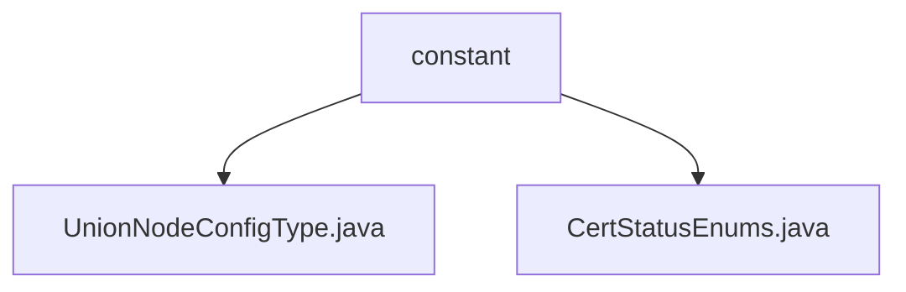

# Basic Information

|      |      |
|------|------|
| Name | constant |
| Language | .java |
| Code Path | WeFe/union/union-service/src/main/java/com/welab/wefe/union/service/constant |
| Package Name | docs.union.union-service.src.main.java.com.welab.wefe.union.service.constant |
| Brief Description | The UnionNodeConfigType enumeration includes the SM2 value, indicating the configuration type. The CertStatusEnums enumeration defines three authentication states: Invalid (0), Authenticating (1), and Valid (2), along with a status code lookup method. |

# Description

## Overview  
The core responsibility of this module is to provide enumeration type definitions for standardized identification of configuration types and authentication states. The interface specifications include static methods for querying enumeration items by Code values (e.g., `getStatus`) and basic property accessors. Key data structures are `UnionNodeConfigType` (containing the SM2 value) and `CertStatusEnums` (with three states: INVALID/WAIT_VERIFY/VALID). There are no external dependencies. Implementation examples include SM2 algorithm identification and authentication status code mapping (e.g., Code=2 corresponds to the VALID state).

## Key Business Scenarios  
The module supports configuration type identification and authentication process state management, similar to a state machine pattern. The complete business process involves converting from Code to enumeration values (e.g., `getStatus(1)` returns WAIT_VERIFY) and type validation. Typical applications include algorithm configuration selection (e.g., SM2) and certificate status tracking, with the API type being enumeration query interfaces. Integration examples cover authentication system state transitions and encryption configuration identification scenarios.

### Package Internal Structure View

This flowchart illustrates the hierarchical structure of the constant directory under the union-service module in the WeFe project. The parent node "constant" contains two enum class files: UnionNodeConfigType.java and CertStatusEnums.java. These files define the union node configuration types and certificate status enum values respectively, belonging to the foundational constant definitions of the service layer. The entire structure is concise and clear, reflecting a typical constant package organization in Java projects.

# File List

| Name   | Type  | Description |
|-------|------|-------------|
| [UnionNodeConfigType.java](UnionNodeConfigType.md) | file | The UnionNodeConfigType enumeration type currently only includes the SM2 configuration item. |
| [CertStatusEnums.java](CertStatusEnums.md) | file | The enumeration CertStatusEnums defines certification statuses: 0 invalid, 1 in progress, 2 valid, and provides a method to retrieve the status based on the code. |

