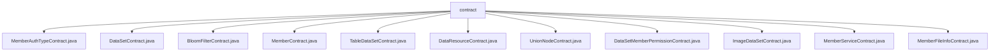

# Basic Information

|      |      |
|------|------|
| Name | contract |
| Language | .java |
| Code Path | WeFe/union/union-service/src/main/java/com/welab/wefe/union/service/contract |
| Package Name | docs.union.union-service.src.main.java.com.welab.wefe.union.service.contract |
| Brief Description | MemberAuthTypeContract: Manages member authentication types, supporting CRUD operations, extended JSON updates, and event listening, with ECDSA/SM encryption.  DataSetContract: Dataset management contract, providing CRUD functionality, supporting ECDSA/SM2 encryption and event notifications.  BloomFilterContract: Bloom filter contract, supporting data CRUD operations and hash function updates, with event subscription.  MemberContract: Member management contract, supporting CRUD operations, paginated queries, and event listening, with ECDSA/SM encryption.  TableDataSetContract: Data table management contract, providing CRUD operations and event subscription, supporting national/non-national cryptographic algorithms.  DataResourceContract: Data resource management contract, supporting status updates, queries, and event listening, using generic type handling.  UnionNodeContract: Alliance node management contract, supporting node CRUD operations and status updates, with 6 types of event listening.  DataSetMemberPermissionContract: Data permission management contract, supporting permission queries and operations, with ECDSA/SM2 encryption.  ImageDataSetContract: Image dataset management contract, providing CRUD operations and extended JSON updates, with event subscription.  MemberServiceContract: Member service management contract, supporting service CRUD operations and event notifications, including ABI and binary code.  MemberFileInfoContract: Member file management contract, supporting file information updates and queries, with 4 types of event listening. |

# Description

## Overview  
This module is a set of Java wrapper classes for smart contracts based on FISCO BCOS, with its core responsibility being to provide member management, data resource operations, and permission control functionalities in a consortium blockchain environment, akin to an on-chain implementation of an enterprise-level RBAC system. The interface specifications uniformly include CRUD operations, extended JSON updates, existence checks, and event subscriptions, supporting both ECDSA/SM2 dual algorithms and synchronous/asynchronous transaction modes. Key data structures include event response inner classes, Tuple multi-return value encapsulation, and BigInteger numerical processing. External dependencies primarily consist of the FISCO BCOS SDK and the national cryptographic algorithm library. For example, MemberContract implements full lifecycle management of members, while DataSetContract provides paginated queries for datasets.

## Key Business Scenarios  
The module supports three typical scenarios: 1) Member system management (e.g., updating authentication types, maintaining file information), 2) Data resource operations (e.g., CRUD for image datasets, Bloom filter maintenance), and 3) Permission control (e.g., dataset member permission verification). Business processes notify state changes through an event bus pattern, such as insertEvent triggering subsequent audit processes. API integration examples include joint node management (UnionNodeContract) and service registration (MemberServiceContract), forming a comprehensive consortium blockchain governance solution. All contracts adhere to the ABI specification, enabling Java applications to access on-chain data through type-safe interfaces.

### Package Internal Structure View

This flowchart illustrates the directory structure of the contract folder within the union-service module of the WeFe project, comprising 11 Java contract files. These files cover various contract types such as member authentication, datasets, Bloom filters, and data resources. All files are directly subordinate to the contract node, presenting a flat structure that reflects the design pattern focused on defining diverse service contract interfaces within this directory.

# File List

| Name   | Type  | Description |
|-------|------|-------------|
| [MemberAuthTypeContract.java](MemberAuthTypeContract.md) | file | The MemberAuthTypeContract is a smart contract class designed for managing member authentication types. Its primary functions include updating extended JSON, modifying type information, checking type existence, querying all types, inserting new types, and deleting types. The contract incorporates four events: insertEvent, updateEvent, deleteByTypeIdEvent, and updateExtJsonEvent, which log operation outcomes. It supports both synchronous and asynchronous transactions and provides methods for parsing input/output parameters. The contract can be utilized either through deployment or by loading an existing contract address. |
| [DataSetContract.java](DataSetContract.md) | file | DataSetContract is a smart contract class that inherits from Contract, encompassing functionalities for dataset CRUD (Create, Read, Update, Delete). It provides operations such as insertion, update, deletion, and query, supporting event listening and callbacks. The contract includes ABI and binary code, compatible with ECDSA and SM2 encryption. Key features include query by ID, paginated queries, updating extended JSON, and more. |
| [BloomFilterContract.java](BloomFilterContract.md) | file | BloomFilterContract is a smart contract class that provides Bloom filter functionality, including insert, query, update, and delete operations. It supports event listening and is suitable for data resource management scenarios. |
| [MemberContract.java](MemberContract.md) | file | The MemberContract is a smart contract class that inherits from the Contract class and is used for managing member information. Its primary functions include updating member extended information, updating excluded logos, querying member information, deleting members, checking member existence, updating member logos, updating last activity time, updating public keys, updating excluded public keys, counting members, querying all members, inserting new members, and paginated member queries. The contract supports event listening, such as insertion events and update events. It provides methods for deploying and loading contracts and supports ECDSA and SM encryption algorithms. |
| [TableDataSetContract.java](TableDataSetContract.md) | file | TableDataSetContract is a smart contract class designed for managing tabular datasets. Its primary functionalities include:1. Data Operations:- selectById: Query data by ID- update: Update data- isExist: Check if data exists- deleteByDataResourceId: Delete data- updateExtJson: Update extended JSON- insert: Insert new data2. Event Listening:- insertEvent: Insert event- updateEvent: Update event- updateExtJsonEvent: Update JSON event- deleteByDataResourceIdEvent: Delete event3. Contract Deployment:- Supports standard deployment and loading existing contracts- Supports ECDSA and SM2 encryption algorithms4. Auxiliary Functions:- Retrieve transaction input/output parameters- Generate signed transactions- Asynchronous transaction callbacksThe contract interacts with the blockchain using ABI encoding and provides comprehensive CRUD (Create, Read, Update, Delete) functionality for data management. |
| [DataResourceContract.java](DataResourceContract.md) | file | DataResourceContract is a smart contract class that inherits from the Contract class, providing data resource management functionalities. Its key features include:1. CRUD operations for data resources:   - insert - Insert a new data resource     - update - Update a data resource   - deleteByDataResourceId - Delete a data resource   - selectById - Query a data resource   - isExist - Check if a data resource exists2. Extended functionalities:   - updateEnable - Update the enabled status     - updateExtJson - Update extended JSON data3. Includes 5 events:   - insertEvent   - updateEvent   - updateExtJsonEvent     - updateEnableEvent   - deleteByDataResourceIdEvent4. Supports two encryption algorithms: ECDSA and SM2  5. Provides complete ABI and binary code6. Supports asynchronous transaction callbacks  7. Offers event subscription functionality  This contract is suitable for blockchain application scenarios requiring structured data management. |
| [UnionNodeContract.java](UnionNodeContract.md) | file | UnionNodeContract is a smart contract class designed for managing consortium node information. Its primary functionalities include:1. Node CRUD Operations:   - Insert new node (insert)   - Update node information (update)   - Delete node (deleteByUnionNodeId)   - Check node existence (isExist)   - Query all nodes (selectAll)2. Node Attribute Updates:   - Update activation status (updateEnable)   - Update public key (updatePublicKey)   - Update extended JSON (updateExtJson)3. Event Notifications:   - Insert event (InsertEvent)   - Update event (UpdateEvent)   - Activation status update event (UpdateEnableEvent)   - Public key update event (UpdatePublicKeyEvent)   - Deletion event (DeleteByUnionNodeIdEvent)   - Extended JSON update event (UpdateExtJsonEvent)The contract supports both ECDSA and SM2 encryption algorithms and provides a comprehensive Java SDK interface, including synchronous/asynchronous transaction execution and event subscription capabilities. |
| [DataSetMemberPermissionContract.java](DataSetMemberPermissionContract.md) | file | The `DataSetMemberPermissionContract` is a smart contract class designed for managing dataset member permissions. Its primary functionalities include querying member permissions, updating extended JSON, checking existence, paginated queries, inserting and updating permission records, and deleting dataset permissions. The contract supports event listening, such as event responses for insert, update, and delete operations. It is suitable for permission management scenarios in blockchain environments. |
| [ImageDataSetContract.java](ImageDataSetContract.md) | file | ImageDataSetContract is a smart contract class designed for managing image datasets. Its primary functionalities include:1. Data Operations:- selectById: Query data by ID  - update: Update data  - insert: Insert new data  - deleteByDataResourceId: Delete data  - updateExtJson: Update extended JSON data  2. Status Checks:- isExist: Check if data exists  3. Event Notifications:- Corresponding event notifications are triggered for operations such as insertion, update, and deletion.  The contract interacts with the blockchain using ABI encoding and supports two encryption algorithms: ECDSA and SM2. It provides both synchronous and asynchronous invocation methods, along with transaction receipt parsing and event subscription capabilities. |
| [MemberServiceContract.java](MemberServiceContract.md) | file | The MemberServiceContract is a smart contract class that provides member service-related functionalities. It includes operations such as querying, updating, and deleting, and supports event listening. Key features include: querying services by ID, updating service information, checking service existence, deleting services, updating extended JSON data, and more. The contract contains binary code and ABI definitions, supporting both standard and national cryptographic encryption methods. |
| [MemberFileInfoContract.java](MemberFileInfoContract.md) | file | The `MemberFileInfoContract` is a smart contract class that inherits from the `Contract` base class and is used for managing member file information. Its main functionalities include:  1. Providing file activation status updates, existence checks, extended JSON updates, data insertion, and file ID query capabilities.  2. Including 4 events: insertion event, update event, activation status update event, and extended JSON update event.  3. Supporting both regular transactions and asynchronous transaction execution methods.  4. Offering event subscription functionality to monitor contract events.  5. Supporting both ECDSA and SM2 encryption algorithms.  Key points: File information management, multiple query and update operations, event monitoring, dual encryption algorithm support. |

