# Basic Information

|      |      |
|------|------|
| Name | dto |
| Language | .java |
| Code Path | WeFe/union/union-service/src/main/java/com/welab/wefe/union/service/dto |
| Package Name | docs.union.union-service.src.main.java.com.welab.wefe.union.service.dto |
| Brief Description | The TrustCertsQueryOutput class represents the certificate query result, containing fields such as certificate ID and content. The module manages metadata resources of data and supports CRUD operations. The real-name authentication module processes protocol templates and SM2 signature data. The member management module encapsulates member information responses. The basic input module handles pagination and member ID parameters. |

# Description

## Overview  
The core responsibility of this module is to centrally manage multi-domain data in federated learning, including data resource metadata, real-name authentication protocols, member information, and basic query parameters. The interface specification adopts a layered design, with `AbstractTimedApiOutput` serving as the base class to provide timestamp capabilities, while `ApiDataResourceQueryOutput` extends the foundational structure to support tag statistics. Key data structures encompass certificate IDs (`TrustCertsQueryOutput`), resource tags (`TagsDTO`), member details (`MemberQueryOutput`), and pagination parameters (`PageInput`). External dependencies are limited to Java core libraries and abstract classes such as `AbstractApiOutput`. For instance, `RealNameAuthFileUploadOutput` implements file identification via `fileId`, resembling a cloud storage callback mechanism.

## Primary Business Scenarios  
The module supports end-to-end operations in federated learning, akin to a data bus in distributed systems. Business processes include: data resource management (e.g., `DataResourcePutInput` for updating descriptions), real-name authentication (e.g., SM2 signature parameter encapsulation), member information queries (e.g., `MemberQueryOutput` returning 20+ fields), and pagination control (e.g., `PageInput` with default values). The interaction model uniformly employs Getter/Setter methods, reusing common fields through inheritance. Typical applications include certificate queries (`TrustCertsQueryOutput` identifying CA certificates), tag aggregation (`ApiTagsQueryOutput` tracking usage frequency), and file uploads (`RealNameAuthFileUploadOutput` returning credentials). API types cover basic DTOs, pagination control, and extended outputs, such as `ApiTableDataSetQueryOutput` appending column features to the base structure.

### Package Internal Structure View

```mermaid
graph TD
    dto --> cert
    dto --> dataresource
    dto --> common
    dto --> member
    dto --> base
    cert --> TrustCertsQueryOutput.java
    dataresource --> bloomfilter
    dataresource --> dataset
    dataresource --> ApiDataResourceQueryOutput.java
    dataresource --> ApiTagsQueryOutput.java
    dataresource --> TagsDTO.java
    dataresource --> ApiDataResourceDetailInput.java
    dataresource --> DataResourcePutInput.java
    dataresource --> ApiDataResourceQueryInput.java
    bloomfilter --> ApiBloomFilterQueryOutput.java
    dataset --> image
    dataset --> table
    image --> ApiImageDataSetQueryOutput.java
    table --> ApiTableDataSetQueryOutput.java
    table --> ApiDataSetQueryOutput.java
    table --> DataSetDetailOutput.java
    table --> DataSetOutput.java
    table --> ApiDataSetDefaultTagOutput.java
    common --> RealnameAuthAgreementTemplateOutput.java
    common --> SM2SignedApiInput.java
    member --> MemberOutput.java
    member --> RealNameAuthFileUploadOutput.java
    member --> ApiMemberServiceQueryOutput.java
    member --> MemberQueryOutput.java
    base --> BaseInput.java
    base --> PageInput.java
```

This flowchart illustrates the DTO layer structure of the union-service module in the WeFe project, with dto as the root node branching into five main categories: cert, dataresource, common, member, and base. The dataresource branch is the most complex, containing subdirectories for bloomfilter and dataset, with dataset further divided into image and table types. Each branch terminates with specific output/input class files, totaling 25 nodes that comprehensively represent the complete organizational structure of the DTO layer.

# File List

| Name   | Type  | Description |
|-------|------|-------------|
| [cert](cert/_module.md) | package | The `TrustCertsQueryOutput` class inherits from `AbstractTimedApiOutput` and contains fields such as certificate ID, serial number, content, parent certificate ID, issuer and subject information, as well as boolean flags indicating whether it is a CA or root certificate. |
| [common](common/_module.md) | package | The RealnameAuthAgreementTemplateOutput class contains template file ID and name attributes along with corresponding methods. The SM2SignedApiInput class inherits from AbstractApiInput and includes node ID, signature, data attributes, and methods. |
| [dataresource](dataresource/_module.md) | package | ApiBloomFilterQueryOutput inherits from ApiDataResourceQueryOutput and contains the ExtraData inner class to store hashFunction. ApiDataResourceQueryOutput includes attributes such as resource ID and name. The TagsDTO class encapsulates tag data. Input classes like ApiDataResourceDetailInput contain mandatory fields dataResourceId and dataResourceType. The module provides standardized output for dataset queries and supports federated learning metadata management. |
| [base](base/_module.md) | package | BaseInput inherits from AbstractApiInput, containing curMemberId and its getter/setter. PageInput inherits from BaseInput, containing default pageSize(10) and pageIndex(0) along with their getter/setter. |
| [member](member/_module.md) | package | MemberOutput is an empty-implemented API output subclass. RealNameAuthFileUploadOutput handles real-name authentication file uploads and includes a fileId attribute. ApiMemberServiceQueryOutput contains service-related attributes. MemberQueryOutput encapsulates member query results, including basic information and status identifiers. |

