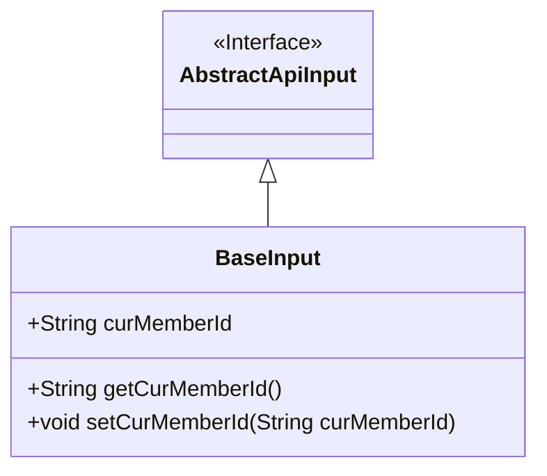
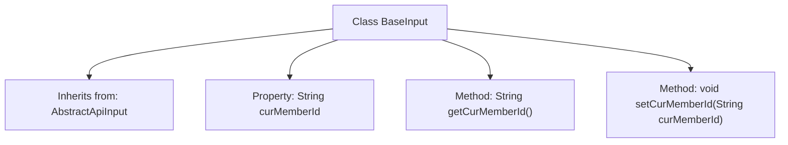

# Basic Information

|      |      |
|------|------|
| Name | BaseInput |
| Language | .java |
| Code Path | WeFe/union/union-service/src/main/java/com/welab/wefe/union/service/dto/base/BaseInput.java |
| Package Name | com.welab.wefe.union.service.dto.base |
| Dependencies | ['com.welab.wefe.common.web.dto.AbstractApiInput'] |
| Brief Description | The BaseInput class inherits from AbstractApiInput and includes the member variable curMemberId along with its getter and setter methods. |

# Description

The BaseInput class inherits from AbstractApiInput and includes a member variable curMemberId of string type, along with corresponding getter and setter methods for accessing and modifying the value of this variable.

# Class Summary

| Name   | Type  | Description |
|-------|------|-------------|
| BaseInput | class | The BaseInput class inherits from AbstractApiInput and includes the member variable curMemberId along with its getter and setter methods. |

## Class BaseInput

|      |      |
|------|------|
| Access Modifier | public |
| Type | class |
| Name | BaseInput |
| Description | The BaseInput class inherits from AbstractApiInput and includes the member variable curMemberId along with its getter and setter methods. |

### UML Class Diagram

This class diagram illustrates the structure where the BaseInput class inherits from the AbstractApiInput interface. BaseInput contains a public string field curMemberId, along with corresponding getter and setter methods. The arrow direction indicates that BaseInput implements the AbstractApiInput interface, adhering to the object-oriented design principle of subclass extending parent class. This structure is commonly used in base class design for API input parameters, achieving parameter standardization through inheritance.

### Internal Method Call Graph

This code illustrates a simple Java class `BaseInput`, which inherits from the `AbstractApiInput` class. The class contains a string-type member variable `curMemberId`, along with corresponding getter and setter methods. The flowchart clearly depicts the inheritance relationship and internal structure of the class, including property definitions and method declarations. Through inheritance, `BaseInput` acquires all the features of `AbstractApiInput` while extending its own specific functionalities.

### Field List

| Name  | Type  | Description |
|-------|-------|------|
| curMemberId | String | The string variable of the current member ID. |

### Method List

| Name  | Type  | Description |
|-------|-------|------|
| getCurMemberId | String | This is a Java method that returns the current member ID string. |
| setCurMemberId | void | The method to set the current member ID assigns the parameter `curMemberId` to the class member variable of the same name. |

