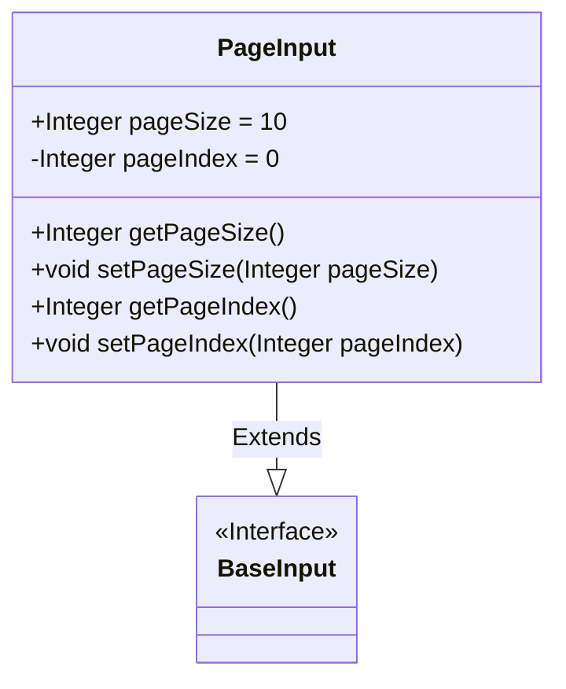
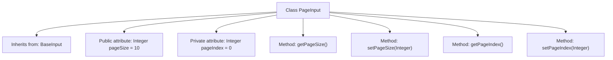

# Basic Information

|      |      |
|------|------|
| Name | PageInput |
| Language | .java |
| Code Path | WeFe/union/union-service/src/main/java/com/welab/wefe/union/service/dto/base/PageInput.java |
| Package Name | com.welab.wefe.union.service.dto.base |
| Dependencies | [] |
| Brief Description | The PageInput class inherits from BaseInput and includes the pageSize and pageIndex properties along with their getter/setter methods, with default values of 10 and 0 respectively. |

# Description

The PageInput class inherits from BaseInput and is used to handle pagination input parameters. This class includes two attributes: pageSize represents the size of each page, with a default value of 10; pageIndex indicates the current page number, with a default value of 0. Getter and setter methods are provided to access and modify these two attributes. pageSize is a public attribute, while pageIndex is a private attribute.

# Class Summary

| Name   | Type  | Description |
|-------|------|-------------|
| PageInput | class | The PageInput class inherits from BaseInput, containing a default page size of 10 and page index of 0, providing getter and setter methods. |

## Class PageInput

|      |      |
|------|------|
| Access Modifier | public |
| Type | class |
| Name | PageInput |
| Description | The PageInput class inherits from BaseInput, containing a default page size of 10 and page index of 0, providing getter and setter methods. |

### UML Class Diagram

This class diagram illustrates the structure where the PageInput class extends the BaseInput interface. PageInput contains two integer attributes: a public attribute pageSize (default value 10) and a private attribute pageIndex (default value 0), along with corresponding getter and setter methods. BaseInput is marked as an interface, and PageInput's inheritance relationship is represented by a solid line with a hollow triangle arrow. This design implements basic encapsulation for pagination parameters, facilitating unified management of page numbers and page sizes.

### Internal Method Call Graph

This code defines a class named PageInput, which inherits from the BaseInput class. The PageInput class contains two attributes: a public attribute pageSize (default value 10) and a private attribute pageIndex (default value 0). The class provides four methods: getPageSize() to retrieve the value of pageSize, setPageSize(Integer) to set the value of pageSize, getPageIndex() to retrieve the value of pageIndex, and setPageIndex(Integer) to set the value of pageIndex. This class is primarily used for handling pagination-related input parameters, leveraging the functionality of the base class through inheritance from BaseInput.

### Field List

| Name  | Type  | Description |
|-------|-------|------|
| pageSize = 10 | Integer | Define an integer variable pageSize with a default value of 10. |
| pageIndex = 0 | Integer | Define an integer variable pageIndex with an initial value of 0. |

### Method List

| Name  | Type  | Description |
|-------|-------|------|
| getPageIndex | Integer | This is a Java method that returns the value of the integer variable pageIndex. |
| getPageSize | Integer | Get the integer value of the current page size. |
| setPageSize | void | This is a Java method used to set the page size, which assigns the passed pageSize parameter to the class's pageSize member variable. |
| setPageIndex | void | Set the integer value of the current page number. |

