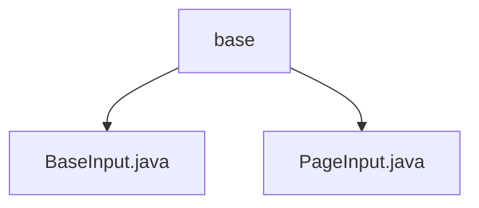

# Basic Information

|      |      |
|------|------|
| Name | base |
| Language | .java |
| Code Path | WeFe/union/union-service/src/main/java/com/welab/wefe/union/service/dto/base |
| Package Name | docs.union.union-service.src.main.java.com.welab.wefe.union.service.dto.base |
| Brief Description | BaseInput inherits from AbstractApiInput, containing curMemberId and its getter/setter. PageInput inherits from BaseInput, containing default pageSize(10) and pageIndex(0) along with their getter/setter. |

# Description

## Overview  
The core responsibility of this module is to provide basic input parameter processing capabilities, including member identification management and pagination control. The interface specification uniformly adopts the Java Bean style, exposing properties through Getter/Setter methods, such as `curMemberId` in `BaseInput` and `pageSize`/`pageIndex` in `PageInput`. Key data structures include string-type member IDs and integer-type pagination parameters. There are no external dependencies.  

## Main Business Scenarios  
Primarily used for constructing paginated query requests, similar to a backend adaptation layer for frontend table controls. A typical application pattern involves extending business parameters by inheriting from `BaseInput`, such as adding pagination control capabilities via `PageInput`. All API types are DTO classes. Integration examples include setting default pagination values (`pageSize=10`) and zero-based page number handling.

### Package Internal Structure View

This flowchart illustrates the DTO base class structure of the union-service module in the WeFe project. The base directory contains two foundational input classes: BaseInput.java serves as the base class for all input parameters, while PageInput.java extends pagination query functionality. This hierarchical relationship reflects a well-organized code structure, facilitating unified management of foundational data transfer objects.

# File List

| Name   | Type  | Description |
|-------|------|-------------|
| [BaseInput.java](BaseInput.md) | file | The BaseInput class inherits from AbstractApiInput and includes the member variable curMemberId along with its getter and setter methods. |
| [PageInput.java](PageInput.md) | file | The PageInput class inherits from BaseInput and includes the pageSize and pageIndex properties along with their getter/setter methods, with default values of 10 and 0 respectively. |

