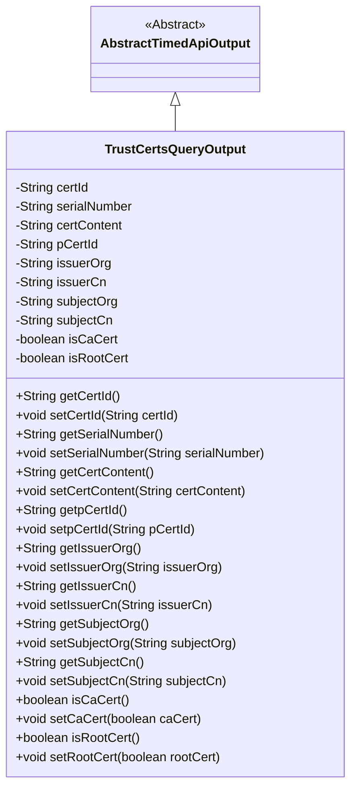

# Basic Information

|      |      |
|------|------|
| Name | TrustCertsQueryOutput |
| Language | .java |
| Code Path | WeFe/union/union-service/src/main/java/com/welab/wefe/union/service/dto/cert/TrustCertsQueryOutput.java |
| Package Name | com.welab.wefe.union.service.dto.cert |
| Dependencies | ['com.welab.wefe.common.web.dto.AbstractTimedApiOutput'] |
| Brief Description | The `TrustCertsQueryOutput` class inherits from `AbstractTimedApiOutput` and includes fields such as certificate ID, serial number, content, parent certificate ID, issuer and subject information, as well as boolean flags indicating whether it is a CA or root certificate. |

# Description

The `TrustCertsQueryOutput` class inherits from `AbstractTimedApiOutput` and is used to represent trust certificate query results. It includes fields such as certificate ID, serial number, certificate content, and parent certificate ID. It records issuer organization and common name, as well as subject organization and common name information. It provides boolean flags for CA certificates and root certificates. All fields are accessed and modified through getter and setter methods.

# Class Summary

| Name   | Type  | Description |
|-------|------|-------------|
| TrustCertsQueryOutput | class | The TrustCertsQueryOutput class inherits from AbstractTimedApiOutput and contains certificate ID, serial number, content, parent certificate ID, issuer and subject information, as well as CA and root certificate identifiers. |

## Class TrustCertsQueryOutput

|      |      |
|------|------|
| Access Modifier | public |
| Type | class |
| Name | TrustCertsQueryOutput |
| Description | The TrustCertsQueryOutput class inherits from AbstractTimedApiOutput and contains certificate ID, serial number, content, parent certificate ID, issuer and subject information, as well as CA and root certificate identifiers. |

### UML Class Diagram

This code defines a class named TrustCertsQueryOutput, which represents the output result of a trust certificate query. The class inherits from AbstractTimedApiOutput and includes multiple private fields such as certificate ID, serial number, certificate content, etc., along with corresponding getter and setter methods. The class diagram clearly illustrates the inheritance relationship and the structure of the class members, reflecting that the core functionality of this class is to encapsulate and manage certificate-related data information.

### Internal Method Call Graph

```mermaid
graph TD
    A["Class TrustCertsQueryOutput"]
    B["Inherits from: AbstractTimedApiOutput"]
    C["Property: String certId"]
    D["Property: String serialNumber"]
    E["Property: String certContent"]
    F["Property: String pCertId"]
    G["Property: String issuerOrg"]
    H["Property: String issuerCn"]
    I["Property: String subjectOrg"]
    J["Property: String subjectCn"]
    K["Property: boolean isCaCert"]
    L["Property: boolean isRootCert"]
    M["Method: getCertId/setCertId"]
    N["Method: getSerialNumber/setSerialNumber"]
    O["Method: getCertContent/setCertContent"]
    P["Method: getpCertId/setpCertId"]
    Q["Method: getIssuerOrg/setIssuerOrg"]
    R["Method: getIssuerCn/setIssuerCn"]
    S["Method: getSubjectOrg/setSubjectOrg"]
    T["Method: getSubjectCn/setSubjectCn"]
    U["Method: isCaCert/setCaCert"]
    V["Method: isRootCert/setRootCert"]

    A --> B
    A --> C
    A --> D
    A --> E
    A --> F
    A --> G
    A --> H
    A --> I
    A --> J
    A --> K
    A --> L
    A --> M
    A --> N
    A --> O
    A --> P
    A --> Q
    A --> R
    A --> S
    A --> T
    A --> U
    A --> V
```

This flowchart illustrates the complete structure of the TrustCertsQueryOutput class, including its inheritance relationship and all properties and methods. The class inherits from AbstractTimedApiOutput and contains 10 private properties of string and boolean types, each with corresponding getter and setter methods. These methods are used to retrieve and set certificate ID, serial number, certificate content, parent certificate ID, issuer organization, issuer common name, subject organization, and subject common name, as well as boolean values indicating whether it is a CA certificate or root certificate.

### Field List

| Name  | Type  | Description |
|-------|-------|------|
| subjectCn | String | Private string variable storing Chinese theme information. |
| isRootCert | boolean | The field isRootCert indicates whether it is a root certificate. |
| certId | String | Declare a private string variable certId. |
| serialNumber | String | Private string variable serialNumber. |
| issuerCn | String | Declare a private string variable issuerCn to store the common name of the certificate issuer. |
| subjectOrg | String | Declare a private string variable subjectOrg. |
| issuerOrg | String | Declare a private string variable issuerOrg to store issuer organization information. |
| pCertId | String | Declare a private string variable pCertId. |
| isCaCert | boolean | Declare a boolean variable isCaCert to indicate whether it is a CA certificate. |
| certContent | String | The private string variable certContent is used to store certificate content. |

### Method List

| Name  | Type  | Description |
|-------|-------|------|
| getCertId | String | Methods to obtain the certificate ID, returns a certId string. |
| setIssuerCn | void | Method to set the issuer common name. |
| setSubjectCn | void | The method for setting the Chinese subject field assigns the input parameter to the class member variable subjectCn. |
| getSubjectCn | String | Method to obtain the Chinese theme name: directly return the value of the attribute subjectCn. |
| getpCertId | String | The method getpCertId returns the value of the string-type variable pCertId. |
| getCertContent | String | The method getCertContent returns the value of the string certContent. |
| setpCertId | void | This is a Java method used to set the value of the object's pCertId property. The method takes a string parameter pCertId and assigns it to the property of the same name in the current object. |
| setSubjectOrg | void | Methods for setting up theme organization fields. |
| getIssuerOrg | String | String method for obtaining the publisher organization. |
| getSerialNumber | String | The method to obtain the serial number, which returns a string-type variable `serialNumber`. |
| getIssuerCn | String | Get the common name of the certificate issuer. |
| setCertId | void | The method for setting the certificate ID assigns the input parameter certId to the class member variable certId. |
| isCaCert | boolean | The method isCaCert returns a boolean value indicating whether it is a CA certificate. |
| getSubjectOrg | String | Methods for obtaining the string value of subjectOrg. |
| setIssuerOrg | void | Methods for setting the Certificate Authority name. |
| setSerialNumber | void | Methods for setting the device serial number, assigning the input parameter to the member variable serialNumber. |
| setCertContent | void | The method to set the certificate content assigns the input string to the class member variable certContent. |
| setCaCert | void | Method to set whether the certificate is a CA certificate, where the parameter caCert determines the status. |
| isRootCert | boolean | The method isRootCert returns a boolean value indicating whether it is a root certificate. |
| setRootCert | void | The method to set the root certificate status, where the parameter `rootCert` determines whether it is a root certificate. |

