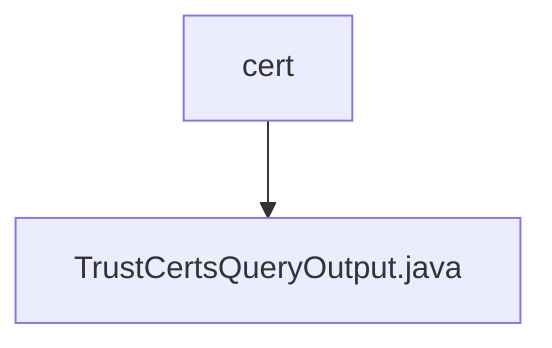

# Basic Information

|      |      |
|------|------|
| Name | cert |
| Language | .java |
| Code Path | WeFe/union/union-service/src/main/java/com/welab/wefe/union/service/dto/cert |
| Package Name | docs.union.union-service.src.main.java.com.welab.wefe.union.service.dto.cert |
| Brief Description | The `TrustCertsQueryOutput` class inherits from `AbstractTimedApiOutput` and contains fields such as certificate ID, serial number, content, parent certificate ID, issuer and subject information, as well as boolean flags indicating whether it is a CA or root certificate. |

# Description

The `TrustCertsQueryOutput` class inherits from `AbstractTimedApiOutput` and is used to represent trust certificate query results. It includes fields such as certificate ID, serial number, certificate content, and parent certificate ID. It records issuer organization and common name, as well as subject organization and common name information. It provides boolean flags for CA certificates and root certificates. All fields are accessed and modified through getter and setter methods.

### Package Internal Structure View

This flowchart illustrates the hierarchical relationship between the cert directory and its Java file within the union-service module of the WeFe project. The cert node serves as the parent directory, containing a single child file TrustCertsQueryOutput.java, which functions as the output data transfer object for certificate query operations. The structure is concise and clear, demonstrating the single-file storage approach for certificate-related classes in the DTO layer.

# File List

| Name   | Type  | Description |
|-------|------|-------------|
| [TrustCertsQueryOutput.java](TrustCertsQueryOutput.md) | file | The TrustCertsQueryOutput class inherits from AbstractTimedApiOutput and includes fields for certificate ID, serial number, content, parent certificate ID, issuer and subject information, as well as boolean flags indicating whether it is a CA or root certificate. |

