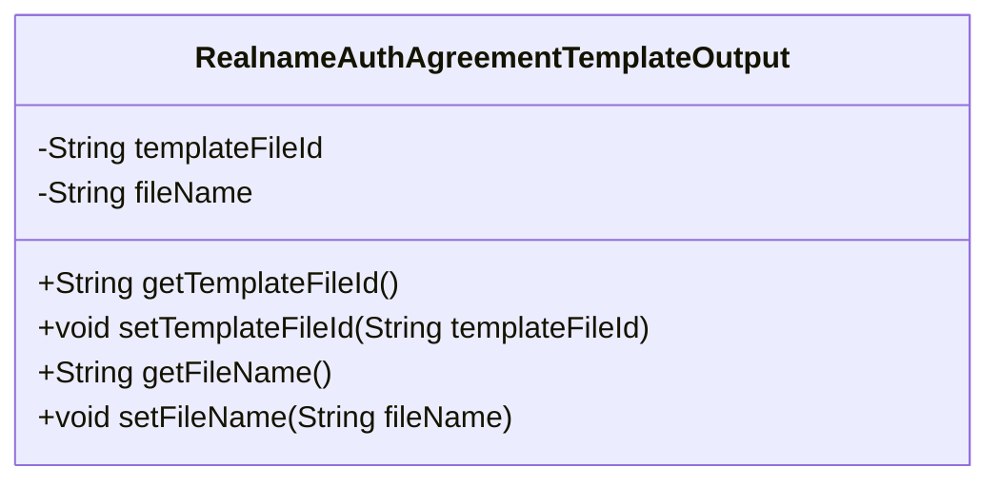
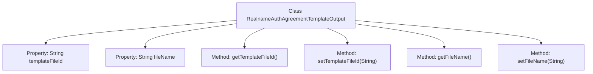

# Basic Information

|      |      |
|------|------|
| Name | RealnameAuthAgreementTemplateOutput |
| Language | .java |
| Code Path | WeFe/union/union-service/src/main/java/com/welab/wefe/union/service/dto/common/RealnameAuthAgreementTemplateOutput.java |
| Package Name | com.welab.wefe.union.service.dto.common |
| Dependencies | [] |
| Brief Description | This is a real-name authentication agreement template class, which includes template file ID and filename attributes along with their getter and setter methods. |

# Description

This is a Java class named RealnameAuthAgreementTemplateOutput, which represents the output information of a real-name authentication agreement template. The class contains two private string attributes: templateFileId (template file ID) and fileName (file name). Corresponding getter and setter methods are provided for these two attributes to retrieve and set their values. This class is primarily used to encapsulate file identification and name information related to real-name authentication agreement templates.

# Class Summary

| Name   | Type  | Description |
|-------|------|-------------|
| RealnameAuthAgreementTemplateOutput | class | This is a Java class designed for real-name authentication protocol template output, containing two attributes: template file ID and file name, along with their corresponding getter and setter methods. |

## Class RealnameAuthAgreementTemplateOutput

|      |      |
|------|------|
| Access Modifier | public |
| Type | class |
| Name | RealnameAuthAgreementTemplateOutput |
| Description | This is a Java class designed for real-name authentication protocol template output, containing two attributes: template file ID and file name, along with their corresponding getter and setter methods. |

### UML Class Diagram

This code defines a class named RealnameAuthAgreementTemplateOutput, which is used to store output information of a real-name authentication agreement template. The class contains two private fields: templateFileId (template file ID) and fileName (file name), along with corresponding getter and setter methods for accessing and modifying these field values. This is a typical Data Transfer Object (DTO) designed to encapsulate and transmit file information related to agreement templates.

### Internal Method Call Graph

This flowchart illustrates the structure of the RealnameAuthAgreementTemplateOutput class, which contains two private properties (templateFileId and fileName) along with their corresponding getter and setter methods. The class modifies property values through set methods and retrieves them via get methods, achieving encapsulated management of template file IDs and filenames. This pattern adheres to the JavaBean specification's data access control model.

### Field List

| Name  | Type  | Description |
|-------|-------|------|
| templateFileId | String | The private string variable templateFileId is used to store the template file ID. |
| fileName | String | The private string variable fileName is used to store the file name. |

### Method List

| Name  | Type  | Description |
|-------|-------|------|
| setFileName | void | This is a Java method used to set the filename property. The method accepts a string parameter fileName and assigns it to the fileName member variable of the current object. |
| getFileName | String | The method returns the filename. |
| getTemplateFileId | String | Method to obtain the template file ID, returns a string-type templateFileId. |
| setTemplateFileId | void | The method for setting the template file ID assigns the passed `templateFileId` to the property of the same name in the current object. |

